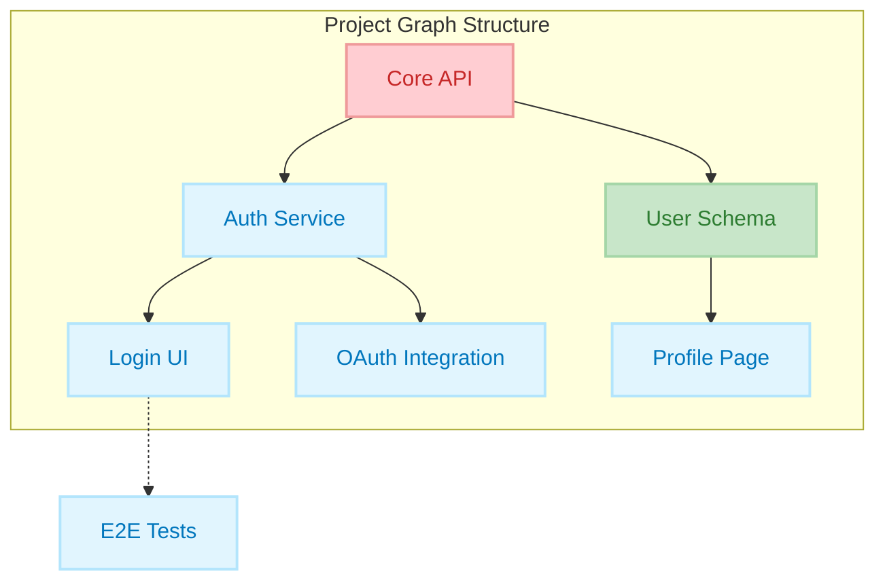
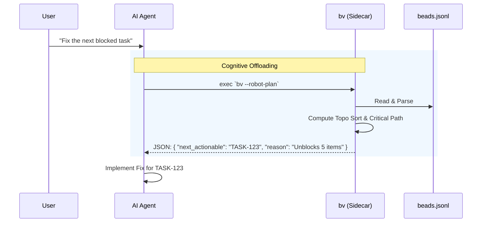
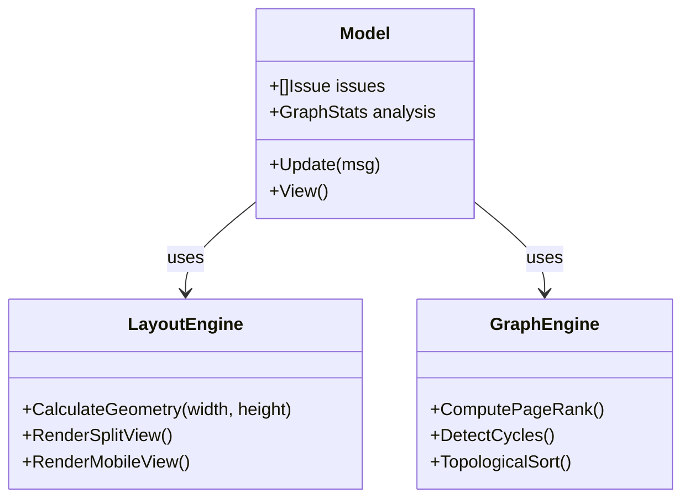

# Beads Viewer (bv)


### ⚡ Quick Install

```bash
curl -fsSL https://raw.githubusercontent.com/Dicklesworthstone/beads_viewer/main/install.sh | bash
```

---

## 💡 TL;DR

`bv` is a high-performance **Terminal User Interface (TUI)** for browsing and managing tasks in projects that use the **Beads** issue tracking system. 

**Why you'd care:**
*   **Speed:** Browse thousands of issues instantly with zero network latency.
*   **Focus:** Stay in your terminal and use Vim-style keys (`j`/`k`) to navigate.
*   **Intelligence:** It visualizes your project as a **dependency graph**, automatically highlighting bottlenecks, cycles, and critical paths that traditional list-based trackers miss.
*   **AI-Ready:** It provides structured, pre-computed insights for AI coding agents, acting as a "brain" for your project's task management.

---

## 📖 The Core Experience

At its heart, `bv` is about **viewing your work nicely**.

### ⚡ Fast, Fluid Browsing
No web page loads, no heavy clients. `bv` starts instantly and lets you fly through your issue backlog.
*   **Split-View Dashboard:** On wider screens, see your list on the left and full details on the right.
*   **Markdown Rendering:** Issue descriptions, comments, and notes are beautifully rendered with syntax highlighting.
*   **Instant Filtering:** Zero-latency filtering for Open (`o`), Closed (`c`), or Ready (`r`) tasks.

### 🎯 Focused Workflows
*   **Kanban Board:** Press `b` to switch to a columnar view (Open, In Progress, Blocked, Closed).
*   **Visual Graph:** Press `g` to explore the dependency tree visually.
*   **Insights:** Press `i` to see graph metrics and bottlenecks.

---

## 📐 Architecture & Design

`bv` treats your project as a **Directed Acyclic Graph (DAG)**, not just a list. This allows it to derive insights about what is *truly* important.



### Key Metrics
*   **PageRank:** Identifies "foundational" tasks that many others depend on.
*   **Betweenness Centrality:** Highlights "bottleneck" tasks that bridge different parts of the system.
*   **Critical Path:** Calculates the longest path of dependencies to find tasks that directly impact delivery time.

---

## 🤖 The Robot Protocol (AI Interface)

`bv` bridges the gap between raw data and AI agents. Agents struggle with graph algorithms; `bv` solves this by acting as a deterministic "sidecar" that offloads the cognitive burden of graph traversal.



### Why `bv` vs. Raw Beads?
Using `beads` directly gives an agent *data*. Using `bv --robot-insights` gives an agent *intelligence*.

| Capability | Raw Beads (JSONL) | `bv` Robot Mode |
| :--- | :--- | :--- |
| **Query** | "List all issues." | "List the top 5 bottlenecks blocking the release." |
| **Context Cost** | High (Linear with issue count). | Low (Fixed summary struct). |
| **Graph Logic** | Agent must infer/compute. | Pre-computed (PageRank/Brandes). |
| **Safety** | Agent might miss a cycle. | Cycles explicitly flagged. |

---

## 🎨 TUI Engineering

`bv` is built with the **Bubble Tea** framework, ensuring a glitch-free, 60fps experience. It features an adaptive layout engine that responds to terminal resize events and a custom ASCII/Unicode graph renderer.



---

## 📄 License

MIT License

Copyright (c) 2025 Jeffrey Emanuel

Permission is hereby granted, free of charge, to any person obtaining a copy
of this software and associated documentation files (the "Software"), to deal
in the Software without restriction, including without limitation the rights
to use, copy, modify, merge, publish, distribute, sublicense, and/or sell
copies of the Software, and to permit persons to whom the Software is
furnished to do so, subject to the following conditions:

The above copyright notice and this permission notice shall be included in all
copies or substantial portions of the Software.

THE SOFTWARE IS PROVIDED "AS IS", WITHOUT WARRANTY OF ANY KIND, EXPRESS OR
IMPLIED, INCLUDING BUT NOT LIMITED TO THE WARRANTIES OF MERCHANTABILITY,
FITNESS FOR A PARTICULAR PURPOSE AND NONINFRINGEMENT. IN NO EVENT SHALL THE
AUTHORS OR COPYRIGHT HOLDERS BE LIABLE FOR ANY CLAIM, DAMAGES OR OTHER
LIABILITY, WHETHER IN AN ACTION OF CONTRACT, TORT OR OTHERWISE, ARISING FROM,
OUT OF OR IN CONNECTION WITH THE SOFTWARE OR THE USE OR OTHER DEALINGS IN THE
SOFTWARE.
