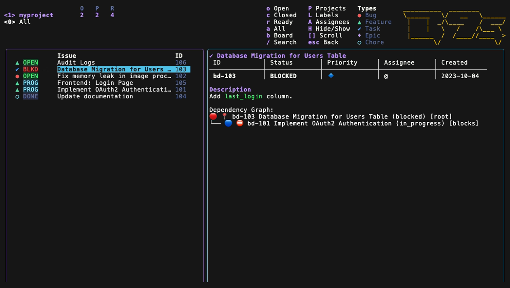

# b9s


A keyboard-driven terminal UI for reading and editing [Beads](https://github.com/steveyegge/beads) issues, modelled on [k9s](https://k9scli.io/). If you know k9s, you already know most of b9s.

b9s shows a Beads project as a tree of issues under their parents, with a Markdown detail pane. It reads from a Dolt server, SQLite or JSONL, reloads when the data changes, and makes every change through the `bd` CLI, so b9s and `bd` always agree on what is stored.



## Contents

- [Inspired by k9s](#inspired-by-k9s)
- [Install](#install)
- [Quick start](#quick-start)
- [Keys](#keys)
- [Creators and assignees](#creators-and-assignees)
- [Search](#search)
- [Projects](#projects)
- [Data sources](#data-sources)
- [Configuration](#configuration)
- [Mouse and tmux](#mouse-and-tmux)
- [Command-line options](#command-line-options)
- [Development](#development)
- [Documentation](#documentation)
- [Acknowledgments](#acknowledgments)
- [License](#license)

## Inspired by k9s

b9s takes its interaction model from k9s, the Kubernetes terminal UI. Where k9s lists the pods in a namespace, b9s lists the issues in a project. These parts work as they do in k9s:

- **Header.** A header with the logo, the project shortcuts and a title bar that names the project and its data source. `Ctrl-E` or `H` hides and shows it.
- **Project shortcuts.** Recent projects sit on `1`-`9`, like favourite namespaces, and follow the same rules: a new project goes to the front, a known one keeps its number, and `lock_recent` freezes the list. `0` shows every project at once, as `0` shows every namespace.
- **Command prompt.** `:` opens a prompt with aliases such as `:epic`, `:bug`, `:issues`, `:project`, `:layout` and `:wrap`. `Tab` accepts the suggestion, and `Backspace` on an empty prompt closes it.
- **Filter.** `/` opens the query. `Enter` hides the field and keeps the filter, and `Esc` clears it.
- **Marking.** `Space` marks an issue, `V` or `Ctrl-Space` marks a range and `Ctrl-\` clears the marks. Close, delete and status changes apply to every marked issue, or to the cursor row when nothing is marked.
- **Table navigation.** `Ctrl-F` and `Ctrl-B` page, and `Ctrl-W` toggles wide columns. When the issue under the cursor is closed or deleted, the next issue takes its row.
- **Look.** A bright cyan full-row cursor, one line for status and key hints, and plain-text tokens instead of emoji.

## Install

With Homebrew on macOS or Linux:

```bash
brew install vanderheijden86/tap/b9s
```

From source, with [Go 1.25 or later](https://go.dev/dl/):

```bash
git clone https://github.com/vanderheijden86/b9s.git
cd b9s
make install   # installs b9s to $GOPATH/bin
```

## Quick start

Run `b9s` in a folder that has a `.beads` directory:

```bash
b9s
```

The tree shows every issue under its parent. Move with `j` and `k`, open an issue with `Enter`, search with `/` and run a command with `:`. `Ctrl-C` quits.

## Keys

b9s always shows the issue tree. `b` opens the board, `g` opens the dependency graph of the issue under the cursor, and `Esc` goes back to the tree. Keys are case-sensitive, so `D` means `Shift-D`.

In the tree:

| Keys | Action |
|------|--------|
| `j` `k`, `Up` `Down` | Move the cursor |
| `h` `l` | Collapse or expand the issue, or go to its parent or child |
| `Tab`, `Shift-Tab` | Fold or unfold the issue, or the whole tree |
| `X`, `Z`, `Ctrl-A` | Expand all, collapse all, switch between the two |
| `v`, `:wrap` | Wrap long titles onto extra lines, or truncate them to one line again |
| `p` `{` `}` | Go to the parent, the first sibling, the last sibling |
| `Ctrl-F` `Ctrl-B`, `Ctrl-D` `Ctrl-U` | Page down and up, half a page down and up |
| `Home`, `End` | Go to the top, the bottom |
| `Enter`, `d` | Move focus to the detail pane and back, show or hide the side pane |
| `\`, `<` `>` | Stack the detail pane below the tree or put it beside it, resize the panes |
| `/`, `n` `N`, `O` | [Search](#search), go to the next or previous match, show only the matches |
| `o` `C` `r` `a` | Show open, closed, ready or all issues |
| `f`, `x` | Show only the cursor's top-level branch, or its subtree. Press again to undo |
| `F` | Follow: when another agent changes an issue, move the cursor to it |
| `s`, `\|`, `Ctrl-W` | Sort, pick columns, toggle wide columns |
| `Space`, `V`, `u`, `Ctrl-\` | Mark the issue, mark a range, unmark the issue, clear the marks |
| `e`, `S`, `K`, `Delete` | Edit, set the status, close, delete |
| `Ctrl-N`, `c` | Create an issue, copy the ID and title |

Everywhere:

| Keys | Action |
|------|--------|
| `1`-`9`, `0` | Open a recent project, show all projects |
| `L`, `A`, `P` | Put labels, assignees or projects on `1`-`9` |
| `Ctrl-E` `H`, `D` | Hide or show the header, show the data source health |
| `Ctrl-R`, `F5` | Reload |
| `?` | Help |
| `Ctrl-C` | Quit |

In the edit form, `Tab` and `Shift-Tab` move between fields, `Enter` starts a new line in Description and Notes, `→` completes an assignee or label, `Ctrl-E` opens Description or Notes in `$EDITOR`, `Ctrl-S` saves and `Esc` cancels.

The detail pane opens with a card framed in the issue's status color: type, ID and last update, the title, then status, priority, creator and assignee. Below the card come the created date, owner and labels, then the description, design, acceptance and notes as Markdown. An issue with children lists them with a done count and a progress bar. A relations list shows the parent, blockers and the issues it blocks, and the comments come last.

In the detail pane, `j` and `k` scroll, `Home` and `End` jump to the top and bottom, `n` and `p` go to the next and previous sibling, and `c` copies the issue as Markdown.

On the board, `h` and `l` change the column, `j` and `k` move between issues, `o`, `i` and `C` toggle `status:open`, `status:in_progress` and `status:closed` in the query bar (they combine, and `Esc` clears them), `r` shows ready issues, `z` folds the focused column into a rail (on OPEN it leaves only the work in progress) and `Z` unfolds all, `s` changes the swimlanes, `e` hides empty columns and `y` copies the issue ID. `f` shows only the card's top-level branch, the issue at the top of its parents and everything below it, and `f` again shows the whole board. Each issue is a boxed card, and empty columns fold into rails. The closed column stays hidden until `c` shows it. Issues sit in one horizontal lane per epic. `v` switches between two designs: the epic rail shows each epic with its completion in a column on the left, and epic rows put that as a header row above the lane. The epics form the first column: `Left` and `Right` move between it and the status columns inside the selected lane, and skip a column where the lane has no card. `Up` and `Down` move through the column's cards, or change the epic in the epic column. `{` and `}` go to the previous and next epic. `Tab` folds the selected epic's lane and `Shift-Tab` folds or unfolds all of them.

## Creators and assignees

Every issue shows two people. The Creator is the `bd` actor that created the issue and never changes. The Assignee is whoever holds the issue now. `|` adds either one as a tree column. `Ctrl-N` fills in the Assignee with you and creates the issue as you, found as `bd` finds its actor.

One person often appears under several names, such as a git user name, an email and a lane agent name. List them once in the `bd` config key `b9s.identities`, and b9s shows one name for all of them. The [user guide](docs/USER_GUIDE.md#creators-assignees-and-identities) gives the format.

## Search

Press `/` to query the loaded issues. Results update as you type. `Enter` hides the field and keeps the query, `/` edits it again, and `Esc` clears it. `Tab` completes field names, values, labels and words found in the loaded issues.

Plain words match issue IDs, titles and labels fuzzily, and every word must match. Predicates narrow by field: `id`, `title`, `status`, `priority`, `type`, `label`, `assignee` and `project`. Different fields combine with AND, repeated values for one field combine with OR, and `!` excludes a match:

```text
status:open label:backend
type:bug !assignee:andre
release blocker
```

`--filter` starts b9s with a query applied, which suits shell scripts and tmux bindings:

```tmux
bind-key B new-window -c '#{pane_current_path}' "b9s --filter 'status:open label:backend'"
```

## Projects

The header lists the project b9s started in and up to nine projects you opened recently, on the keys `1`-`9`. A project b9s has not seen yet is added as `1`, and a project already in the list keeps its number, so switching never renumbers the header. `0` combines the issues of every Dolt project in the list into one read-only view. b9s does not scan folders for projects. A recent project whose server or tunnel is down stays in the header and shows `✗` in place of its issue counts. A recent project whose database refuses the startup project's Dolt user stays out of the header for that session. It stays in `recent_projects` and comes back when b9s starts as a user with access to that database. The counts come from the checkout's configured source, never from a JSONL export beside a Dolt checkout.

Type `:project` to list the Beads databases that the startup project's Dolt user can read, then press `Enter` to open one. A project without a local checkout opens read-only, because writes run `bd` inside a checkout.

b9s loads a project before it replaces the one on screen. While it loads, the status line shows `Opening <name>…` and `Esc` cancels. If the project cannot be opened, you stay where you were and a popup names the reason:

| Reason | Example |
|--------|---------|
| Not a Beads project | the folder has no `.beads` directory |
| Server unreachable | the Dolt server or SSH tunnel is down |
| Access denied | the Dolt user may not read that database |
| Not a Beads database | the database has no `issues` table, or does not exist |
| Unreadable | no issues file or Dolt configuration could be read |
| Timed out | the project did not open within 10 seconds |

Press `r` in the popup to retry. When the folder b9s starts in cannot be opened, b9s opens the recent project that last opened successfully and shows the same popup. With `--no-fallback`, or without a terminal, it exits with status 1 instead, so a script never acts on the wrong project.

## Data sources

b9s reads the `.beads` directory of the current folder, or the one in `BEADS_DIR`. When it finds more than one source, it uses the first of these:

| Source | Found through |
|--------|---------------|
| Dolt server | `.beads/metadata.json` with `"dolt_mode": "server"` |
| SQLite | `.beads/beads.db`, from older `bd` versions |
| JSONL | `.beads/issues.jsonl`, also in linked git worktrees |

A configured Dolt server always wins, even over a newer JSONL file. If b9s cannot connect to it, b9s falls back to SQLite and then JSONL, and `D` shows the active source and the connection error while the header is visible. b9s cannot read embedded Dolt (`bd init` without `--server`), because there is no server to connect to.

b9s takes the Dolt host, port, user and database from `metadata.json` and the password from `BEADS_DOLT_PASSWORD`. It sends that password only to a loopback address or to an exact `host:port` listed in `B9S_TRUSTED_DOLT_ENDPOINTS` (comma-separated), so a cloned repository cannot choose where your password goes. See [ADR 0013](docs/adr/0013-trust-dolt-endpoints-before-sending-environment-credentials.md).

b9s checks the Dolt database hash every 500 ms by default, so changes from `bd` or another agent appear by themselves, uncommitted ones included. JSONL files reload when they change on disk. `Ctrl-R` or `F5` reloads at once.

## Configuration

b9s reads `~/.config/b9s/config.yaml`, or `$XDG_CONFIG_HOME/b9s/config.yaml`. Every key is optional:

```yaml
ui:
  board_epics: rail       # rail or rows; v switches
  sort:
    field: created      # priority, created, updated, title, status, type or deps
    direction: desc     # asc or desc; leave out for the field's natural order
refresh:
  poll_interval: 500ms  # at least 100ms; restart b9s after a change
lock_recent: false      # true freezes the list below
recent_projects:        # b9s maintains this list; edit it to remove an entry
  - name: b9s
    database: b9s
    host: 127.0.0.1:3306
    path: /Users/me/src/b9s   # empty for a database without a local checkout
```

`s` picks another sort for the current session only. If the file does not parse, for example because of an unknown sort field, b9s ignores the whole file, starts with the defaults and never saves over it.

## Mouse and tmux

The mouse wheel moves through issues and scrolls the detail pane. Because b9s captures the mouse for this, a drag does not select text, and in tmux with `mouse on` the drag goes to b9s instead of starting copy mode.

Type `:mouse` to hand the mouse to the terminal, so a drag selects text. Type `:mouse` again to scroll with the wheel. Without it, hold the terminal's override key while you drag: `Option` in iTerm2, `Shift` in most other terminals.

## Command-line options

| Option | Effect |
|--------|--------|
| `--filter '<query>'` | Start with a [query](#search) applied |
| `--repo <prefix>` | Show only issues whose ID starts with the prefix, for example `api` |
| `--no-fallback` | Exit with status 1 when the current folder cannot be opened |
| `--debug` | Write a debug log to `.b9s/debug.log` |
| `--check-update` | Report whether a newer release exists |
| `--update` | Install the latest release; `--yes` skips the prompt |
| `--rollback` | Go back to the version before the last update |
| `--version` | Print the version |

## Development

```bash
make build                            # builds ./b9s
go test ./... -skip DoltIntegration   # everything that needs no Dolt server
```

Tests named `DoltIntegration` need a Dolt server. The ones that create databases run only against a disposable local server:

```bash
mkdir -p /tmp/b9s-dolt && (cd /tmp/b9s-dolt && dolt init && dolt sql-server --port 13306) &
B9S_TEST_DOLT_SCRATCH_ADDR=127.0.0.1:13306 go test ./internal/datasource/ -run DoltIntegration
```

[docs/testing.md](docs/testing.md) describes the test layers and the Dolt rules in full.

## Documentation

- [User guide](docs/USER_GUIDE.md): every view, key, query and setting.
- [Architecture](docs/ARCHITECTURE.md): the packages, the data flow and the write path through `bd`.
- [Testing](docs/testing.md): unit, integration and end-to-end tests.
- [Migrating embedded Dolt to a server](docs/embedded-to-server-migration.md): what to do when `D` reports embedded Dolt.
- [Decision records](docs/adr/): why b9s works the way it does.

## Acknowledgments

- Steve Yegge for [Beads](https://github.com/steveyegge/beads).
- The [k9s](https://k9scli.io/) project for the interaction model b9s follows.
- The [Charm](https://charm.sh) team for [Bubble Tea](https://github.com/charmbracelet/bubbletea), [Lip Gloss](https://github.com/charmbracelet/lipgloss), [Bubbles](https://github.com/charmbracelet/bubbles), [Huh](https://github.com/charmbracelet/huh) and [Glamour](https://github.com/charmbracelet/glamour).

## License

MIT. See [LICENSE](LICENSE).
