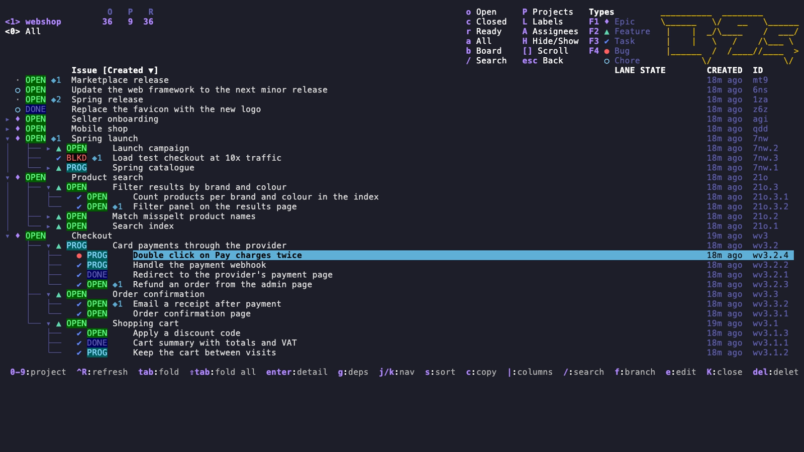
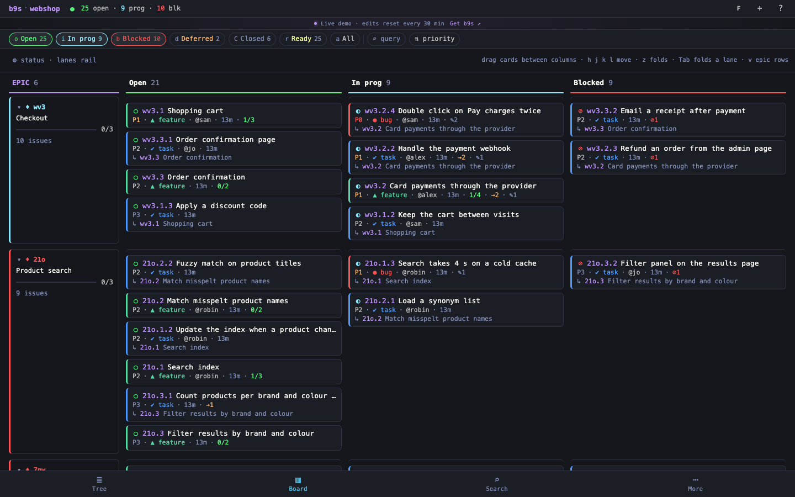
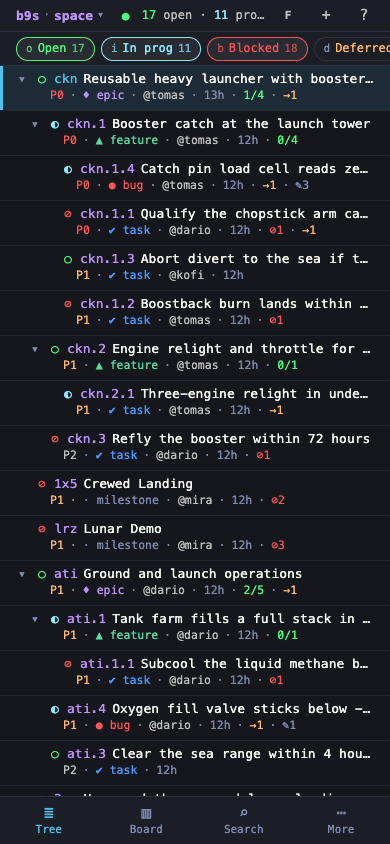

# b9s


**See your [Beads](https://github.com/steveyegge/beads) issues as a tree, a board and a dependency graph, and change them from the terminal, a browser or your phone.** Every change goes through the `bd` CLI, so b9s, `bd` and your agents always agree on what is stored.

**Try it in your browser, no install:** [demo.b9s.osen.co](https://demo.b9s.osen.co) opens a made-up space programme that anyone can edit. It resets every 30 minutes.

**Or watch the 90-second demo:** the tree and the board in a terminal, then the same project on a phone over Tailscale.

https://github.com/user-attachments/assets/ccc8ebc9-4daf-4867-8c41-3f91df364f42

| Terminal | Browser | Phone |
|:---:|:---:|:---:|
|  |  |  |

b9s is a keyboard-driven terminal UI modelled on [k9s](https://k9scli.io/): if you know k9s, you already know most of b9s. It opens any Beads project, including a fresh `bd init` with no server, and shows changes from `bd` or another agent as they happen. `b9s web` serves the same project, with every write, to a browser or a phone.

## Contents

- [Inspired by k9s](#inspired-by-k9s)
- [Install](#install)
- [Quick start](#quick-start)
- [Keys](#keys)
- [Creators and assignees](#creators-and-assignees)
- [Search](#search)
- [Projects](#projects)
- [Data sources](#data-sources)
- [Configuration](#configuration)
- [Phone and browser](#phone-and-browser)
- [Mouse and tmux](#mouse-and-tmux)
- [Command-line options](#command-line-options)
- [Development](#development)
- [Documentation](#documentation)
- [Acknowledgments](#acknowledgments)
- [License](#license)

## Inspired by k9s

b9s takes its interaction model from k9s, the Kubernetes terminal UI. Where k9s lists the pods in a namespace, b9s lists the issues in a project. These parts work as they do in k9s:

- **Header.** A header with the logo, the project shortcuts and a title bar that names the project and its data source. `Ctrl-E` or `H` hides and shows it.
- **Project shortcuts.** Recent projects sit on `1`-`9`, like favourite namespaces, and follow the same rules: a new project goes to the front, a known one keeps its number, and `lock_recent` freezes the list. `0` shows every project at once, as `0` shows every namespace.
- **Command prompt.** `:` opens a prompt with aliases such as `:epic`, `:bug`, `:issues`, `:project`, `:layout`, `:wrap` and `:branch <id>`. `Tab` accepts the suggestion, and `Backspace` on an empty prompt closes it.
- **Filter.** `/` opens the query. `Enter` hides the field and keeps the filter, and `Esc` clears it.
- **Marking.** `Space` marks an issue, `V` or `Ctrl-Space` marks a range and `Ctrl-\` clears the marks. Close, delete and status changes apply to every marked issue, or to the cursor row when nothing is marked.
- **Table navigation.** `Ctrl-F` and `Ctrl-B` page, and `Ctrl-W` toggles wide columns. When the issue under the cursor is closed or deleted, the next issue takes its row.
- **Look.** A bright cyan full-row cursor, one line for status and key hints, and plain-text tokens instead of emoji.

## Install

With Homebrew on macOS or Linux:

```bash
brew install vanderheijden86/tap/b9s
```

On Linux or macOS without Homebrew, the install script downloads the release binary for your platform, checks it against the release checksums and puts it in `~/.local/bin`:

```bash
curl -fsSL https://raw.githubusercontent.com/vanderheijden86/b9s/main/install.sh | bash
```

Set `INSTALL_DIR` to choose another directory. On a platform without a release binary, the script builds from source instead. After that, `b9s --update` installs new releases.

On Debian, Ubuntu, Fedora or RHEL, each [release](https://github.com/vanderheijden86/b9s/releases/latest) also carries `.deb` and `.rpm` packages for amd64 and arm64. Download the one for your system and install it:

```bash
sudo dpkg -i b9s_<version>_linux_amd64.deb   # Debian, Ubuntu
sudo rpm -i b9s_<version>_linux_amd64.rpm    # Fedora, RHEL
```

The package puts `b9s` in `/usr/bin`. There is no apt or dnf repository, so upgrade by installing the next release's package (`dpkg -i` or `rpm -U`), not with `b9s --update`, which would replace a file the package manager owns.

From source, with [Go 1.25 or later](https://go.dev/dl/):

```bash
git clone https://github.com/vanderheijden86/b9s.git
cd b9s
make install   # installs b9s to $GOPATH/bin
```

b9s makes every write through the [Beads](https://github.com/steveyegge/beads) `bd` command, and reads embedded Dolt projects through it too, so `bd` must be on your `PATH`. **b9s is tested with bd 1.2.2 through 1.3.0.** A newer bd usually works. [docs/testing.md](docs/testing.md#bd-releases) says how to check one.

**Tried it?** Tell me what worked and what did not in the [feedback thread](https://github.com/vanderheijden86/b9s/discussions/12).

## Quick start

Run `b9s` in a folder that has a `.beads` directory:

```bash
b9s
```

The tree shows every issue under its parent. Move with `j` and `k`, open an issue with `Enter`, search with `/` and run a command with `:`. `b` shows the board, `S` changes the status of the issue under the cursor, and `Ctrl-C` quits.

To open the same project on your phone, run `b9s web` in the same folder and follow [Phone and browser](#phone-and-browser).

No Beads project at hand? Download the [sample project](examples/sample-project/), a made-up web shop with epics, blocked work and comments, and browse it:

```bash
mkdir -p b9s-sample/.beads && cd b9s-sample
curl -fsSL -o .beads/issues.jsonl \
  https://raw.githubusercontent.com/vanderheijden86/b9s/main/examples/sample-project/.beads/issues.jsonl
b9s
```

## Keys

b9s always shows the issue tree. `b` opens the board, `g` opens the dependency graph of the issue under the cursor, and `Esc` goes back to the tree. Keys are case-sensitive, so `D` means `Shift-D`.

In the tree:

| Keys | Action |
|------|--------|
| `j` `k`, `Up` `Down` | Move the cursor |
| `h` `l` | Collapse or expand the issue, or go to its parent or child |
| `Tab`, `Shift-Tab` | Fold or unfold the issue, or the whole tree |
| `X`, `Z`, `Ctrl-A` | Expand all, collapse all, switch between the two |
| `t` | Show a flat list instead of the tree, and back. The sort then runs over every issue, so `s` → Updated puts the latest changes at the top. b9s remembers the choice per project |
| `v`, `:wrap` | Wrap long titles onto extra lines, or truncate them to one line again |
| `p` `{` `}` | Go to the parent, the first sibling, the last sibling |
| `Ctrl-F` `Ctrl-B`, `Ctrl-D` `Ctrl-U` | Page down and up, half a page down and up |
| `Home`, `End` | Go to the top, the bottom |
| `Enter`, `d` | Move focus to the detail pane and back, show or hide the side pane |
| `\`, `<` `>` | Stack the detail pane below the tree or put it beside it, resize the panes |
| `/`, `n` `N`, `O` | [Search](#search), go to the next or previous match, show only the matches. A `type:` term, or `:task` and the other entity commands, shows the flat list |
| `o` `C` `r` `a` | Show open, closed, ready or all issues |
| `f`, `x` | Show only the cursor's top-level branch, or its subtree. Press again to undo |
| `F` | Follow: when another agent changes an issue, move the cursor to it |
| `s`, `\|`, `Ctrl-W` | Sort, pick columns (Created, Updated, Deferred, Due and more), toggle wide columns |
| `T` | Show the time columns as an age (`2h ago`) or a date and minute (`30-09 14:05`, or `09-30 14:05` in a month-first locale) |
| `Space`, `V`, `u`, `Ctrl-\` | Mark the issue, mark a range, unmark the issue, clear the marks |
| `e`, `S`, `K`, `Delete` | Edit, set the status, close, delete |
| `Ctrl-N`, `c` | Create an issue, copy the ID and title |

Everywhere:

| Keys | Action |
|------|--------|
| `1`-`9`, `0` | Open a recent project, show all projects |
| `L`, `A`, `P` | Put labels, assignees or projects on `1`-`9` |
| `R` | List the cursor issue's attachments and open one, see [Attachments](#attachments) |
| `I` | Attach one or more files to the cursor issue, see [Attachments](#attachments) |
| `Ctrl-E` `H`, `D` | Hide or show the header, show the data source health |
| `Ctrl-R`, `F5` | Reload |
| `?` | Help |
| `Ctrl-C` | Quit |

In the edit form, `Tab` and `Shift-Tab` move between fields, `Enter` starts a new line in Description and Notes, `→` completes an assignee or label, `Ctrl-E` opens Description or Notes in `$EDITOR`, `Ctrl-S` saves and `Esc` cancels.

The detail pane opens with a card framed in the issue's status color: type, ID and last update, the title, then status, priority, creator and assignee. Below the card come the created date, owner and labels, then the description, design, acceptance and notes as Markdown. An issue with children lists them with a done count and a progress bar. A relations list shows the parent, blockers and the issues it blocks, and the comments come last.

In the detail pane, Mermaid code fences render as terminal diagrams for `graph` and `flowchart` with TD, TB or LR direction, and for `sequenceDiagram`. Other types, diagrams that fail to render, and diagrams wider than the pane stay as code. Widen the pane to retry a wide diagram. Copying an issue keeps the Mermaid source.

In the detail pane, `j` and `k` scroll, `Home` and `End` jump to the top and bottom, `n` and `p` go to the next and previous sibling, and `c` copies the issue as Markdown. The detail numbers the first nine children: `1`-`9` open that child instead of a project, and `Backspace` goes back to the issue the number was pressed on.

On the board, `h` and `l` change the column, `j` and `k` move between issues, `o`, `i` and `C` toggle `status:open`, `status:in_progress` and `status:closed` in the query bar (they combine, and `Esc` clears them), `r` shows ready issues, `z` folds the focused column into a rail (on OPEN it leaves only the work in progress) and `Z` unfolds all, `s` changes the swimlanes, `e` hides empty columns and `y` copies the issue ID. `f` shows only the card's top-level branch, the issue at the top of its parents and everything below it, and `f` again shows the whole board. Each issue is a boxed card, and empty columns fold into rails. The closed column stays hidden until `c` shows it. `c` also clears an open or ready filter set in the tree, which would otherwise keep closed issues off the board. Issues sit in one horizontal lane per epic. `v` switches between two designs: the epic rail shows each epic with its completion in a column on the left, and epic rows put that as a header row above the lane. The epics form the first column: `Left` and `Right` move between it and the status columns inside the selected lane, and skip a column where the lane has no card. `Up` and `Down` move through the column's cards, or change the epic in the epic column. `{` and `}` go to the previous and next epic. `Tab` folds the selected epic's lane and `Shift-Tab` folds or unfolds all of them.

## Creators and assignees

Every issue shows two people. The Creator is the `bd` actor that created the issue and never changes. The Assignee is whoever holds the issue now. `|` adds either one as a tree column. `Ctrl-N` fills in the Assignee with you and creates the issue as you, found as `bd` finds its actor.

One person often appears under several names, such as a git user name, an email and a lane agent name. List them once in the `bd` config key `b9s.identities`, and b9s shows one name for all of them. The [user guide](docs/USER_GUIDE.md#creators-assignees-and-identities) gives the format.

## Search

Press `/` to query the loaded issues. Results update as you type. `Enter` hides the field and keeps the query, `/` edits it again, and `Esc` clears it. `Tab` completes field names, values, labels and words found in the loaded issues.

Plain words match issue IDs, titles and labels fuzzily, and every word must match. Predicates narrow by field: `id`, `title`, `status`, `priority`, `type`, `label`, `assignee` and `project`. Different fields combine with AND, repeated values for one field combine with OR, and `!` excludes a match:

```text
status:open label:backend
type:bug !assignee:andre
release blocker
```

The tree keeps the parents of a match on screen, dimmed, so you see where it sits. A query with a `type:` predicate, positive or excluded, shows the flat list instead: `type:task` lists only tasks, sorted by the active sort, with no epic rows above them. `:task`, `:bug` and the other entity commands set that predicate. Remove it and the tree comes back, unless you chose the list with `t`.

`--filter` starts b9s with a query applied, which suits shell scripts and tmux bindings:

```tmux
bind-key B new-window -c '#{pane_current_path}' "b9s --filter 'status:open label:backend'"
```

## Projects

The header lists the project b9s started in and up to nine projects you opened recently, on the keys `1`-`9`. A project b9s has not seen yet is added as `1`, and a project already in the list keeps its number, so switching never renumbers the header. A project is identified by its Dolt host and database when it has one, so a checkout and an entry opened through `:project` on the same database share one row. `0` combines the issues of every Dolt project in the list into one read-only view. b9s does not scan folders for projects. A recent project whose server or tunnel is down stays in the header and shows `✗` in place of its issue counts. A recent project whose database refuses the startup project's Dolt user stays out of the header for that session. It stays in `recent_projects` and comes back when b9s starts as a user with access to that database. The counts come from the checkout's configured source, never from a JSONL export beside a Dolt checkout.

Type `:project` to list the Beads databases that the startup project's Dolt user can read, then press `Enter` to open one. A project without a local checkout opens read-only, because writes run `bd` inside a checkout.

b9s loads a project before it replaces the one on screen. While it loads, the status line shows `Opening <name>…` and `Esc` cancels. If the project cannot be opened, you stay where you were and a popup names the reason:

| Reason | Example |
|--------|---------|
| Not a Beads project | the folder has no `.beads` directory |
| Server unreachable | the Dolt server or SSH tunnel is down |
| Access denied | the Dolt user may not read that database |
| Not a Beads database | the database has no `issues` table, or does not exist |
| Unreadable | no issues file or Dolt configuration could be read |
| Timed out | the project did not open within 10 seconds |
| bd not found | the project uses embedded Dolt, and `bd` is not on `PATH` |

Press `r` in the popup to retry. When the folder b9s starts in cannot be opened, b9s opens the recent project that last opened successfully and shows the same popup. With `--no-fallback`, or without a terminal, it exits with status 1 instead, so a script never acts on the wrong project.

## Data sources

b9s reads the `.beads` directory of the current folder, or the one in `BEADS_DIR`. When it finds more than one source, it uses the first of these:

| Source | Found through |
|--------|---------------|
| Dolt server | `.beads/metadata.json` with `"dolt_mode": "server"` |
| Embedded Dolt | `.beads/metadata.json` with `"dolt_mode": "embedded"`, the default of `bd init` |
| SQLite | `.beads/beads.db`, from older `bd` versions |
| JSONL | `.beads/issues.jsonl`, also in linked git worktrees |

A configured Dolt server always wins, even over a newer JSONL file. If b9s cannot connect to it, b9s falls back to SQLite and then JSONL, and `D` shows the active source and the connection error while the header is visible.

b9s reads embedded Dolt (`bd init` without `--server`) by running `bd export` in the project, so it needs `bd` on `PATH` and nothing else. It never opens the store itself, so your own `bd` writes never wait for b9s. An `issues.jsonl` beside the store is never read in its place, and b9s does not fall back to it when `bd` fails. See [ADR 0025](docs/adr/0025-read-embedded-dolt-through-bd-export.md).

b9s takes the Dolt user and database from `metadata.json` and the password from `BEADS_DOLT_PASSWORD`. It finds the server's address the way bd does, so both always read the same server. The host comes from `BEADS_DOLT_SERVER_HOST`, then `metadata.json`, then `dolt.host` in `config.yaml`, else `127.0.0.1`. The port comes from `BEADS_DOLT_SERVER_PORT`, then `.beads/dolt-server.port` (the port of a server bd started), then `listener.port` in the Dolt data directory, then `dolt.port` in `config.yaml`, then `dolt_server_port` in `metadata.json`. For a remote host b9s ignores the port file and defaults to 3307, as bd does. In shared server mode (`BEADS_DOLT_SHARED_SERVER`) the port file is `~/.beads/shared-server/dolt-server.port`, with 3308 as the default. It sends that password only to a loopback address or to an exact `host:port` listed in `B9S_TRUSTED_DOLT_ENDPOINTS` (comma-separated), so a cloned repository cannot choose where your password goes. See [ADR 0013](docs/adr/0013-trust-dolt-endpoints-before-sending-environment-credentials.md).

b9s checks the Dolt database hash every 500 ms by default, so changes from `bd` or another agent appear by themselves, uncommitted ones included. For embedded Dolt it checks the store files at the same interval and reloads after each `bd` write. JSONL files reload when they change on disk. `Ctrl-R` or `F5` reloads at once.

## Configuration

b9s reads `~/.config/b9s/config.yaml`, or `$XDG_CONFIG_HOME/b9s/config.yaml`. Every key is optional:

```yaml
ui:
  board_epics: rail       # rail or rows; v switches
  date_order: auto        # auto, dmy or mdy: day or month first in dates (T)
  sort:
    field: created      # priority, created, updated, title, status, type, deps, pagerank or deferred
    direction: desc     # asc or desc; leave out for the field's natural order
refresh:
  poll_interval: 500ms  # at least 100ms; restart b9s after a change
lock_recent: false      # true freezes the list below
recent_projects:        # b9s maintains this list; edit it to remove an entry
  - name: b9s
    database: b9s
    host: 127.0.0.1:3306
    path: /Users/me/src/b9s   # empty for a database without a local checkout
# attachments:            # absent by default; issue attachments are opt-in
#   backend: s3           # s3 or local
#   max_bytes: 26214400   # 25 MiB
#   gc_grace: 24h
#   local_dir: ""         # local backend only; default <beads dir>/attachments
#   prefix: osenco         # the workspace; default is the project's database name; applies to both backends
#   local_with_dolt_server: false # required true to use the local backend when the project is a Dolt server
#   s3:
#     endpoint: https://nbg1.your-objectstorage.com
#     region: nbg1
#     bucket: osenco-beads-attachments
#     path_style: false
#     url_ttl: 15m         # at most 168h (7 days): the S3 presign limit
#     credential_command: "" # prints two lines: access key id, secret
```

`s` picks another sort for the current session only. If the file does not parse, for example because of an unknown sort field, b9s ignores the whole file, starts with the defaults and never saves over it.

### Attachments

The `attachments` section configures the blob store b9s uses to attach files to issues (see [ADR 0024](docs/adr/0024-attach-files-through-reference-comments.md)). It never holds credentials: the `s3` backend reads them from `B9S_ATTACHMENTS_S3_ACCESS_KEY_ID` and `B9S_ATTACHMENTS_S3_SECRET_ACCESS_KEY`, or from `s3.credential_command`, which must print exactly two lines (access key id, then secret) within 10 seconds. Only the fields shown above are accepted under `attachments` and `attachments.s3`; any other key, and any YAML alias or merge (`<<`) node anywhere in the section, makes the whole file fail to load, naming the key it rejected. The `local` backend is refused for a project whose data source is a Dolt server unless `local_with_dolt_server: true` is set: b9s's own shared Dolt server runs through an SSH tunnel and looks like loopback from every machine that reaches it, so a host-based check cannot tell that apart from Dolt genuinely running solo, and files the local backend writes are invisible to every other operator sharing that server.

Once configured, the `b9s attach` command line attaches and retrieves files without opening the TUI:

```
b9s attach <issue-id> <file>...          upload one or more files, then write the reference comment
b9s attach --detach <issue-id> <sha256>  write a comment that marks a hash detached
b9s attach list <issue-id> [--json]      list an issue's current attachments
b9s attach get <issue-id> <sha256|name> [-o path] [--force]   download one, by full hash, a hash prefix, or its name
b9s attach url <issue-id> <sha256|name>  print a presigned URL (s3 backend only)
b9s attach gc [--apply] [--grace 24h] [--json] [--allow-empty-references]   reclaim blobs no live comment references
```

`get` refuses to overwrite an existing file (or a symlink) at its output path; pass `--force` to replace it. On a project whose data source is a plain `issues.jsonl` file, `attach list` can lag behind an `attach` made moments earlier, until `bd` writes its next export.

`gc` lists every blob under the project's prefix, reads every comment in the database, and reports the blobs no live attach comment (`attachref.Collect`, detach-aware) still references and that are older than `--grace` (default: the config's `gc_grace`, 24h). It is a dry run unless `--apply` is given; with `--apply`, each candidate is re-checked immediately before deletion, so a blob re-attached after `gc` first listed it survives even under load. A key `gc` cannot parse back into a project blob is reported as unrecognised and never deleted. If the referenced set comes back empty while blobs exist, `gc` warns, and `--apply` additionally refuses to run unless `--allow-empty-references` is given, since an empty referenced set is far more likely a wrong database or a failed comments load than a project with zero live attachments.

The detail pane shows an issue's attachments above its comments, and `R` lists them in a picker: `j`/`k` to move, `Enter` to open the highlighted one, `Esc` to cancel. Opening downloads the file into a private per-run temporary directory, under the name it was attached with, and hands it to the system opener (`open` on macOS, `xdg-open` on Linux). b9s trusts the downloaded bytes, not the attachment's declared type: opening needs the actually sniffed content and the file name's extension to agree on one of image (except SVG), PDF, plain text, audio or video, so a disguised extension (a `.sh` or `.desktop` file whose bytes happen to sniff as text) never reaches the opener on the strength of the sniff alone. Anything else downloads without opening; b9s shows the download path in the footer instead. With `B9S_WEB=1` (a web session has no local file system to open into), `Enter` prints an OSC 8 hyperlink to a presigned URL, which needs the `s3` backend. A project with no `attachments` section still shows the list; `Enter` names the setting to add. `R` is not available in all-projects mode (`0`): the merged issue list does not track which project's blob store each attachment belongs to.

`I` opens a form to attach files to the cursor issue without leaving the TUI. Type one path per line, or several on one line separated by spaces (quote a path that contains a space, e.g. `"my file.txt"`); a leading `~` expands to the home directory, and a relative path resolves against the project's directory (the same checkout `bd` runs in), not wherever the `b9s` process was launched from. One submission attaches at most 50 files. `Ctrl-S` submits and `Esc` cancels. The footer shows progress while the upload runs, then a summary of how many files attached, were already stored, or failed, with the first error's text. A successful attach reloads the issue so the detail pane picks up the new attachment. `I` is not available in all-projects mode (`0`), the same as `R`; submitting also refuses when the project has no local checkout to write through, or no `attachments` section configured.

## Phone and browser

`b9s web` serves the same project to a phone browser: the tree, the board, search with the TUI query language, the detail sheet, the dependency graph, and every write the TUI makes, through the same `bd` calls. Changes from anywhere show up live.

Mermaid fences in the web detail sheet render as diagrams when opened. Large diagrams scroll sideways, and invalid diagrams stay as source code. Copy and Edit keep the original Mermaid text.

```bash
cd ~/code/my-project       # a folder with .beads, as for b9s itself
b9s web                    # serves 127.0.0.1:7979 and prints a pairing link
```

**Reach it from a phone with [Tailscale](https://tailscale.com).** When `tailscale` is on the `PATH`, `b9s web` prints the phone link and the one command that publishes the loopback port to your tailnet over HTTPS:

```bash
tailscale serve --bg 7979
```

With `qrencode` installed (`brew install qrencode`), the phone link also prints as a QR code. The server stays on loopback, so nothing outside your tailnet can reach it.

The phone gets a page in its browser, not a native app, and nothing works offline. The computer must stay awake with `b9s web` running. `--listen` on a LAN address also works with pairing, but over plain HTTP. The [user guide](docs/USER_GUIDE.md#reaching-it-from-a-phone) has the steps and the risks.

**Pairing.** Open the printed link once on each device. It sets a session cookie that lasts 90 days, and the browser needs nothing else. `b9s web --new-token` replaces the secret and unpairs every device. `--no-token` serves without pairing, on loopback addresses only. The database password stays on the server: the browser only ever holds the cookie. See [ADR 0019](docs/adr/0019-serve-a-mobile-web-ui-from-b9s-web.md) and [ADR 0020](docs/adr/0020-pair-every-browser-with-a-persistent-token.md).

| Option | Effect |
|--------|--------|
| `--listen <addr>` | Address to serve on, default `127.0.0.1:7979`. Anything but loopback needs pairing |
| `--new-token` | Replace the pairing secret, which unpairs every browser |
| `--no-token` | Serve without pairing, loopback only |
| `--filter '<query>'` | Open browsers with this [query](#search) applied |
| `--debug` | Write a debug log to `.b9s/debug.log` |

Writes run `bd` on the machine that serves, as its `bd` actor. The all-projects view and a project without a checkout are read-only, as in the TUI.

### Gestures

| Gesture | Effect | TUI key |
|---------|--------|---------|
| Tap a row | Open the detail at full height | `Enter` |
| Tap ▾ or ▸ | Fold or unfold | `Tab` |
| Double-tap ▾ | Fold the whole subtree | `h` / `l` |
| Short swipe right | Start, or stop when in progress | `S` |
| Long swipe right | Status picker | `S` |
| Short swipe left | Close, with 5 s to undo | `K` |
| Long swipe left | Action sheet: edit, comment, defer, copy, focus, graph, mark, child, delete | `e` `c` `y` `f` `x` |
| Long-press a row | Mark it; then tap more rows | `Space` |
| Long-press while marking | Mark the range | `Ctrl-Space` |
| Pull down on the tree | Reload | `Ctrl-R` |
| Swipe left or right on the detail | Next or previous sibling | `n` / `p` |
| Scroll the detail up, or tap its head | Raise the half sheet to full height; a tap on the head switches back | `\` |
| Pull the detail down from its top | Full height goes to half, half closes | `Esc` |
| Drag the detail handle | Up: full height. Down: half height, then close | `Esc` |
| Tap a relation in the detail | Go there; `‹` goes back | |
| Browser Back, or `Backspace` | Step back: an open sheet closes first, then the previous issue, the closed detail and the previous view. Forward redoes it, but never reopens a sheet | `Esc` |
| Swipe left or right on the board | Next column | `h` / `l` |
| Tap the active column tab | Fold it into a rail | `z` |
| Tap the phone board's **All** tab | Show every unfolded column in one list, under the epic lanes, so open and in-progress cards sit together. The chips choose the statuses | `h` from the first column |
| Tap `Z unfold` | Unfold every column | `Z` |
| Tap an epic in the board rail | Scroll to its lane | |
| Long-press an epic in the rail, or tap a lane header's title | Fold or unfold that lane | `Tab` |
| Tap a lane header's ▾ or epic ID | Open the epic | `Enter` on the epic |
| Long-press a card, then drag | Move it to the column under the finger, or hold at an edge | |
| Tap the project name | Project sheet | `1`-`9`, `0` |
| Tap the ● dot | Data source health | `D` |
| Swipe down on the header | Hide or show the filter chips | `Ctrl-E` |
| Tap `F` | Follow live changes | `F` |

On a phone, the board groups each column into epic lanes. A lane's header shows the epic, its completion and the card count, and stays at the top of the column while you scroll through the lane. The rail on the left is an index: the lane in view is highlighted, and a tap on another epic scrolls to it. A card nested below another task names that parent on a third line ([ADR 0022](docs/adr/0022-make-the-phone-epic-rail-an-index.md)).

No gesture starts in the outer 24 px of the screen, because iOS and Android use the edges for back and home. The `?` button shows this table in the app.

The address shows the view and the open issue, for example `#/board/bd-12`. A reload or a shared link opens the same place. Moving the cursor or swiping to a sibling replaces the open issue rather than adding a step, so one Back closes the detail.

### Laptop, desktop and iPad

A window at least 720 px wide and 500 px high shows the whole board at once. Every column sits side by side, and each epic is a swimlane across them. As in the TUI, the board opens on the epic rail: the first column holds one cell per epic, with its completion and issue count, level with its lane. `v` switches to epic rows, a header row above each lane, and the choice stays. The detail opens as a panel on the right, so the board stays in view beside it. `\` or the panel's ⤢ button widens it to the full window, and again makes it a panel. A phone keeps the one-column board. The tests run this layout in current Chrome, Safari and Firefox.

| Input | Effect |
|-------|--------|
| Drag a card with the mouse | Move it to the column under the pointer. The board scrolls when the pointer is near an edge |
| Click a column header | Fold it into a rail; click the rail to unfold it |
| Click an epic cell | Open the epic. Its ▾ arrow folds the lane |
| Click a lane header (epic rows) | Its ▾ or epic ID opens the epic; the rest of the header, title included, folds or unfolds the lane |
| `h` `l`, `Left` `Right` | Move the cursor to the nearest card in the previous or next column. `h` from the first column selects the lane's epic |
| `Tab` | Fold or unfold the lane of the selected card or epic |
| `v` | Switch between the epic rail and epic rows |
| `j` `k`, `Down` `Up` | Move the cursor through the column |
| `Enter` | Open the detail panel. With it open, the cursor keys change the issue it shows |
| `\` | Switch the detail between a side panel and the full width |
| `z`, `Z` | Fold the cursor's column into a rail, unfold every column |
| `Esc` | Close the detail panel |

On a touch screen, a long press on a card still starts the drag.

### Keyboard

With a keyboard, the web UI takes the TUI's keys, with the same case-sensitive meaning. `?` shows the list in the app. Keys do nothing while a text field has focus, and with a sheet open only `Esc` works: it closes the sheet.

| Keys | Effect |
|------|--------|
| `j` `k`, `Down` `Up`, `Ctrl-F` `Ctrl-B`, `Ctrl-D` `Ctrl-U`, `Home` `End` | Move the tree cursor, by a row, a page or half a page, or to the top or bottom |
| `h` `l`, `Tab`, `Shift-Tab`, `X` `Z` `Ctrl-A` | Collapse or expand, fold the issue, fold the whole tree, expand all, collapse all, switch |
| `p` `{` `}` | Go to the parent, the first sibling, the last sibling |
| `o` `C` `r` `a` | Show open, closed, ready or all issues |
| `/`, `n` `N`, `O` | Search, next or previous match, only the matches without their ancestors |
| `f`, `x` | Show only the cursor's branch or subtree; again undoes it |
| `s`, `\|`, `v`, `F` | Sort, columns, wrap titles, follow live changes |
| `Space`, `V`, `u`, `Ctrl-\` | Mark, mark a range, unmark, clear the marks |
| `Enter` `d`, `e`, `S`, `K`, `Delete` or `Cmd-Backspace`, `c` | Open the detail, edit, status, close, delete, copy the ID and title. A Mac keyboard has no `Delete` key, and `Backspace` alone goes back |
| `Ctrl-N` | Create an issue |
| `b`, `t`, `g`, `Esc` | Board, and back to the tree; the tree from any view, and in the tree a flat list and back; dependency graph of the cursor; back |
| `1`-`9`, `0`, `L` `A` `P` | Toggle a label or assignee filter, or open a project, all projects; `L` `A` `P` choose what the digits stand for |
| `Ctrl-E` `H`, `D`, `Ctrl-R` `F5` | Hide the header chips, source health, reload |
| Detail: `n` `p`, `c`, `d` | Next or previous sibling, copy as Markdown, close |
| Detail: `1`-`9`, `Backspace` | Open the child with that number, instead of a project; go back to the issue before |
| Board: `o` `i` `C`, `r`, `c` | Toggle open, in progress, closed; ready; the closed column |
| Board: `s`, `v`, `e` | Group by status, priority or type; epic rows or rail; hide empty columns |
| Board: `y`, `f`, `{` `}`, `Tab`, `Shift-Tab` | Copy the ID, show the branch, previous or next epic, fold the lane, fold every lane |

The browser keeps a few keys, so the web UI does not use them. `Ctrl-C` copies instead of quitting, and `Ctrl-W` closes the tab. `\` `<` `>` lay out TUI panes, which the web UI does not have. Chrome on Windows and Linux takes `Ctrl-N` for a new window: use the `+` button there.

## Mouse and tmux

The mouse wheel moves through issues and scrolls the detail pane. Because b9s captures the mouse for this, a drag does not select text, and in tmux with `mouse on` the drag goes to b9s instead of starting copy mode.

Type `:mouse` to hand the mouse to the terminal, so a drag selects text. Type `:mouse` again to scroll with the wheel. Without it, hold the terminal's override key while you drag: `Option` in iTerm2, `Shift` in most other terminals.

`b9s ctl branch <id>` steers the b9s in the same tmux window: it selects the issue and shows only its branch. `--if-known` takes candidate ids and ignores those b9s has not loaded. A Claude Code hook uses both, so b9s follows the issues the agent files or claims and the issues named in a prompt. See the [user guide](docs/USER_GUIDE.md#steering-b9s-from-another-program).

## Command-line options

| Option | Effect |
|--------|--------|
| `--filter '<query>'` | Start with a [query](#search) applied |
| `--repo <prefix>` | Show only issues whose ID starts with the prefix, for example `api` |
| `--no-fallback` | Exit with status 1 when the current folder cannot be opened |
| `--debug` | Write a debug log to `.b9s/debug.log` |
| `--check-update` | Report whether a newer release exists |
| `--update` | Install the latest release after verifying its checksum and its build provenance ([ADR 0028](docs/adr/0028-verify-release-provenance-in-the-updater.md)); `--yes` skips the prompt |
| `--rollback` | Go back to the version before the last update |
| `--version` | Print the version |
| `ctl [--pane %N] branch [--if-known] <id>...` | Steer a running b9s, see [Mouse and tmux](#mouse-and-tmux) |
| `attach <issue-id> <file>...` | Attach files to an issue, see [Attachments](#attachments) |

## Development

```bash
make build                            # builds ./b9s
go test ./... -skip DoltIntegration   # everything that needs no Dolt server
```

Tests named `DoltIntegration` need a Dolt server. The ones that create databases run only against a disposable local server:

```bash
mkdir -p /tmp/b9s-dolt && (cd /tmp/b9s-dolt && dolt init && dolt sql-server --port 13306) &
B9S_TEST_DOLT_SCRATCH_ADDR=127.0.0.1:13306 go test ./internal/datasource/ -run DoltIntegration
```

The web UI lives in `web/` (TypeScript, no framework) and builds into `pkg/web/dist`, which is committed so `go build` needs no Node:

```bash
make web        # npm ci, typecheck, build pkg/web/dist
make web-types  # regenerate web/src/api.gen.ts from the Go API types
make web-e2e    # browser tests in Chromium and WebKit
```

[docs/testing.md](docs/testing.md) describes the test layers and the Dolt rules in full.

## Documentation

- [User guide](docs/USER_GUIDE.md): every view, key, query and setting.
- [Architecture](docs/ARCHITECTURE.md): the packages, the data flow and the write path through `bd`.
- [Testing](docs/testing.md): unit, integration and end-to-end tests.
- [Migrating embedded Dolt to a server](docs/embedded-to-server-migration.md): for a project that several agents or machines write to at once.
- [Decision records](docs/adr/): why b9s works the way it does.
- [How b9s Works](docs/book/how-b9s-works.epub): a short book on the architecture and design, built from [docs/book](docs/book/) with `make book`.

## Acknowledgments

- Jeffrey Emanuel for [beads_viewer](https://github.com/Dicklesworthstone/beads_viewer), the project b9s started from. Parts of its code remain, under the MIT licence.
- Steve Yegge for [Beads](https://github.com/steveyegge/beads).
- The [k9s](https://k9scli.io/) project for the interaction model b9s follows.
- The [Charm](https://charm.sh) team for [Bubble Tea](https://github.com/charmbracelet/bubbletea), [Lip Gloss](https://github.com/charmbracelet/lipgloss), [Bubbles](https://github.com/charmbracelet/bubbles), [Huh](https://github.com/charmbracelet/huh) and [Glamour](https://github.com/charmbracelet/glamour).

## License

MIT. See [LICENSE](LICENSE).
