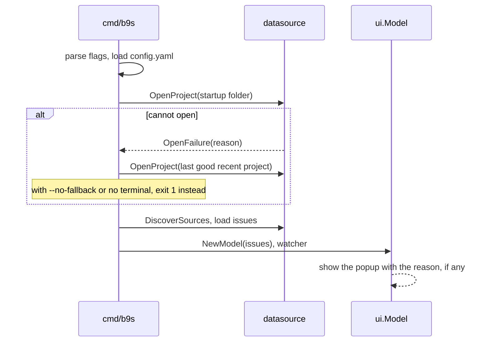
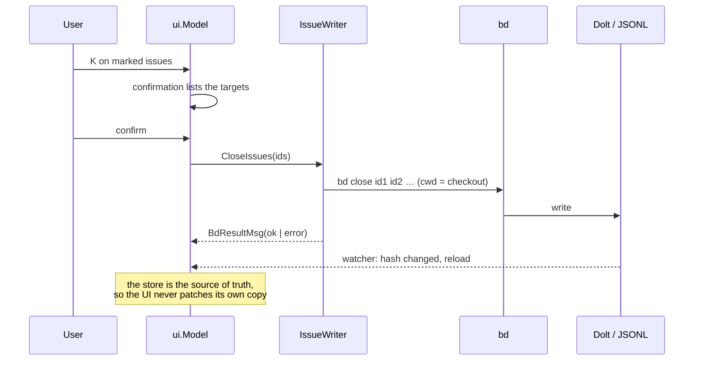

# b9s architecture

b9s is a Go program built on [Bubble Tea](https://github.com/charmbracelet/bubbletea). It reads Beads issues from a Dolt server, SQLite or JSONL, renders them as a tree with a Markdown detail pane, and makes every change by running the `bd` CLI. This document describes the packages, the data flow and the decisions that shape them. The [user guide](USER_GUIDE.md) describes what the program does from the outside.

## Contents

- [Overview](#overview)
- [Packages](#packages)
- [Startup](#startup)
- [Data sources](#data-sources)
- [Live reload](#live-reload)
- [The UI model](#the-ui-model)
- [Query state](#query-state)
- [Writes go through bd](#writes-go-through-bd)
- [Projects and the catalog](#projects-and-the-catalog)
- [People and identities](#people-and-identities)
- [Configuration](#configuration)
- [Decision records](#decision-records)

## Overview

```text
                 ┌──────────────────────────────────────────────────────┐
                 │ cmd/b9s: flags, config, project choice, tea.Program  │
                 └───────────────┬──────────────────────┬───────────────┘
                                 │ issues                │ watcher events
   ┌────────────────────┐        ▼                       ▼
   │ internal/datasource│  ┌─────────────────────────────────────────┐
   │  DoltReader        │─▶│ pkg/ui.Model (Bubble Tea)               │
   │  SQLiteReader      │  │  tree · detail · board · graph · prompt │
   │  JSONL (pkg/loader)│  │  query state · marks · pickers · forms  │
   └────────┬───────────┘  └───────────────┬─────────────────────────┘
            │ poll hash / fsnotify         │ exec
            ▼                              ▼
   ┌────────────────────┐        ┌────────────────────┐
   │ Dolt server / disk │◀───────│ bd CLI (writes)     │
   └────────────────────┘        └────────────────────┘
```

Reads and writes take different paths on purpose. b9s reads the store directly for speed and live reload. It never writes to the store itself, so the rules that `bd` enforces on create, update, close and delete apply to every change made in b9s.

## Packages

| Package | Role |
|---------|------|
| `cmd/b9s` | Flag parsing, configuration loading, startup project choice, data source discovery and the Bubble Tea program |
| `pkg/ui` | The whole terminal UI: the root `Model`, the tree, detail pane, board, graph, command prompt, pickers, forms, tutorial and the `IssueWriter` that runs `bd` |
| `pkg/model` | Domain types: `Issue`, `Dependency`, `Status`, `Priority` and their parsing |
| `internal/datasource` | Source discovery and readers for Dolt, SQLite and JSONL, plus the Dolt watcher, the project catalog and the open-failure reasons |
| `pkg/loader` | JSONL parsing, `.beads` directory lookup including `BEADS_DIR` and git worktrees, and git-history loading |
| `pkg/watcher` | File watching with debouncing, and a polling fallback on filesystems where events are unreliable |
| `pkg/identity` | The alias registry that maps creator and assignee names to people, agents and pools |
| `pkg/config` | `~/.config/b9s/config.yaml`: sort defaults, poll interval, recent projects |
| `pkg/updater` | Self-update from GitHub releases with checksum verification and rollback |
| `pkg/debug`, `pkg/version` | Debug logging behind `B9S_DEBUG`, and the version string set at build time |
| `pkg/testutil` | Deterministic fixture generators and assertion helpers for tests |
| `tests/e2e` | End-to-end tests that run the built binary in a pseudo-terminal |

`pkg/ui` is large because Bubble Tea keeps one model per program. The files split it by concern: `model.go` holds the root `Update` and key routing, `tree.go` the tree, `board.go` the board, `graph.go` the graph, `query_state.go` the query, `commands.go` the prompt aliases, `edit_modal.go` the forms, `issue_writer.go` the `bd` calls, and `project_*.go` the project header, table and switch.

## Startup



`chooseStartupProject` in `cmd/b9s/main.go` decides which project the UI starts in. The folder b9s runs in is tried first. When it cannot be opened, the most recent project that opened successfully is tried, and the failure is shown in a popup once the UI is up. A script gets an exit status instead, so it never acts on the wrong project. See [ADR 0012](adr/0012-open-a-project-before-replacing-the-visible-one.md).

## Data sources

`DiscoverSources` in `internal/datasource/source.go` looks in the `.beads` directory of the current folder, or the one named in `BEADS_DIR`, and returns every source it finds:

| Source | Found through | Reader |
|--------|---------------|--------|
| Dolt server | `metadata.json` with `"dolt_mode": "server"` | `DoltReader` over `go-sql-driver/mysql` |
| SQLite | `beads.db` | `SQLiteReader` |
| JSONL | `issues.jsonl`, also through a linked worktree's main checkout | `pkg/loader` |

A Dolt server always wins. If the connection fails, `cmd/b9s` falls back to SQLite and then JSONL and records the error for the `D` health popup. Embedded Dolt has no server to connect to and cannot be read.

`DoltReader` connects with the host, port, user and database from `metadata.json` and the password from `BEADS_DOLT_PASSWORD`. The password is sent only to a loopback address or an endpoint listed in `B9S_TRUSTED_DOLT_ENDPOINTS`, so a cloned repository cannot redirect it. See [ADR 0013](adr/0013-trust-dolt-endpoints-before-sending-environment-credentials.md).

`MultiDoltReader` in `dolt_multi.go` opens one `DoltReader` per database for the all-projects view (`0`). It is read-only.

## Live reload

The active source decides how changes are detected:

- **Dolt.** `DoltWatcher` polls `DOLT_HASHOF_DB()` at `refresh.poll_interval`, 500 ms by default. That hash covers the working set, not only `HEAD`, so a write from `bd` shows up without a Dolt commit.
- **JSONL.** `pkg/watcher` uses fsnotify with a debounce window, and switches to polling on NFS, SMB and similar filesystems where events do not arrive.
- **SQLite.** The file is watched like JSONL.

Every path ends in the same reload message to the UI model, which reloads the issues and keeps the cursor, the marks and the fold state. `Ctrl-R` and `F5` send that message by hand.

## The UI model

`ui.Model` is the Bubble Tea root. `Update` routes a key in this order:

1. Modal overlays: the tutorial, the help overlay, the edit form, the status picker, the confirmation, the project table and the command prompt each take every key while open.
2. The query field, while it is being edited. Every key goes into the query, so a query letter never triggers an action.
3. Global keys: project digits, `L` and `A` pickers, `b` and `g` for the board and the graph, `e`, `K`, `Delete`, `Ctrl-N`, `Ctrl-E`, `?`, `:` and `/`.
4. The focused pane: `handleTreeKeys`, `handleBoardKeys`, `handleGraphKeys` or the detail pane.

A key that a global handler consumes never reaches a pane. `b` is the board everywhere, so the tree's bookmark on `b` is unreachable. Keys that fall into this trap are tracked in Beads rather than documented as features.

The tree is always present. The board and the graph are overlays that `Esc` closes, and the detail pane sits beside the tree when the terminal is at least 100 columns wide, and over it otherwise. Each view owns its cursor and scroll state, and nothing else.

## Query state

The root model owns one query string and parses it into an immutable `IssueQuery` before any view derives its rows. The tree, the board and the graph therefore filter the same result set instead of implementing their own matching. See [ADR 0001](adr/0001-use-one-query-state-across-tui-views.md).

Plain words match issue IDs, titles and labels fuzzily and nothing else, so every hit is explained by data visible in its row. Predicates target `id`, `title`, `status`, `priority`, `type`, `label`, `assignee` and `project`. Values within one field combine with OR, fields and negations with AND, and priority is exact so `p1` never matches `p10`. An incomplete predicate adds no constraint. See [ADR 0002](adr/0002-use-global-fuzzy-matching-with-a-focused-search-field.md) and [ADR 0004](adr/0004-limit-plain-fuzzy-search-to-primary-fields.md).

The query runs against the loaded issues in memory. There is no round trip to the store, so results update on every keystroke.

## Writes go through bd



`IssueWriter` in `pkg/ui/issue_writer.go` finds `bd` on `PATH` at startup and runs it with `exec.Command` inside the project's checkout. Every write is one of `bd create`, `bd update`, `bd close`, `bd delete --force` or `bd defer`. Bulk actions send all marked IDs in one `bd` call.

A `Checkout` value can only be built by `NewCheckout` from a folder that has a `.beads` directory, so a project opened from its database alone cannot reach `bd`. The writer answers such a request with a read-only message rather than running anything. The all-projects view is read-only for the same reason.

Bulk actions act on the marked issues, or on the cursor row when nothing is marked. See [ADR 0011](adr/0011-bulk-actions-act-on-marks-else-cursor.md).

## Projects and the catalog

The header lists recent projects from `config.yaml`, not folders discovered by scanning. A new project takes key `1`, a known project keeps its key, and `lock_recent` freezes the list. A recent project whose database denies the startup user is left out of the header for the session, and its counts always come from the checkout's configured source. See [ADR 0008](adr/0008-list-recent-projects-instead-of-discovered-folders.md) and [ADR 0015](adr/0015-hide-recent-projects-the-startup-user-cannot-read.md).

`:project` opens the project table, which lists the databases on the startup project's Dolt server that the startup user can read. `catalog.go` classifies each database into a closed `Reachability` set from the MySQL error number, so a down tunnel is never reported as refused access or the reverse. Opening a database without a checkout reads it as the startup user, the only credential b9s holds. See [ADR 0007](adr/0007-read-shared-beads-through-one-select-only-catalog-account.md) and [ADR 0009](adr/0009-open-entity-views-from-a-colon-command-prompt.md).

A project switch is a small state machine in `project_switch.go`. While a project is `Opening`, the current one stays on screen and usable, and it is replaced only once the new one has loaded. A deadline of ten seconds bounds the wait, with the Dolt connect timeout of five seconds inside it. A failure keeps the old project and shows the `OpenReason`, a closed set that the CLI and the TUI share.

## People and identities

Each issue carries a fixed Creator (`created_by`, with the git email in `owner`) and a changing Assignee. The readers fill `CreatedBy` and `Owner` in `internal/datasource/creators.go`, and leave them empty on schemas without those columns.

The names in those fields are aliases. `pkg/identity` resolves them to identities from the `bd` config key `b9s.identities` and from `bd`'s own `claim.pools`, and compares names as `bd`'s claim path does. `pkg/ui/identities.go` loads the registry off the update loop when a Dolt project opens and on every reload, and drops a load that finishes after a project switch.

```
config table ──▶ LoadIdentityConfig ──▶ identity.Parse ──▶ Registry
                                                            │
     assignee picker, filters, suggestions ◀────────────────┤
     Ctrl-N actor (BEADS_ACTOR > BD_ACTOR > git > USER) ◀───┤
     health popup: SQL login, You:, conflicts ◀─────────────┘
```

The Dolt SQL login is a workspace credential shared by every agent, so it is shown but never used as a person. See [ADR 0014](adr/0014-map-actors-to-identities-in-b9s-config.md).

## Configuration

`pkg/config` reads `~/.config/b9s/config.yaml`. The sort field names in `config.go` must stay in step with `ui.SortField`, and a test in `pkg/ui` checks that. An unknown field or direction makes the file fail to load, and a file that fails to load is ignored as a whole and never overwritten. See [ADR 0010](adr/0010-take-tree-sort-from-user-config.md).

## Decision records

The decisions behind this document live in [docs/adr](adr/). Each record is immutable once active. A change of direction gets a new record that supersedes the old one.
