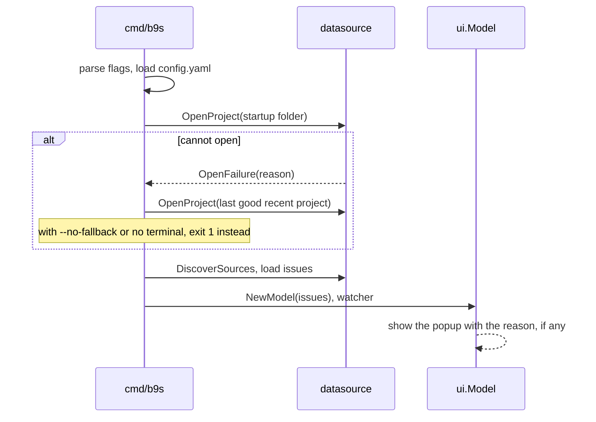
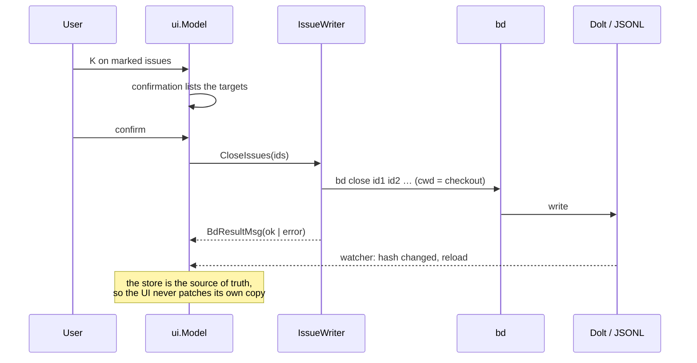

# b9s architecture

b9s is a Go program built on [Bubble Tea](https://github.com/charmbracelet/bubbletea). It reads Beads issues from a Dolt server, SQLite or JSONL, renders them as a tree with a Markdown detail pane, and makes every change by running the `bd` CLI. This document describes the packages, the data flow and the decisions that shape them. The [user guide](USER_GUIDE.md) describes what the program does from the outside.

## Contents

- [Overview](#overview)
- [Packages](#packages)
- [Startup](#startup)
- [Data sources](#data-sources)
- [Memory preview adapter](#memory-preview-adapter)
- [Live reload](#live-reload)
- [Control socket](#control-socket)
- [The UI model](#the-ui-model)
- [Query state](#query-state)
- [Writes go through bd](#writes-go-through-bd)
- [Projects and the catalog](#projects-and-the-catalog)
- [People and identities](#people-and-identities)
- [The web UI](#the-web-ui)
- [Configuration](#configuration)
- [Decision records](#decision-records)

## Overview

```text
                 ┌──────────────────────────────────────────────────────┐
                 │ cmd/b9s: flags, config, project choice, tea.Program  │
                 └───────────────┬──────────────────────┬───────────────┘
                                 │ issues                │ watcher events
   ┌────────────────────┐        ▼                       ▼
   │ internal/datasource│  ┌─────────────────────────────────────────┐
   │  DoltReader        │─▶│ pkg/ui.Model (Bubble Tea)               │
   │  SQLiteReader      │  │  tree · detail · board · graph · prompt │
   │  JSONL (pkg/loader)│  │  query state · marks · pickers · forms  │
   └────────┬───────────┘  └───────────────┬─────────────────────────┘
            │ poll hash / fsnotify         │ exec
            ▼                              ▼
   ┌────────────────────┐        ┌────────────────────┐
   │ Dolt server / disk │◀───────│ bd CLI (writes)     │
   └────────────────────┘        └────────────────────┘
```

Reads and writes take different paths on purpose. b9s reads the store directly for speed and live reload. It never writes to the store itself, so the rules that `bd` enforces on create, update, close and delete apply to every change made in b9s.

Every `bd` run goes through `internal/bdrun`, with a literal argv and no shell. It runs under a deadline: 60 seconds for one write from the TUI, plus 2 seconds per issue in a batch, and 2 minutes for each `b9s attach` subcommand. At the deadline b9s kills `bd` and its whole process group. The exit status of `bd` decides the result whenever `bd` exits by itself, so a write that completed is never reported as a timeout, even when a child of `bd` still holds its output open.

## Packages

| Package | Role |
|---------|------|
| `cmd/b9s` | Flag parsing, configuration loading, startup project choice, data source discovery and the Bubble Tea program |
| `pkg/ui` | The whole terminal UI: the root `Model`, the tree, detail pane, board, graph, command prompt, pickers, forms, tutorial and the `IssueWriter` that runs `bd` |
| `pkg/model` | Domain types: `Issue`, `Dependency`, `Status`, `Priority` and their parsing |
| `internal/datasource` | Source discovery and readers for Dolt, SQLite and JSONL, plus the Dolt watcher, the project catalog and the open-failure reasons |
| `internal/bdrun` | Finding and running `bd`: the deadline, the process-group kill, and the timeout and cancel errors |
| `internal/attach` | Attaching and detaching files: upload to the blob store, then a reference comment through `bd` (ADR 0024). `GC` deletes blobs that no comment references once they are older than the grace period, and checks each one again just before it deletes it |
| `internal/attachref` | The versioned attachment reference line in a comment, and the fold of comments into an issue's attachment list |
| `internal/blobstore` | Content-addressed blob storage with local and S3 backends, and store selection from the `attachments` config |
| `internal/control` | The control socket: instance registration, the verb set, picking the instance in the caller's tmux window, and the `b9s ctl` client side |
| `pkg/loader` | JSONL parsing, `.beads` directory lookup including `BEADS_DIR` and git worktrees, and git-history loading |
| `pkg/watcher` | File watching with debouncing, and a polling fallback on filesystems where events are unreliable |
| `pkg/identity` | The alias registry that maps creator and assignee names to people, agents and pools |
| `pkg/config` | `~/.config/b9s/config.yaml`: sort defaults, poll interval, recent projects. `hotkeys.yaml`: user hotkeys |
| `pkg/updater` | Self-update from GitHub releases: checksum and Sigstore provenance verification (ADR 0028), then rollback support. It reads `/releases/latest`, which skips a release candidate: GoReleaser publishes a `-rc` tag as a GitHub prerelease and does not push it to the Homebrew tap |
| `pkg/debug`, `pkg/version` | Debug logging behind `B9S_DEBUG`, and the running build: version and commit from the release ldflags, or from Go build info for `go install` and local builds |
| `pkg/testutil` | Deterministic fixture generators and assertion helpers for tests |
| `pkg/web` | `b9s web`: the HTTP API, the server-sent event stream, pairing and sessions, the write endpoint, and the embedded browser bundle in `dist` |
| `web` | The browser app in TypeScript, built with esbuild into `pkg/web/dist`, and its Playwright tests |
| `tests/e2e` | End-to-end tests that run the built binary in a pseudo-terminal |

`pkg/ui` is large because Bubble Tea keeps one model per program. The files split it by concern: `model.go` holds the root `Update` and key routing, `tree.go` the tree, `board.go` the board, `board_lanes.go` the epic lanes and cards, `board_epics.go` the epic index and the facts each epic cell shows (ADR 0030), `graph.go` the graph, `query_state.go` the query, `commands.go` the prompt aliases, `edit_modal.go` the forms, `issue_writer.go` the `bd` calls, and `project_*.go` the project header, table and switch.

## Startup


```mermaid
sequenceDiagram
    participant CLI as cmd/b9s
    participant DS as datasource
    participant UI as ui.Model
    CLI->>CLI: parse flags, load config.yaml
    CLI->>DS: OpenProject(startup folder)
    alt cannot open
        DS-->>CLI: OpenFailure(reason)
        CLI->>DS: OpenProject(last good recent project)
        Note over CLI: with --no-fallback or no terminal, exit 1 instead
    end
    CLI->>DS: DiscoverSources, load issues
    CLI->>UI: NewModel(issues), watcher
    UI-->>UI: show the popup with the reason, if any
```

`chooseStartupProject` in `cmd/b9s/main.go` decides which project the UI starts in. The folder b9s runs in is tried first. When it cannot be opened, the most recent project that opened successfully is tried, and the failure is shown in a popup once the UI is up. A script gets an exit status instead, so it never acts on the wrong project. See [ADR 0012](adr/0012-open-a-project-before-replacing-the-visible-one.md).

## Data sources

`DiscoverSources` in `internal/datasource/source.go` looks in the `.beads` directory of the current folder, or the one named in `BEADS_DIR`, and returns every source it finds:

| Source | Found through | Reader |
|--------|---------------|--------|
| Dolt server | `metadata.json` with `"dolt_mode": "server"` | `DoltReader` over `go-sql-driver/mysql` |
| Embedded Dolt | `metadata.json` with `"dolt_mode": "embedded"` | `bd export` through `bdrun.Output`, parsed by `pkg/loader` (`embedded.go`) |
| SQLite | `beads.db` | `SQLiteReader` |
| JSONL | `issues.jsonl`, also through a linked worktree's main checkout | `pkg/loader` |

A Dolt server always wins. If the connection fails, `cmd/b9s` falls back to SQLite and then JSONL and records the error for the `D` health popup.

`loader.FindJSONLPath` picks the JSONL file. It takes a non-empty file under a canonical name (`beads.jsonl`, `issues.jsonl`, `beads.base.jsonl`) first. A file under another name counts only when its first record is one the loader accepts as an issue, because bd keeps other journals in `.beads` (prefix routes, interactions) and a Dolt project keeps no export at all. An empty file counts only under a canonical name. With no file left, there is no JSONL fallback, and a Dolt project whose server refuses the connection opens as server down instead of as an empty project.

Embedded Dolt ranks with a Dolt server. b9s never opens the store: it runs `bd export` with `BEADS_DIR` set and parses stdout only, because `bd` holds the store's lock for as long as a process has it open. When the export fails, `OpenProject` reports it (`OpenNoBD` when `bd` is missing) and does not fall back to an `issues.jsonl` beside the store. See [ADR 0025](adr/0025-read-embedded-dolt-through-bd-export.md).

`DoltReader` connects with the user and database from `metadata.json` and the password from `BEADS_DOLT_PASSWORD`. `resolveDoltAddress` (`internal/datasource/dolt_address.go`) picks the host and port with bd's own precedence: environment, then the port file bd writes for a server it started, then the Dolt server's `listener.port`, then `dolt.port` in `config.yaml`, then `metadata.json`. A project whose `metadata.json` names no port is the common case, because bd starts its server on a free port and records it only in `.beads/dolt-server.port`. The password is sent only to a loopback address or an endpoint listed in `B9S_TRUSTED_DOLT_ENDPOINTS`, so a cloned repository cannot redirect it. See [ADR 0013](adr/0013-trust-dolt-endpoints-before-sending-environment-credentials.md).

`MultiDoltReader` in `dolt_multi.go` opens one `DoltReader` per database for the all-projects view (`0`). It is read-only.

## Memory preview adapter

`b9s memories` reads an isolated graph preview workspace through its matching `bd` binary. `internal/datasource/graph_preview.go` checks `graph_mode` and `graph_ready`, and its `GraphPreviewClient` wraps the preview reads: `bd memories` for summaries and literal search, `bd list --format records-json --all` for the inventory, `bd show --version` for a body at a retained version, `bd links` for incident Links and `bd versions` for the retained versions. It rejects `hasMore`, since the current CLI has no continuation cursor, and reports bd's refusal code in its errors. It opens no Dolt store directly.

Regular b9s embeds `pkg/ui/memory_view.go`: `M` opens Memory wires and `\` expands details. Wires are the only terminal relationship layout. They open with all context shown, and `Shift+Tab` collapses unrelated runs ([ADR 0047](adr/0047-show-all-wire-context-by-default.md)). The browser reuses the main model's loaded graph, keeps selection when hidden, and scopes asynchronous replies to the current project generation. Status and literal search filters produce the visible graph without changing its source snapshot. `DetectMemory` decides availability before any read: the workspace must be a ready graph workspace with a supported schema, and a bounded probe of `bd versions`, `bd links` and `bd memories` help output, cached per bd binary by `internal/bdrun/capability.go`, must find the preview dialect. Unless both hold, `M`, the web Memory tab and `b9s memories` state the reason in one line. `B9S_MEMORY=off` turns the views off; a graph workspace still loads its Issues from the inventory ([ADR 0046](adr/0046-memory-lever-keeps-graph-workspace-issues.md)). There is no version or branch allowlist, and cached data cannot conceal CLI capability failures. See [ADR 0045](adr/0045-probe-bd-help-before-memory-reads.md). The standalone command also opens the browser for direct list/version access. It reads a Memory's body and Links only when selected, caching them per Memory and version. With `--print`, `--id` or a non-terminal, it prints instead. See [ADR 0044](adr/0044-keep-terminal-memory-wires-and-detect-capabilities.md). The web graph draws each Link kind as its UML connector, with reader-set line thickness ([ADR 0048](adr/0048-draw-memory-links-as-uml-connectors.md)). The terminal wires draw the same connectors in heavy box-drawing glyphs from one table in `pkg/ui/memory_graph_view.go`, one labelled run per Link, and `Enter` or a click opens the selected record in a detail panel beside the wires that `Esc` closes ([ADR 0050](adr/0050-label-heavy-terminal-wires-and-open-a-wires-detail-panel.md)).

`GraphPreviewClient.Graph` in `internal/datasource/memory_graph.go` takes every node and Memory-owned Link from the inventory, then runs `bd graph --view generic --direction both` for components containing Issues or unknown Types. Issue informational Links are unowned, so these traversals supply Links absent from the inventory. Complete owned records take precedence over traversal summaries. Titles and bodies remain literal. Only Issues have lifecycle status. `b9s memories` reads the graph on the first press of `2`. The main TUI loads the Issues of an embedded `graph_mode: link` source that `DetectMemory` finds ready from the inventory alone, since its CLI refuses `bd export`; the inventory owns every Issue and its `child-of` and blocking Links. The graph, with its traversals, is read only when the Memory view opens or an Issue detail is shown, and is then cached by `.beads` directory (`StoreMemoryGraph`). `Graph` reports each finished traversal through its progress callback, and `MemoryBrowser.graphCmd` streams the latest count to the view and the detail as a progress bar. A reload of the Issues re-reads a graph that was read, keeping the old one on screen meanwhile. The tree's MEMORY LINKS column and detail section read that same cache through `TreeModel.SetDecisionLookup`. See [ADR 0051](adr/0051-read-the-memory-graph-on-request-with-progress.md). See [ADR 0042](adr/0042-show-native-memory-relationships-with-focus-wires.md).

The web Store reads that graph on the first request for it. Its authenticated, read-only `/api/memory-graph` endpoint, or `/api/issue` for an Issue's Memory Links, starts one background read per project and answers `loading: true` with `done` and `total` until it finishes. The finished read raises the version and publishes `changed`, so the browser fetches the snapshot, the graph and the open detail again; a reload re-reads a graph that was read. Once read, the endpoint serves native nodes, bodies and typed Links, or `available: false` with the one-line `reason` from `DetectMemory`. A failed read is reported to one request, and the next one retries. `web/src/memory.ts` polls every 250 ms while the graph loads and draws a progress bar. `web/src/memory.ts` assigns stable card positions and supports Type filters, neighbourhood highlighting, pan and zoom. The terminal offers focus wires with collapsed unrelated context, endpoint paging and a scrollable detail strip.

The browser offers network, radial and column arrangements. A bounded deterministic relaxation and collision pass place network cards before rendering. Explicit layout changes recalculate positions and fit the viewport. Selection and Type filtering reuse those positions. Overview scale shows record IDs, and the neighbour-fit control frames the selected record's incident Links.

The [Memory transport investigation](memory-read-research.md) keeps the CLI
boundary after comparing SQL and BDP. [ADR 0041](adr/0041-retain-cli-memory-reads-after-transport-probes.md)
records the locking, validation and snapshot requirements for a replacement.
It adds no automatic Memory graph refresh.

## Live reload

The active source decides how changes are detected:

- **Dolt.** `DoltWatcher` polls `DOLT_HASHOF_DB()` at `refresh.poll_interval`, 500 ms by default. That hash covers the working set, not only `HEAD`, so a write from `bd` shows up without a Dolt commit.
- **Embedded Dolt.** The same `DoltWatcher` polls a fingerprint of the store instead: the content of each `manifest` and the size of the chunk journal. Every other file is left out, because `bd` rewrites `journal.idx` and writes temporary manifests while it only reads, and those would turn each reload into the trigger for the next.
- **JSONL.** `pkg/watcher` uses fsnotify with a debounce window, and switches to polling on NFS, SMB and similar filesystems where events do not arrive.
- **SQLite.** The file is watched like JSONL.

Every path ends in the same reload message to the UI model, which reloads the issues and keeps the cursor, the marks and the fold state. `Ctrl-R` and `F5` send that message by hand.

## Control socket

Every TUI instance serves `internal/control` on a unix socket in a 0700 state directory and writes `<pid>.json` beside it with its tmux pane. `b9s ctl` lists the registrations, drops those whose process is gone, picks the one in the caller's tmux window and sends one JSON request. The server checks the verb against a closed set and hands the request to the program with `tea.Program.Send`, so it enters `Update` like any other message. A request with `if_known` candidates becomes `ShowKnownBranchMsg`, which never waits for a missing id, so guessed ids leave no trace.

`branch <id>` becomes `ShowBranchMsg`. The model selects the issue and sets the branch filter; when the id is not loaded it keeps the request and retries after every message until a five-second deadline message ends it. See [ADR 0023](adr/0023-steer-a-running-b9s-through-a-control-socket.md).

## The UI model

`ui.Model` is the Bubble Tea root. `Update` routes a key in this order:

1. Modal overlays: the tutorial, the help overlay, the edit form, the status picker, the confirmation, the project table and the command prompt each take every key while open.
2. The query field, while it is being edited. Every key goes into the query, so a query letter never triggers an action.
3. Global keys: project digits, `L` and `A` pickers, `b` and `g` for the board and the graph, `e`, `K`, `Delete`, `U` for the update confirmation, `Ctrl-N`, `Ctrl-E`, `?`, `:` and `/`.
4. The focused pane: `handleTreeKeys`, `handleBoardKeys`, `handleGraphKeys` or the detail pane.

A key that a global handler consumes never reaches a pane. `b` is the board everywhere, so the tree's bookmark on `b` is unreachable. Keys that fall into this trap are tracked in Beads rather than documented as features.

The tree is always present. The board and the graph are overlays that `Esc` closes, and the detail pane sits beside the tree when the terminal is at least 100 columns wide, and over it otherwise. Each view owns its cursor and scroll state, and nothing else.

`pkg/ui/markdown.go` renders supported Mermaid fences before Glamour renders the surrounding Markdown. It uses a vendored Go renderer for TD, TB and LR flowcharts and sequence diagrams. Sequence diagrams show participant boxes at both ends of the lifelines, except for participants destroyed before the footer. The footer is a local patch in the vendored renderer, so reapplying it is necessary after `go mod vendor`. Unsupported syntax, parser failures and output wider than the detail pane stay as source code. The renderer checks display width after layout and runs again when the pane width changes. The issue copy path still uses the original Markdown. See [ADR 0030](adr/0030-render-mermaid-as-terminal-text-in-the-detail-view.md).

The tree pane draws its rows in one of two layouts. The tree keeps each match's ancestors on screen, dimmed, and sorts siblings within their parent. Under the Created and Updated sorts a parent ranks by the newest date in its subtree, so fresh work on a subtask lifts its epic ([ADR 0032](adr/0032-rank-tree-parents-by-newest-descendant-date.md)). The flat list shows only the matches, one row each, sorted across the whole project. `t` chooses the layout and `.beads/tree-state.json` keeps the choice per project. A `type:` predicate in the query forces the list, because the context rows the tree would add are the types the query leaves out. See [ADR 0027](adr/0027-show-a-flat-list-for-type-queries-and-on-t.md). `F1`-`F4` write that predicate for epics, features, tasks and bugs: each key replaces the query's type terms with its own, and pressing it again removes it ([ADR 0034](adr/0034-bind-issue-types-to-function-keys.md)). User hotkeys from `hotkeys.yaml` run `:` commands, and a type or `issues` command with query terms replaces the query ([ADR 0035](adr/0035-take-hotkeys-from-a-k9s-style-hotkeys-file.md)).

## Query state

The root model owns one query string and parses it into an immutable `IssueQuery` before any view derives its rows. The tree, the board and the graph therefore filter the same result set instead of implementing their own matching. See [ADR 0001](adr/0001-use-one-query-state-across-tui-views.md).

Plain words match issue IDs, titles and labels fuzzily and nothing else, so every hit is explained by data visible in its row. Predicates target `id`, `title`, `status`, `priority`, `type`, `label`, `assignee` and `project`. Values within one field combine with OR, fields and negations with AND, and priority is exact so `p1` never matches `p10`. An incomplete predicate adds no constraint. See [ADR 0002](adr/0002-use-global-fuzzy-matching-with-a-focused-search-field.md) and [ADR 0004](adr/0004-limit-plain-fuzzy-search-to-primary-fields.md).

The query runs against the loaded issues in memory. There is no round trip to the store, so results update on every keystroke.

## Writes go through bd


```mermaid
sequenceDiagram
    participant User
    participant UI as ui.Model
    participant W as IssueWriter
    participant bd
    participant Store as Dolt / JSONL
    User->>UI: K on marked issues
    UI->>UI: confirmation lists the targets
    User->>UI: confirm
    UI->>W: CloseIssues(ids)
    W->>bd: bd close id1 id2 …  (cwd = checkout)
    bd->>Store: write
    W-->>UI: BdResultMsg(ok | error)
    Store-->>UI: watcher: hash changed, reload
    Note over UI: the store is the source of truth,<br/>so the UI never patches its own copy
```

`IssueWriter` in `pkg/ui/issue_writer.go` finds `bd` on `PATH` at startup and runs it with `exec.Command` inside the project's checkout. Every write is one of `bd create`, `bd update`, `bd close`, `bd delete --force` or `bd defer`. Bulk actions send all marked IDs in one `bd` call.

A `Checkout` value can only be built by `NewCheckout` from a folder that has a `.beads` directory, so a project opened from its database alone cannot reach `bd`. The writer answers such a request with a read-only message rather than running anything. The all-projects view is read-only for the same reason.

Bulk actions act on the marked issues, or on the cursor row when nothing is marked. See [ADR 0011](adr/0011-bulk-actions-act-on-marks-else-cursor.md).

## Projects and the catalog

The header lists recent projects from `config.yaml`, not folders discovered by scanning. A new project takes key `1`, a known project keeps its key, and `lock_recent` freezes the list. A recent project whose database denies the startup user is left out of the header for the session, and its counts always come from the checkout's configured source. See [ADR 0008](adr/0008-list-recent-projects-instead-of-discovered-folders.md) and [ADR 0015](adr/0015-hide-recent-projects-the-startup-user-cannot-read.md).

`:project` opens the project table, which lists the databases on the startup project's Dolt server that the startup user can read. `catalog.go` classifies each database into a closed `Reachability` set from the MySQL error number, so a down tunnel is never reported as refused access or the reverse. Opening a database without a checkout reads it as the startup user, the only credential b9s holds. See [ADR 0007](adr/0007-read-shared-beads-through-one-select-only-catalog-account.md) and [ADR 0009](adr/0009-open-entity-views-from-a-colon-command-prompt.md), superseded in part by [ADR 0027](adr/0027-show-a-flat-list-for-type-queries-and-on-t.md).

A project switch is a small state machine in `project_switch.go`. While a project is `Opening`, the current one stays on screen and usable, and it is replaced only once the new one has loaded. A deadline of ten seconds bounds the wait, with the Dolt connect timeout of five seconds inside it. A failure keeps the old project and shows the `OpenReason`, a closed set that the CLI and the TUI share.

## People and identities

Each issue carries a fixed Creator (`created_by`, with the git email in `owner`) and a changing Assignee. The readers fill `CreatedBy` and `Owner` in `internal/datasource/creators.go`, and leave them empty on schemas without those columns.

The names in those fields are aliases. `pkg/identity` resolves them to identities from the `bd` config key `b9s.identities` and from `bd`'s own `claim.pools`, and compares names as `bd`'s claim path does. `pkg/ui/identities.go` loads the registry off the update loop when a Dolt project opens and on every reload, and drops a load that finishes after a project switch.

```
config table ──▶ LoadIdentityConfig ──▶ identity.Parse ──▶ Registry
                                                            │
     assignee picker, filters, suggestions ◀────────────────┤
     Ctrl-N actor (BEADS_ACTOR > BD_ACTOR > git > USER) ◀───┤
     health popup: SQL login, You:, conflicts ◀─────────────┘
```

The Dolt SQL login is a workspace credential shared by every agent, so it is shown but never used as a person. See [ADR 0014](adr/0014-map-actors-to-identities-in-b9s-config.md).

## The web UI

`b9s web` (`cmd/b9s/web.go`) serves one project to browsers. It reuses the TUI's readers, watcher, query parser and `IssueWriter`, so the browser sees the same data and makes the same `bd` calls.

```text
  phone ──https──▶ tailscale serve ──▶ 127.0.0.1:7979  pkg/web.Server
                                          │
             GET /api/snapshot, /issue,   │  Store: one open project,
             /query, /health, /projects   │  version counter, watcher
             GET /api/events (SSE) ◀──────┤
             POST /api/write ─────────────┼──▶ ui.IssueWriter ──▶ bd
                                          ▼
                                   Dolt / SQLite / JSONL
```

- **Store** (`store.go`) holds the open project and a version number that goes up on each watcher event. The snapshot is lean: long text and comments come from `/api/issue` when the detail opens.
- **Events** (`/api/events`) send `hello` with the current version on connect, then `changed`, `project` and `health`. The browser fetches a new snapshot when the version moves, so a missed event costs one fetch, never a wrong list.
- **Queries** go to the server (`/api/query`), which runs the TUI's `ParseIssueQuery`, so the browser never has a second query language.
- **Writes** (`write.go`) accept a closed set of operations, check them, and call `IssueWriter`. A failed `bd` answers 422 with its output. A write needs the session cookie and the `X-B9s-CSRF` header.
- **Auth** (`auth.go`) derives the pairing token from a secret in the config folder, so a paired phone stays paired across restarts. See [ADR 0020](adr/0020-pair-every-browser-with-a-persistent-token.md).
- **Types**: `web/src/api.gen.ts` is generated from `types.go` by `TestGeneratedTypesAreCurrent`, and fails that test when stale.
- **Bundle**: `pkg/web/dist` is committed and embedded with `go:embed`. `dist/source.sha256` hashes the inputs, and `TestEmbeddedBundleIsCurrent` fails when `web/` changed without `make web`. The GoReleaser before-hook runs that test and `TestGeneratedTypesAreCurrent`, so a release cannot ship a stale bundle and needs no Node.
- **Mermaid**: the browser loads the pinned Mermaid asset only when a detail contains a Mermaid fence. It renders SVG in strict mode, keeps escaped source on failure, and preserves the original text for copy and edit. The asset is embedded with the web bundle. See [ADR 0031](adr/0031-render-mermaid-in-the-web-detail-view.md).

The browser app (`web/src`) keeps one module per concern: `api.ts` the fetch and SSE client, `data.ts` the snapshot and derived fields, `state.ts` the view state and filters, `render.ts` the DOM, `actions.ts` writes, sheets and undo, `gestures.ts` the pointer handlers, `nav.ts` the browser history, and `main.ts` the boot and live updates. `nav.ts` derives the place (view, detail stack, graph path) from the view state after each render and pushes, replaces or steps back a history entry, so no action has to call the History API itself. A live change that arrives while a finger is on a row waits until the gesture ends. See [ADR 0019](adr/0019-serve-a-mobile-web-ui-from-b9s-web.md).

## Configuration

`pkg/config` reads `~/.config/b9s/config.yaml`. The sort field names in `config.go` must stay in step with `ui.SortField`, and a test in `pkg/ui` checks that. An unknown field or direction makes the file fail to load, and a file that fails to load is ignored as a whole and never overwritten. See [ADR 0010](adr/0010-take-tree-sort-from-user-config.md).

## Decision records

The decisions behind this document live in [docs/adr](adr/). Each record is immutable once active. A change of direction gets a new record that supersedes the old one.
