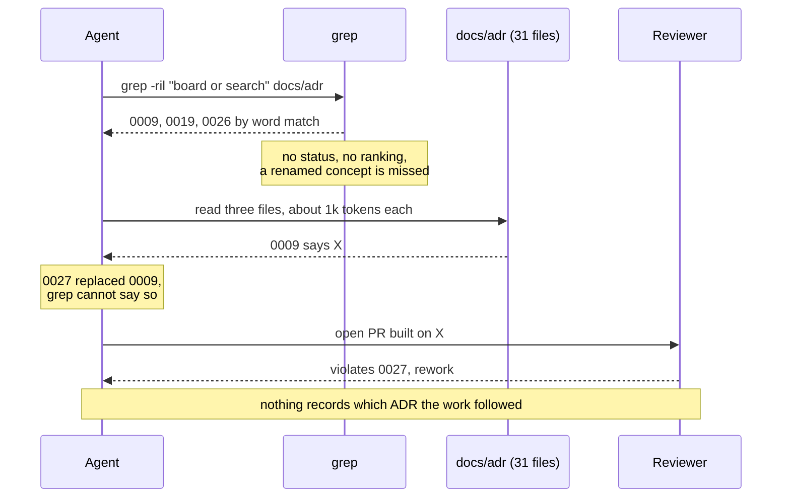
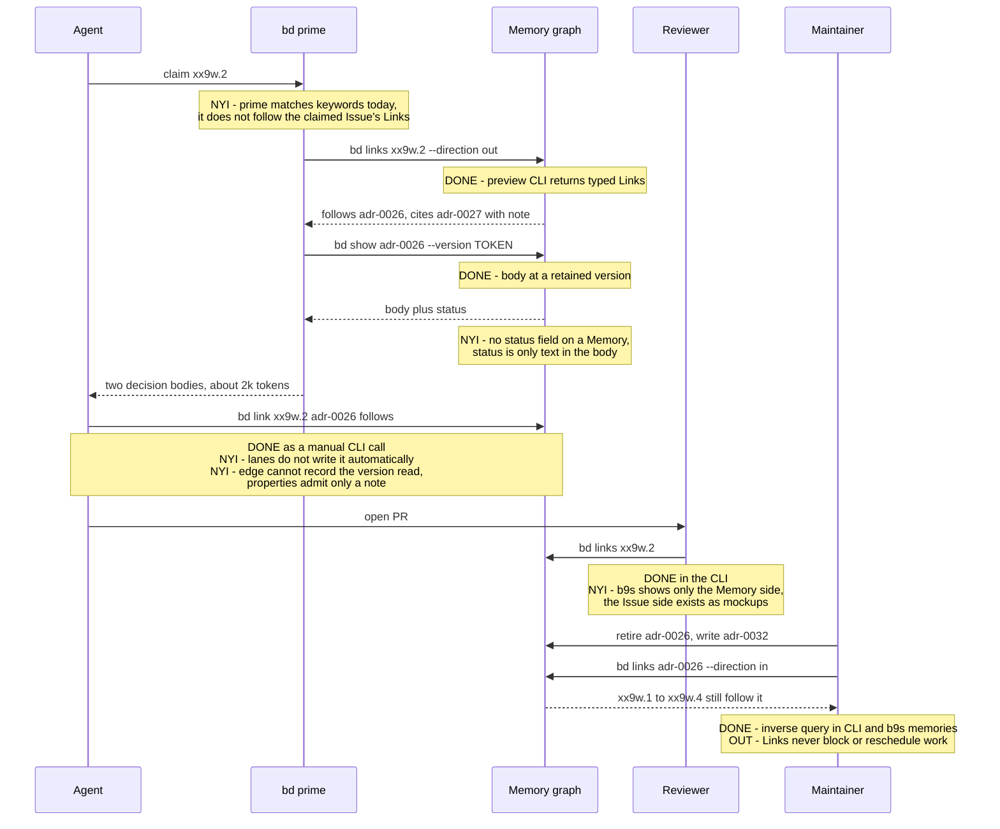

# Regular ADRs versus Memory Beads

How an agent working on b9s gets the right architecture decision into its context, today with
ADR files and grep, and in the proposed flow with Memory Beads and `bd prime`. Each step in the
second diagram is marked with what exists in the pinned Memory preview, what is not yet
implemented, and what is out of scope for this evaluation.

Evidence comes from the isolated POC workspace (`docs/memory-poc.md`): 13 ADRs imported as
Memories, 20 b9s epics and features copied as Issues, and 20 hand-written `follows` and `cites`
Links (epic `bd-db5q`, ticket `bd-db5q.11`). The five graph view mockups are in
[`mockups/memory-graph/`](mockups/memory-graph/index.html).

## The difference in one table

| Question | Regular ADR + grep | Memory Bead + edges |
|---|---|---|
| Where does the decision live? | A Markdown file in `docs/adr/`, versioned by git | A Memory record in the Beads graph, with retained versions |
| How does an agent find it? | Text search on words it guesses | Follows the Links on the claimed Issue |
| Does it know the status? | Only if it opens the file and reads the frontmatter | Not today: the preview has no status field, status is body text |
| Which version did it read? | Whatever is on disk at that moment | Pinnable with `bd show --version`, but not recorded on the edge |
| Who uses this decision? | Grep the ticket texts, hope they mention the number | `bd links ADR --direction in` |
| What breaks when a decision is replaced? | Nobody knows until a reviewer notices | One query lists every open Issue on the retired decision |
| What trace does the work leave? | None, unless the commit message says so | A `follows` Link from the Issue to the Memory |
| Cost to adopt | Zero, it is how b9s works today | Edges must be written, and the loop below must be built |

The Memory itself is not the gain. A Memory is still a Markdown body. The gain is the typed edge
between work and decision, and only if something reads and writes those edges automatically.

## Path A: today, ADR files found with grep

Everything in this path exists and runs on every b9s session.

## Path B: proposed, Memory Beads put into context by bd prime

Legend for the notes: **DONE** works in the pinned preview today. **NYI** is not yet implemented.
**OUT** is out of scope for this evaluation.

## Status of each capability

| Capability | State | Notes |
|---|---|---|
| Memories with retained versions (`bd remember`, `bd versions`, `bd show --version`) | DONE | Retained versions only, not full history |
| Typed Links between Issues and Memories (`bd link`, `bd links`) | DONE | `preview-related-v2`, informational |
| Inverse query, who follows a decision | DONE | CLI and the `b9s memories` browser |
| Browse Memories, Links and versions in b9s | DONE | `b9s memories`, ADR 0031 |
| `bd prime` injects the Memories linked from the claimed Issue | NYI | Today it matches keywords, like grep |
| Agents write the `follows` Link when they apply a decision | NYI | 20 Links took about 15 minutes by hand |
| Structured status field on a Memory | NYI | Upstream finding for `bd-db5q.8` |
| Edge records the Memory version the agent read | NYI | Edge properties admit only `note` |
| Issue side of the graph in b9s (DECISIONS column, graph view) | NYI | Five mockups in `mockups/memory-graph/` |
| Bulk read of all Links for a tree column | NYI | One `bd links` per Issue costs about 0.4 s |
| Links that block or reschedule work when a decision is retired | OUT | Informational Links have no scheduling effect by design |
| Semantic or synonym search over Memories | OUT | The preview search is literal over title and body |
| Full edit history of a Memory | OUT | bd retains selected versions, git keeps the ADR history |

## What decides whether Path B is worth it

Path B is Path A plus bookkeeping until the two NYI steps at the top of the diagram exist:
`bd prime` following Links, and agents writing the `follows` Link back. With both in place, run
five real b9s tasks in a lane and compare against a baseline of the last 20 PRs:

1. Reviewer findings that cite an ADR, per PR (rework).
2. Tokens spent reading `docs/adr` at session start (context cost).

If neither number moves, regular ADRs with grep remain the right tool for b9s, and the Memory
browser stays a viewer for workspaces that already use Memories.
