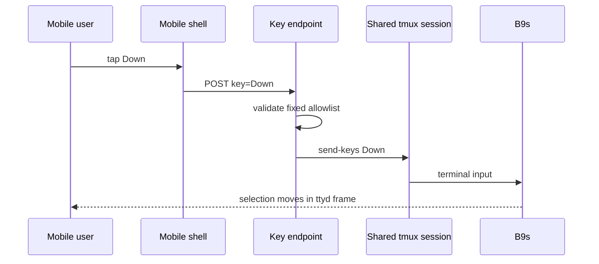

## Context

The browser preview exposes B9s through ttyd. Desktop browsers can send the
full terminal keyboard, but mobile keyboards do not reliably expose arrow,
page, Enter or Escape keys. Dispatching synthetic keyboard events into ttyd is
browser-dependent and couples the wrapper to ttyd's private DOM structure.

## Decision

**The mobile preview sends a small allowlist of navigation keys to a CGI endpoint,
which writes them into the same tmux session used by both ttyd listeners.**

## Options considered

- **Allowlisted server-side keys through tmux** (chosen): reliable across mobile
  browsers and independent of ttyd internals, at the cost of one tiny control
  endpoint and a shared preview session.
- **Synthetic events in the ttyd iframe**: fewer server components, but depends
  on private DOM details and browser treatment of untrusted keyboard events.
- **A separate mobile application**: complete control over interaction, but
  duplicates the TUI and its behavior.

## Consequences

Desktop and mobile viewers see the same disposable preview session. The control
endpoint accepts only navigation keys and project digits, rejects other input,
and is exposed only with the preview itself. Concurrent viewers can move the
same selection, which is acceptable for a review preview but not for a
multi-user application. Re-evaluate if B9s gains a native web UI or ttyd exposes
a stable, authenticated input API.
