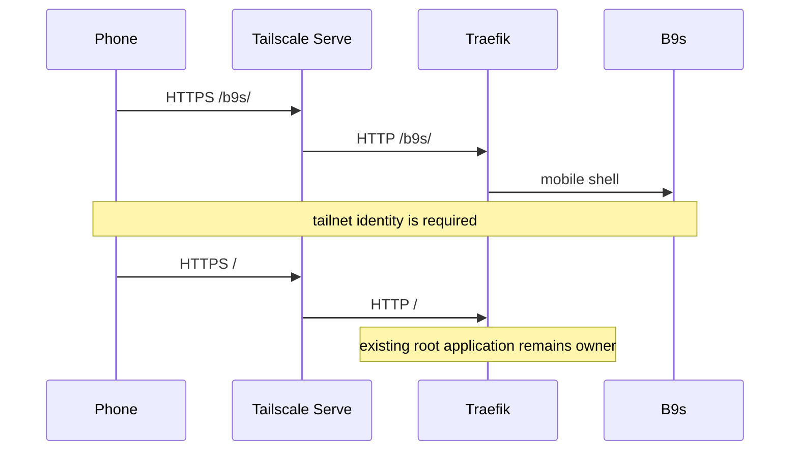

## Context

The local k3s cluster already exposes Traefik on the laptop, and Tailscale Serve
already forwards the laptop's private HTTPS hostname to that listener. The host
root serves Omnigent, so replacing the Serve target or claiming `/` for B9s
would break an existing local tool. Funnel would make the preview public.

## Decision

**A B9s preview may add only its `/b9s` mobile paths to the laptop's MagicDNS
hostname. Tailscale Serve remains the single private HTTPS entry point, and
Tailscale Funnel is not used.**

## Options considered

- **Path-scoped ingress on the existing tailnet hostname** (chosen): preserves
  the existing root application and reuses one authenticated private endpoint.
- **Replace the Tailscale Serve root target**: simple, but disconnects the
  application already published from the laptop.
- **Tailscale Funnel**: easy public access, but exposes a disposable development
  preview to the internet.
- **A second long-lived port-forward**: does not survive its terminal session
  and is not reachable from the phone without another publication layer.

## Consequences

The mobile URL is stable at `https://LAPTOP_MAGICDNS/b9s/` while the preview
exists. The repository manifest validates the configured hostname and owns only
the B9s paths on it. Tailnet membership remains the access boundary. Re-evaluate
if each repository receives a dedicated Tailscale service identity or the local
cluster gets its own tailnet ingress controller.
