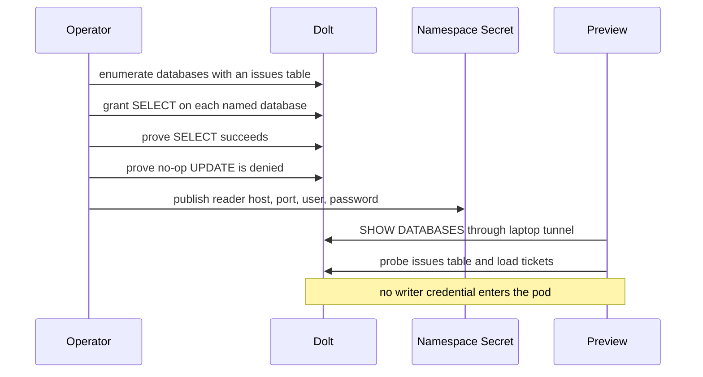

## Context

The browser preview initially booted from disposable JSONL data. A useful
preview must show the real tickets across the shared Dolt server, but a
browser-facing workload must not receive the project writers' credentials.
The container also has no repository tree from which B9s can discover project
metadata.

Dolt records wildcard database grants without reliably enforcing them. The
local Kubernetes cluster can reach the shared server through the laptop's
existing SSH tunnel at `host.docker.internal`, while the remote public port is
blocked.

## Decision

**The B9s preview uses the existing `bd_b9s_ro` identity, grants it SELECT on
each current Beads database by explicit name, and generates an ephemeral B9s
project catalog from the databases that identity can actually query.**

## Options considered

- **One explicitly granted SELECT-only catalog identity** (chosen): gives the
  preview a complete view while keeping write refusal at the database boundary;
  new databases require reconciliation.
- **Project writer credentials**: needs no new grant process, but compromise of
  the browser workload could mutate every project it can see.
- **A copied JSONL snapshot**: keeps the database unreachable, but is stale and
  does not provide the requested shared view.
- **A global wildcard SELECT grant**: automatically covers future databases,
  but Dolt's wildcard grant behavior is not a reliable security contract and it
  exposes non-Beads schemas.

## Consequences

The preview displays live tickets from all currently granted Beads databases
and starts in the aggregated project view. The pod receives no insert, update,
delete, create, drop, alter, grant, or super privilege. The provisioning command
refuses to publish a credential if any write privilege is detected or if a
no-op update is accepted.

An operator must rerun provisioning after a new Beads database is created. The
generated project metadata is disposable container state. TCP 3306 egress is
allowed from the preview pod so it can reach the laptop tunnel; the database
credential remains the enforcement boundary for query effects.
