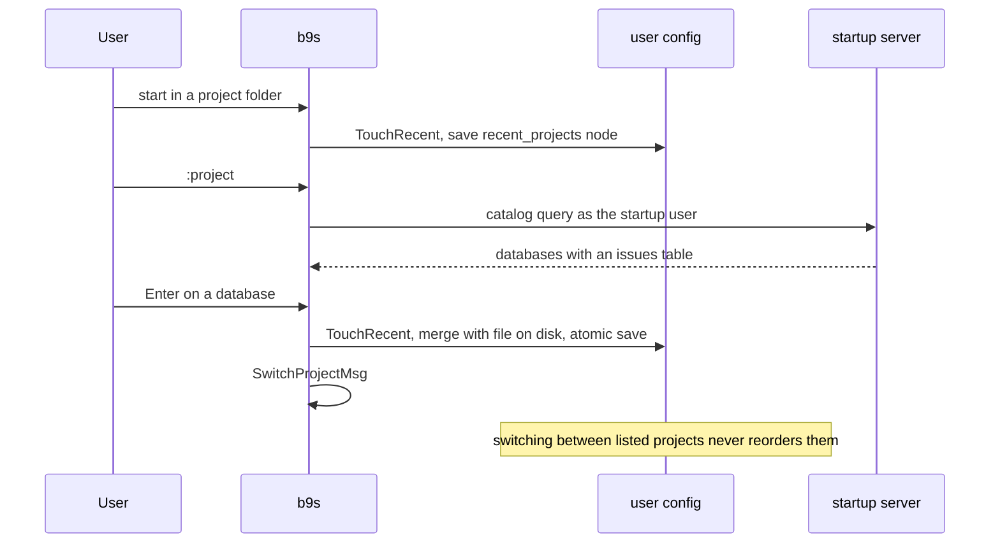

## Context

The k9s-style header listed every project b9s could find: entries under
`projects:` in `~/.config/b9s/config.yaml`, every folder with a `.beads`
directory below `discovery.scan_paths`, and numbered `favorites:` that pinned
some of them to keys 1-9. On a machine with dozens of Beads projects the header
was mostly noise, and a newly discovered folder could shift which project a
number key opened.

Folder discovery also cannot see the projects that matter most on the shared
Dolt server: a database with no local checkout has no folder to find.

k9s solves the same problem for namespaces. It keeps a short favourites list
per context: a namespace you open is prepended, a namespace already in the
list keeps its slot, the list is capped at nine, and `:ns` shows every
namespace the cluster lets you see.

## Decision

**The header lists the project b9s starts in plus `recent_projects` from the
user config, at most nine, using k9s rules: a new project is prepended, a
project already in the list keeps its slot, and `lock_recent` freezes the
list. Projects enter the list by opening them, either by starting b9s in their
folder or by picking them in the `:project` table, which lists the Beads
databases the startup project's Dolt user can read. `discovery.scan_paths`,
`projects:` and `favorites:` are removed; favourites migrate into
`recent_projects` once.**

## Options considered

- **Recent list with k9s rules** (chosen): short, and the number keys stay put
  while switching, so muscle memory survives. Server databases without a
  checkout can be added. Costs a way to add projects, which `:project` covers.
- **Keep discovery and numbered favourites**: already shown to be noisy, and
  it cannot list databases without a checkout.
- **Most-recently-used with move to front**: the familiar MRU shape, but every
  switch renumbers the header, which breaks the stable keys bd-jorl
  established.
- **List every readable database in the header**: complete, but the header
  becomes the noise it replaces; it belongs in a table opened on demand.

## Consequences

- The header is predictable across restarts and between windows: saves re-read
  the file and merge its recent list, and only the `recent_projects` and
  `lock_recent` nodes are rewritten, so comments and other settings survive.
- A project without a local checkout opens read-only. Writes go through `bd`,
  which needs a checkout, so write actions require a `Checkout` value that only
  exists for a folder with `.beads`.
- Every connection uses the startup project's host and user. A recent project
  that user cannot read stays in the header marked `✗` with a closed
  reachability reason, and `:project` lists only what that user can read. A
  scoped project user typically sees only its own database.
- A startup project backed by JSONL or SQLite has no server, so `:project`
  shows why it cannot list databases.
- There is no in-app way to forget a recent project (bd-6e8h.7); editing the
  config file is the workaround.
- Re-evaluate if users need projects from several Dolt servers or per-project
  credentials in one session.
