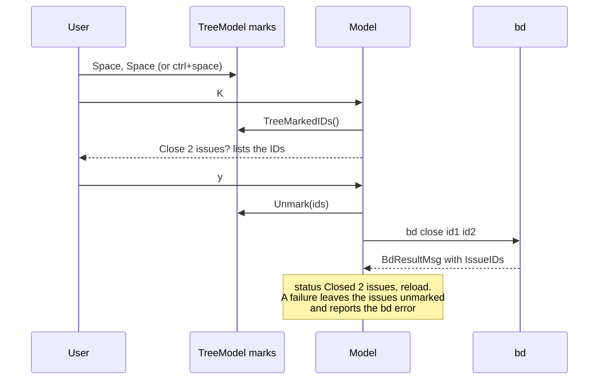

## Context

The tree view has had a mark set since bd-cz0 (`m` toggles, `M` clears, a `●`
marks the row), but no action consumed it: `K` and Delete always targeted the
cursor row. Closing a handful of finished tasks meant a confirm dialog per
issue and a `bd` process per issue.

k9s solves the same problem in its resource tables. Space toggles a mark,
ctrl+space marks the range from the nearest mark to the cursor, ctrl+\ clears
all marks, and every action asks the table for its selected items: the marked
rows when any exist, otherwise the row under the cursor. The confirmation then
names a count ("Delete 3 marked pods?") instead of a single resource. b9s
users already know k9s, which is where the `:` prompt and recent projects came
from as well.

## Decision

**In the tree view, `K` and Delete act on every marked issue when at least one
is marked and on the cursor row otherwise. Marking uses the k9s keys (Space,
ctrl+space, ctrl+\) alongside the existing `m`/`M`. A bulk action runs as one
`bd` invocation over all IDs, and confirming it unmarks those issues whether
or not the command succeeds.**

Details that follow from it:

- **Marks survive filters.** An issue marked and then hidden by a filter or
  search is still a target. The confirmation states the number of issues and
  lists their IDs, so nothing is acted on unseen.
- **Marks belong to the tree.** Board, graph and list selections ignore them.
- **Space no longer has any other tree meaning.** It was documented as
  "toggle expand" but was never bound; Enter opens the detail view and `h`/`l`
  collapse and expand.
- **ctrl+space with no mark in view marks the cursor row**, which anchors the
  next range. k9s does nothing in that case, which reads as a dead key.

## Options considered

- **Marks else cursor, one bd call** (chosen): the k9s model users already
  know; one dialog and one process however many issues are marked.
- **A separate bulk key (for example `ctrl+k`)**: never ambiguous, but doubles
  the key surface and every new action needs a bulk twin.
- **One bd call per issue**: per-issue success reporting, at the cost of N
  processes and N reloads racing each other on the Dolt watcher.
- **Keep marks after the action**: allows chaining close after a priority
  change, but a stale mark set makes the next `K` act on issues the user has
  already dealt with.

## Consequences

- A partial failure inside one `bd close a b c` is reported as one error
  string; the user cannot see which ID failed without reading it.
- New issue actions (status, priority, labels: bd-bjqc.3) should resolve their
  targets through `issueConfirmationFor` so the semantics stay uniform.
- Re-evaluate if `bd` stops accepting several IDs in one call, or if users
  report acting on marked issues they had filtered out of view.
