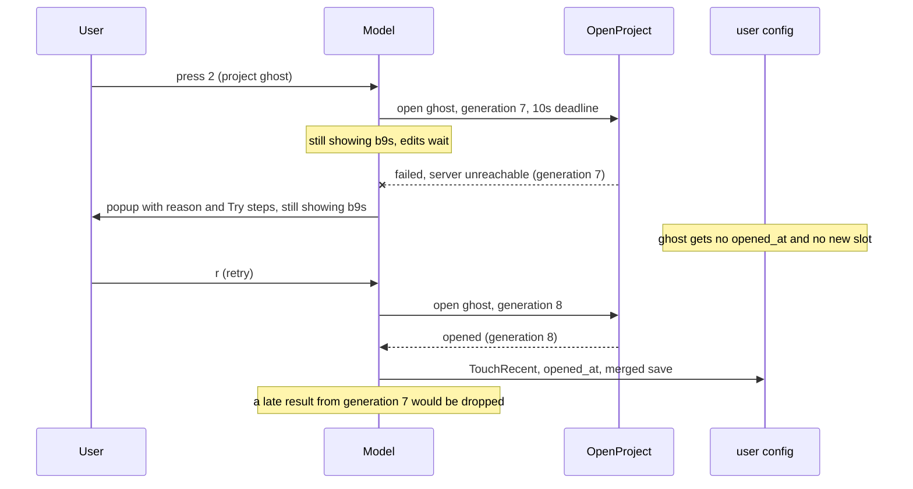

## Context

Switching projects cleared the visible project's issues first and loaded the
new project afterwards. When the new project could not be read (a Dolt server
or tunnel down, access refused, a folder without `.beads`), b9s was left on an
empty screen with a status line and no way back to the project that worked.
Starting b9s in such a folder printed a raw error and exited, and an
unreachable Dolt server was even reported as a missing JSONL export, because
the JSONL fallback's error replaced the Dolt one.

With the recent projects list (ADR 0008) and `:project`, users switch to
projects they have not opened on this machine before, so a failed open is an
ordinary event rather than a misconfiguration.

## Decision

**A project is loaded before it replaces the visible one. While it loads, the
current project stays on screen and browsable, `Esc` cancels, and writes wait.
A failed open keeps the current project and explains the failure in a popup
built from a closed set of reasons, each with next steps. At startup, a folder
that cannot be opened makes an interactive b9s open the recent project that
most recently opened successfully (`opened_at`) and show the same popup;
without a terminal, or with `--no-fallback`, b9s exits 1.**

## Options considered

- **Load first, fall back to the last project that opened** (chosen): the
  user never loses a working screen, the reason is readable, and a script
  still fails loudly because the fallback needs a terminal.
- **Clear first, then revert on failure**: the screen flashes empty on every
  switch, and reverting means reloading the previous project, which can itself
  fail.
- **Readable error and exit, no fallback**: simple and script-friendly, but it
  keeps the dead end this decision removes for interactive use.
- **Fall back to whichever project holds key 1**: needs no new field, but the
  first slot is only the newest project added, not one known to work.

## Consequences

- Opening runs outside the Bubble Tea update loop, with a generation number so
  a cancelled or superseded result is ignored, and a 10s deadline that ends in
  a `TimedOut` reason.
- A project joins `recent_projects` and records `opened_at` only after its
  issues load, so a broken folder or database never takes a number key.
- Failure reasons (`NotAProject`, `ServerDown`, `Denied`, `NoIssuesTable`,
  `Unreadable`, `TimedOut`) are a closed enum; a test fails when a reason has
  no message or next steps. Dolt's refusal of a database arrives as MySQL
  error 1105 with an "Access denied" message and is classified as denied.
- A successful switch loads the project twice: once to decide, once through
  the existing reload path that rebuilds the views.
- A database without a checkout cannot be the startup fallback, because the
  failed startup folder is what would have named the Dolt user.
- Re-evaluate if loading twice becomes noticeable on large Dolt projects, or if
  a connection that drops while a project is already open needs the same
  popup.
