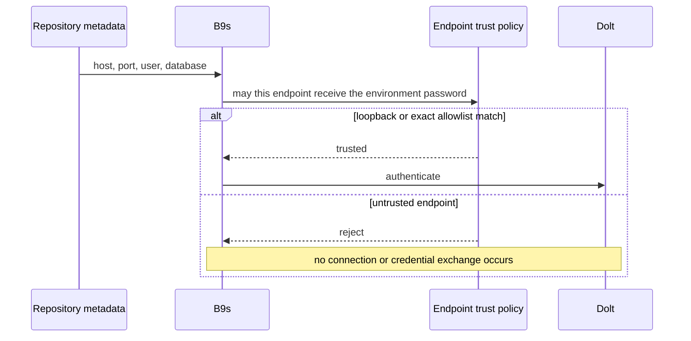

## Context

B9s reads Dolt connection details from `.beads/metadata.json`. That file belongs
to the repository, while `BEADS_DOLT_PASSWORD` belongs to the operator's
environment. A cloned repository can therefore select an authentication endpoint
but must not gain authority to receive the operator's credential.

Local Beads installations connect through loopback. Container previews may use
another trusted endpoint, such as the host-side SSH tunnel, which the operator
can identify exactly.

## Decision

**B9s sends `BEADS_DOLT_PASSWORD` only to loopback endpoints or exact
`host:port` entries in `B9S_TRUSTED_DOLT_ENDPOINTS`. A credentialed connection
to any other endpoint fails before network authentication begins.**

## Options considered

- **Loopback by default with an exact endpoint allowlist** (chosen): preserves local operation and makes remote trust an explicit operator decision.
- **Trust every endpoint in repository metadata**: requires no configuration but crosses the repository-to-environment credential boundary.
- **Disable all remote Dolt connections**: strongest restriction but prevents the existing container preview and legitimate remote deployments.
- **Trust hostnames resolved to private addresses**: convenient but vulnerable to DNS changes and too broad for a credential boundary.

## Consequences

Existing loopback connections continue without configuration. A trusted remote
or container endpoint must be listed exactly, for example
`B9S_TRUSTED_DOLT_ENDPOINTS=host.docker.internal:3306`. Multiple endpoints are
comma-separated.

An uncredentialed connection remains possible because there is no environment
secret to disclose. Transport encryption remains a separate requirement for
connections that do not terminate at a local tunnel.
