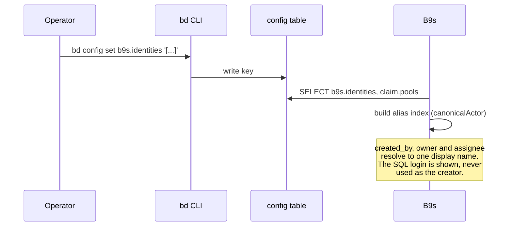

## Context

Every issue carries two people: the one who created it and the one who holds it
now. Beads stores both, but under names that do not agree with each other:

- `issues.created_by` holds the bd actor at creation time (`--actor`, then
  `$BEADS_ACTOR`, then `git config user.name`, then `$USER`). On the b9s
  database it reads `vanderheijden86`, `ubuntu` (lane pods), `jemanuel`,
  `unknown` or empty.
- `issues.owner` holds the creator's git email (`GIT_AUTHOR_EMAIL`, then
  `git config user.email`).
- `issues.assignee` is free text: humans, lane agent names such as
  `BrownBear`, and role names.
- The Dolt SQL login, for example `bd_b9s`, is one credential per workspace.
  Every agent in a lane holds it (see agents-config
  `docs/beads-workspace-credential-boundary.md`). It names a project, not a
  person, and Dolt stores it on no issue row.

Upstream Beads has no alias-to-person mapping. It compares actors with
`canonicalActor` (`internal/storage/issueops/identity.go`), which treats runs of
`.`, `_` and `-` as one separator and decodes `--` to `/`. It has a
`claim.pools` config key that lists role assignees anyone may claim. A proposed
`identities` table (#3400, #3583) was deferred, and upstream ADR-0003 keeps
`actor` an opaque string that bd never interprets. Issue #6611 reports the same
gap from the claim side.

## Decision

**B9s shows Creator (`created_by`, with `owner` as detail) and Assignee as two
separate fields, and resolves both through an alias list that b9s reads from the
bd config key `b9s.identities`. Names without an entry resolve to themselves
under `canonicalActor` rules.**



The value is a JSON list:

```json
[
  {"name": "vanderheijden86", "kind": "human",
   "aliases": ["vanderheijden86@gmail.com", "andre"]},
  {"name": "lane-agents", "kind": "agent", "aliases": ["ubuntu"]}
]
```

- `kind` is one of `human`, `agent`, `pool`. Every `claim.pools` entry is a
  `pool` identity without further configuration.
- Matching compares `canonicalActor` forms, so `gastown.mayor` and
  `gastown_mayor` hit the same entry.
- An alias listed under two names is a configuration error. B9s keeps the first
  entry and reports the conflict in the health popup.
- When b9s creates an issue it prefills Assignee with the current actor, found
  with bd's own precedence and resolved through the list, and passes the same
  actor to `bd create --actor`. The Creator never changes after creation.

## Options considered

- **Alias list in bd config, owned by b9s** (chosen): shared by every clone and
  lane through the project database, written with the bd CLI like every other
  b9s write, needs no schema change on the shared server. Costs one config key
  that bd itself ignores.
- **Dolt SQL user as the identity**: rejected. One login covers every person
  and agent of a workspace, and no issue row records it.
- **An `identities` table in the shared schema**: rejected for now. Upstream
  deferred it, b9s would own a migration on a server that holds every project,
  and a later upstream table would conflict with it.
- **A file in `.beads/`**: rejected. Lanes and other clones would each need
  their own copy, and the list would drift between them.

## Consequences

- JSONL-only projects have no config table and show raw names. The fields still
  work.
- Adding a person is `bd config set b9s.identities ...`. B9s has no editor for
  the list yet.
- If upstream ships an identities model, this ADR is superseded and the list
  migrates into it. #6611 is the natural place to offer the format upstream.
- Re-evaluate if per-person SQL logins arrive: then the login becomes one more
  alias kind, still not the creator.
