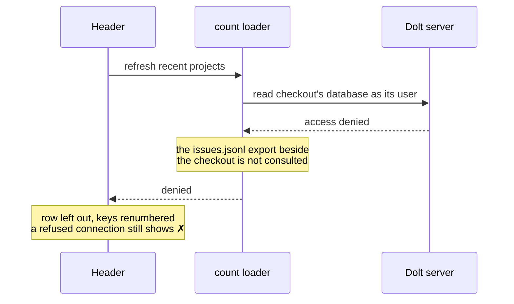

## Context

ADR 0008 keeps a recent project the startup user cannot read in the header,
marked `✗`. Since then every project received its own Dolt user, granted on
its own database only (the workspace credential boundary in `agents-config`).
A b9s started in one checkout therefore reads exactly one database, and the
header became a row of `✗` marks around it.

Two things made that worse than noise. The header counted a checkout through
the same loader the startup path uses, which falls back to the JSONL export
when the Dolt connection fails. A denied database with an export beside it
showed stale counts and no mark at all; one without an export showed `0 0 0`.
Only a project without a checkout showed the `✗` that ADR 0008 describes. And
`recent_projects` is one list for every b9s on the machine, so the projects a
user opened from other checkouts, with other credentials, all land in a header
that cannot open them.

## Decision

**The header lists only the recent projects the startup user can read. A
project whose database refuses that user is left out for the session; it stays
in `recent_projects` and returns when b9s starts as a user granted on it. The
active project always keeps its row. A checkout's reachability and counts come
from its configured source, never from a JSONL export beside it. Number keys
and the `:project` recent marks follow the visible rows.**

This replaces the consequence of ADR 0008 that a project the user cannot read
stays in the header marked `✗`. The recent-list rules of ADR 0008 stand.

## Options considered

- **Hide denied projects, keep other failures marked** (chosen): the header
  shows what this session can open. A down tunnel still shows every row with
  `✗`, so an outage is not mistaken for a missing grant. Costs a row that
  appears or disappears when the grants change.
- **Keep every recent project marked `✗`** (ADR 0008): honest once the count
  loader stops reading the export, but with one user per project most rows are
  marks, and the number keys are spent on projects that cannot open.
- **Hide every unreachable project**: a down tunnel would empty the header
  and hide the reason with it.
- **Remove denied projects from `recent_projects`**: the entry is valid for
  the b9s that opened it from its own checkout; one session may not edit what
  another relies on.

## Consequences

- The header differs by startup project: each shows the projects its user can
  read. A recent project can vanish once its counts load, and returns on a
  later refresh when the grant appears.
- Number keys are stable within a session while the grants hold, and follow
  the visible rows, so `<2>` opens the second row shown.
- A checkout whose Dolt server is down shows `✗` instead of counts from its
  export. That matches ADR 0008's rule for projects without a checkout.
- The `0` view still tries every recent project's database; denied ones fail
  as before.
- Re-evaluate when one session can hold several credentials, which is also
  ADR 0008's trigger.
