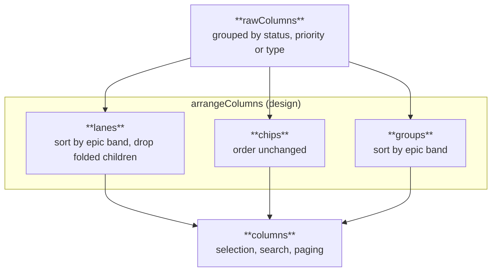

## Context

ADR 0016 kept two board layouts, A (adaptive focus) and E (focus plus an
inspector), behind `v` until daily use picked one. Review picked A. E's
inspector duplicated the detail pane that `Enter` already opens, and its
one-line rows hid the facts A shows on the second line.

The same review found a gap that neither layout closed: the board gave no
sign of which epic an issue belongs to, nor how far an epic has come. The
tree shows the hierarchy, but a status column mixes the children of every
epic into one list. Three presentations were proposed, each with a real
trade-off, and choosing between them needs the same daily use that chose A.

## Decision

**Layout A is the only board layout; layout E, its inspector and
`ui.board_layout` are removed. `v` now cycles three epic designs over layout
A (lanes, chips and groups), and `ui.board_epics` sets the one used at
start.** Lanes are the default.

- **Lanes** cut the columns into horizontal bands, one per epic, aligned
  across every full column so an epic reads as one row of the board. The
  band header carries a completion bar. `Tab` folds a band to the epic's own
  row, `Shift-Tab` folds or unfolds all bands.
- **Chips** keep the plain column order and tag each row with a bar in the
  epic's color and an epic chip on the second line.
- **Groups** sort each column by epic under its own subheader, and each
  column scrolls on its own.

An issue's epic is its nearest ancestor of type epic along parent-child
links. Completion counts every issue under the epic in the whole project,
closed ones included, not only those that pass the current filter; otherwise
the default open filter would show every epic as 0 done. Bands are ordered by
the most urgent open issue they hold.

The grouped columns are kept as `rawColumns` and the design arranges them
into `columns`, so selection, search and paging keep working on one list per
column whatever the design.

## Options considered

- **Three designs behind `v`, layout A only** (chosen): the reviewer compares
  the epic designs on real projects, as ADR 0016 did for layouts. Costs three
  render paths until one wins.
- **Keep layout E and add epics to both layouts**: six combinations to keep
  working, for a layout the review already rejected.
- **Pick one epic design now**: cheaper, but lanes trade vertical space for
  alignment and chips trade structure for density, and neither cost shows in
  a mockup.
- **Epics as a fourth swimlane mode (`s`)**: `s` replaces the status columns,
  and the point is to see epics and status together.

## Consequences

- The inspector's keys (`Tab` focus, `Ctrl-J`/`Ctrl-K`) are gone. `Tab` and
  `Shift-Tab` fold epics in lanes, which matches what they do in the tree.
- Folding exists only in lanes. The other designs show every issue, and
  `Tab` there says so rather than doing nothing silently.
- A project without epics renders the plain layout A in every design.
- When one design wins, a new ADR removes the other two and `v` is free again.

