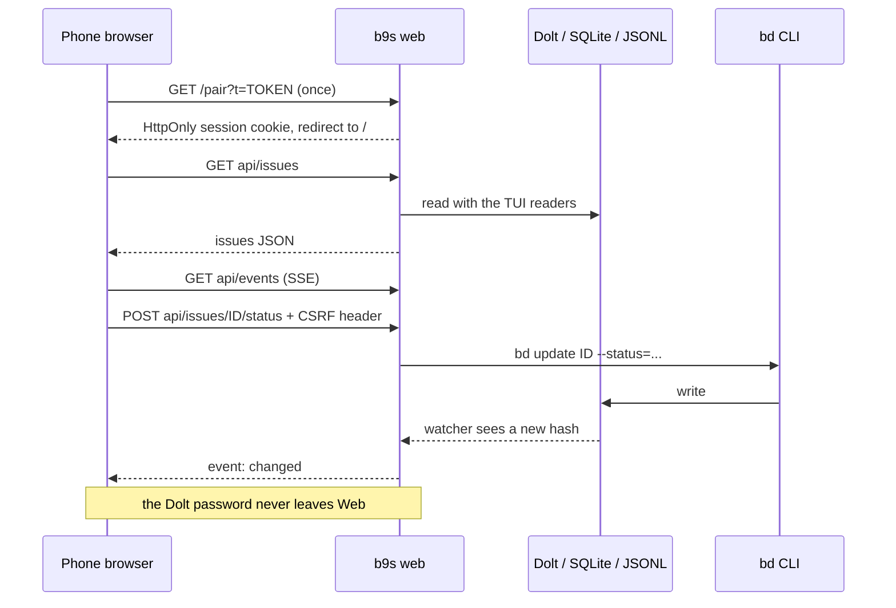

## Context

ADR 0005 put the TUI in a phone browser through ttyd and a key bridge. It
works for a review, but a terminal on a phone is a keyboard UI without a
keyboard: every function needs a key, the text is small, and nothing
responds to a swipe. The mockup in `docs/mockups/mobile-web-ui.html`
(bd-foit.1) showed that the TUI's functions fit a touch UI at the same
density: two-line rows, bottom sheets, swipes for status and close, and a
long-press to mark.

A web UI has to read the same sources the TUI reads (Dolt, SQLite, JSONL),
agree with the TUI on what a query means, and write only through `bd`
(docs/ARCHITECTURE.md). It also runs on a laptop that holds the Dolt
password, and ADR 0013 forbids sending that password anywhere but a
trusted endpoint. A phone browser is not one.

## Decision

**`b9s web` is a subcommand of the same binary. It serves a JSON API over
`internal/datasource`, Server-Sent Events fed by the TUI's watchers, and a
Preact and TypeScript single-page app built with esbuild and embedded with
`go:embed`. Every write runs `bd` through the TUI's `IssueWriter`. The
server listens on loopback by default, and any other address needs a
pairing token.**

- One binary: `go build` needs no Node, because the built bundle is
  committed under `pkg/web/dist`. `make web` rebuilds it, and a test fails
  when the committed bundle is older than its sources.
- The API reuses `ui.ParseIssueQuery`, the `datasource` readers, and the
  `ui.IssueWriter`, so a query, a read or a write cannot mean something
  else in the browser than it does in the TUI.
- The JSON types in TypeScript are generated from the Go types by an
  in-repo generator, and a test fails when the generated file is stale.
  The contract is never retyped by hand.
- The SPA uses relative URLs only, so it works at `/` and behind a path
  prefix such as a Tailscale Serve path (ADR 0006).
- Access: loopback needs no token. `--listen` on any other address prints a
  one-time pairing URL. Opening it sets an HttpOnly, SameSite=Strict
  session cookie, and every write also needs a CSRF header that matches
  the cookie. The server refuses to start on a non-loopback address
  without a token, and a test guards that rule. Remote phones reach the
  laptop through `tailscale serve`, never through Funnel.

## Options considered

- **Embedded Preact SPA served by `b9s web`** (chosen): full control over
  touch, one binary, and the TUI's own readers and write path. Costs a
  Node toolchain for anyone who changes the frontend, and a second UI to
  keep in step with the TUI.
- **ttyd terminal with a key bridge** (ADR 0005, bd-b6jw.3): no second
  UI, but a keyboard UI on a touch screen, small text, and no gestures.
  It stays as a desktop review preview.
- **Server-rendered HTML with htmx**: no build step, but swipes, drags,
  long-presses and sheets are client-side state that htmx does not model,
  so the gesture code would end up as a hand-written SPA anyway.
- **A separate Node server**: a familiar web stack, but it would
  reimplement the readers, the query language and the write rules, and
  hold the Dolt password in a second process.

## Consequences

- The TUI and the web UI share their data rules, and they can still drift
  in presentation. Every web feature task adds Playwright tests on Pixel 9
  and iPhone profiles to catch that.
- Frontend changes need Node and `make web`. Go-only changes do not.
- The server is single-user: one laptop, one person's phone. Concurrent
  writers are serialised by `bd`, not by the server.
- ADR 0005 stays active for the ttyd preview. Re-evaluate this decision if
  b9s gains a multi-user deployment, which would need real accounts
  instead of a pairing token.
