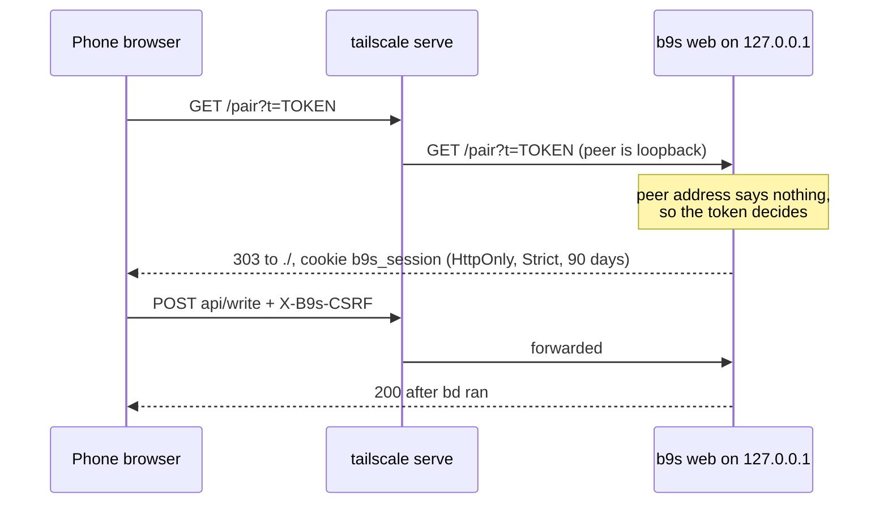

## Context

ADR 0019 let a loopback `b9s web` serve without a token and gave other
addresses a one-time pairing URL. Building it showed two problems with that
access rule. It replaces only that rule; the rest of ADR 0019 stands.

- **Loopback is not the same as local.** The documented way to reach the
  laptop from a phone is `tailscale serve`, which proxies from the tailnet
  to `127.0.0.1`. Every tailnet request then arrives from loopback, so a
  rule keyed on the listen address or the peer address lets every tailnet
  device in without a token.
- **A one-time token pairs one browser once.** A phone that clears its
  cookies, a second browser, or a restarted server needs a new link, and
  the laptop may not be at hand to print one.

## Decision

**`b9s web` requires pairing on every address. The pairing token, the
session cookie and the CSRF value all derive by HMAC from one secret kept in
`~/.config/b9s/web-secret` (mode 0600). The link works until the secret is
replaced with `--new-token`, which unpairs every browser at once.
`--no-token` is accepted only on a loopback address, for local development.**

- Nothing but the secret is stored. Restarting the server keeps every
  paired browser paired and prints the same link.
- The pairing response sends `Referrer-Policy: no-referrer` and redirects
  to a relative `./`, so the token does not leak and a path prefix is kept.
- A write needs the `X-B9s-CSRF` header. A page on another site cannot set
  it without a CORS preflight, which the server never grants.
- `CheckListen` refuses a non-loopback address without auth, and
  `TestListenWithoutAuthOnlyOnLoopback` guards it.

## Options considered

- **Always pair, token derived from a stored secret** (chosen): one rule
  for every route to the server, and a link that keeps working. A leaked
  link stays valid until `--new-token`.
- **Loopback without a token, one-time token elsewhere** (ADR 0019): no
  step on the laptop's own browser, but open to the whole tailnet through
  `tailscale serve`, and a phone needs a new link after losing its cookie.
- **Trust Tailscale identity headers**: no token at all, but only when the
  request came through `tailscale serve`, and a local process could forge
  the headers on loopback.

## Consequences

- The laptop's own browser also opens the pairing link once.
- Anyone holding the link can pair until the secret is renewed. The banner
  says how to renew it.
- Re-evaluate if b9s web serves more than one person, which needs accounts.
