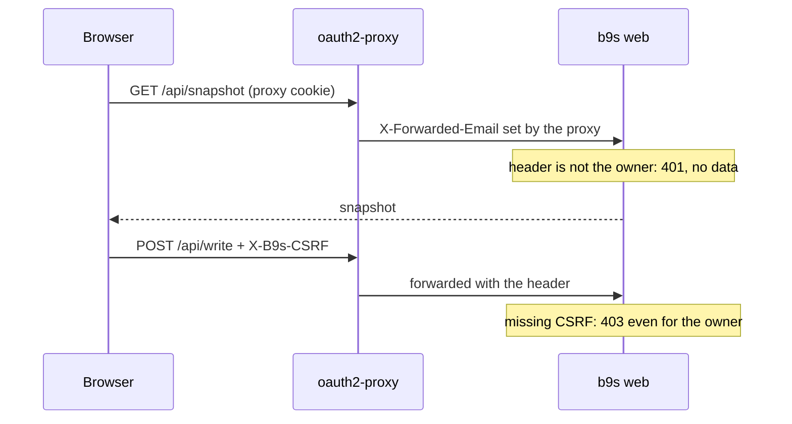

## Context

ADR 0020 pairs every browser with a link derived from a secret on the
machine running `b9s web`. Its re-evaluation clause is "b9s web serves more
than one person". The hosted board at `<person>.beads.osen.co` (osenco-infra
ADR 0004) is that case in its simplest form: one pod per person, behind an
oauth2-proxy that signs the person in with Google and forwards their email in
`X-Forwarded-Email`. Until now that pod ran the TUI in ttyd, because ttyd
could trust the header and `b9s web` could not.

Pairing on top of the proxy works but makes every browser sign in twice, and
the pairing link has to be fetched from pod logs. A second proxy inside the
pod to check the header would work too, at the cost of one more process in
the image and a loopback-only `b9s web` with no auth of its own.

## Decision

**`b9s web --trust-header <name> --owner <email>` pairs a request when that
header carries the owner's email, compared without case. In that mode the
pairing cookie is never issued or accepted, `/pair` only forwards an owner
who is already signed in, and writes still need the CSRF value.** The flags
go together, and they cannot be combined with `--no-token`.

## Options considered

- **Trusted header for one owner** (chosen): one sign-in, no pairing step,
  and the owner check lives in the process that serves the data. The header
  is only as good as the network path, so the deployment must let nothing but
  the proxy reach the port.
- **Pairing behind the proxy**: no code change, but two sign-ins per browser
  and a pairing link read from logs.
- **Loopback `b9s web --no-token` plus an in-pod header check**: no code
  change and one sign-in, but a second process whose only job is what four
  lines in `Auth` do.
- **Several owners per server**: out of scope. Each person still gets their
  own pod and their own Dolt credential (osenco-infra ADR 0004).

## Consequences

- The hosted image runs `b9s web` instead of ttyd and tmux, so the phone and
  desktop web UI is what a person sees at their board's address.
- The recent list holds nine projects, and a hosted board serves every
  database its owner may read. The image passes `--projects-root`, so the
  project sheet lists every checkout the pod builds after the recent ones.
- Anyone who can reach the port directly can claim to be the owner. The flag
  is for a server behind a proxy and a NetworkPolicy, never for a laptop on a
  tailnet; the laptop keeps ADR 0020's pairing.
- The CSRF value still derives from the secret file, which a pod recreates on
  each start. A tab open across a restart gets 403 on its next write until it
  reloads the session.
- Re-evaluate when one `b9s web` must serve several people, which needs a
  Dolt credential per request rather than per process.
