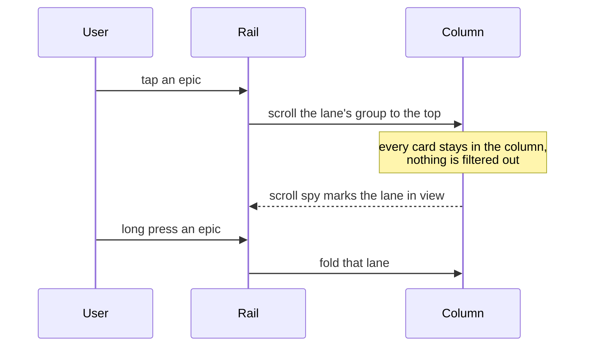

## Context

The phone board shows one column at a time. In epic rail mode it drew a
64 px rail of epics beside a flat list sorted by priority, and a tap on an
epic filtered the list to that epic's lane. Its "all" state therefore showed
no hierarchy at all: siblings were scattered, and nothing told a reader which
epic a card belonged to. A lane also knows only its topmost epic, so a card
two levels down read as a direct child of the epic.

ADR 0018 chose the rail because it keeps the epic in view while its lane
scrolls. The phone's filtering rail did not do that. Four options were drawn
in `docs/mockups/mobile-board-hierarchy-options.html`: sticky lane headers
with the rail as an index, a parent line on every card, tree guides inside
the column, and an accordion of epic cards.

## Decision

**On the phone, the column always groups its cards into epic lanes under
sticky headers, and the rail is an index into those lanes rather than a
filter.**

- Each lane header shows the epic's hue, `♦ id`, title, a completion bar and
  the card count. It stays pinned at the top of the column until the next
  lane's header pushes it off.
- A tap on a rail entry scrolls its lane to the top. The entry of the lane at
  the top of the column is highlighted as the column scrolls.
- The header's chevron, or a long press on the rail entry, folds the lane.
- A card whose direct parent is not its lane's epic gets a third line naming
  that parent: `↳ id title`.
- Epic rows mode keeps the same sticky headers without the rail.

## Options considered

- **Sticky lane headers, rail as index** (chosen): the hierarchy is visible
  at a glance, and the rail still gets you to an epic in one tap. Costs one
  header row per lane.
- **Parent line on every card**: cheapest, but siblings stay scattered by
  priority. Kept only for cards nested below a task.
- **Tree guides in the column**: any depth, but every level costs title
  width on a 390 px screen.
- **Epic accordion without a rail**: gives cards the rail's width, but costs
  a tap before any card shows.

## Consequences

- The phone board no longer hides cards when an epic is chosen. Anyone who
  used the rail to narrow the column now uses the query bar or `f`.
- The rail order follows the column's lane order, biggest lane first and
  "no epic" last, so the index reads top to bottom like the column.
- Re-evaluate if boards with many small epics make the headers dominate the
  column; folding all lanes by default would then be the next step.
