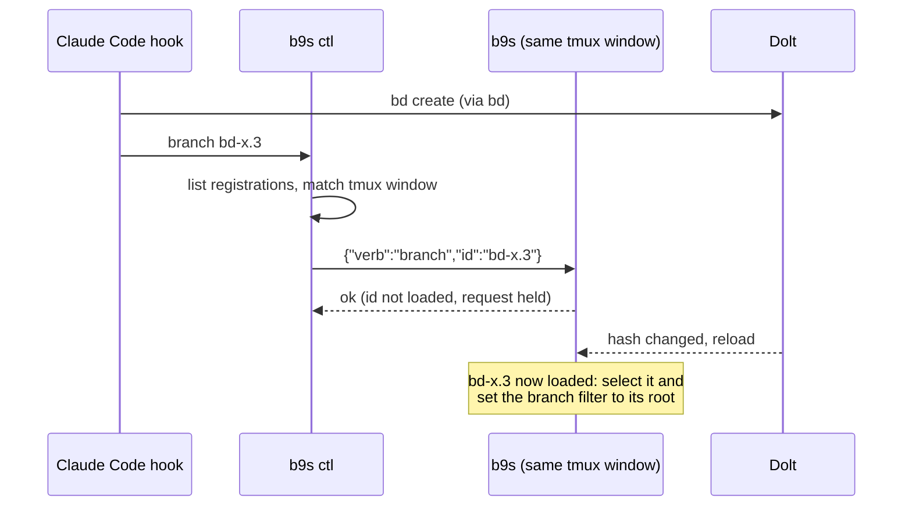

## Context

b9s usually runs in a tmux pane beside a coding agent such as Claude Code.
When the agent runs `bd create`, the operator wants the b9s next to it to show
the new issue in the context of its epic, the way `f` does for the cursor.
Nothing outside the b9s process could ask it to do anything: its only inputs
were the keyboard, the mouse and the data source.

Two forces shape the answer. The agent works in the same tmux window as its
b9s, and several windows often show the same folder, so the folder alone
cannot say which b9s is meant. And `bd create` returns before b9s has seen
the write: the Dolt watcher polls every 500 ms, so the new id is usually
missing when the request arrives.

## Decision

**Each TUI instance listens on a unix socket in a private state directory and
registers its pid and tmux pane beside it. `b9s ctl branch <id>` picks the
instance in the caller's tmux window and sends it a verb from a closed set.
b9s holds a request for an id it has not loaded for up to five seconds, and
applies it on the first reload that brings the id in.**

`branch` sets the branch filter; it never toggles it. A second `bd create` in
the same epic keeps the filter on and only moves the cursor. The same code
serves `:branch <id>` in the command prompt.

## Options considered

- **Control socket with a verb set** (chosen): works in any view and any
  prompt state, and the reply tells the caller whether b9s accepted the
  request. It costs a socket, a registry file and a subcommand.
- **tmux send-keys**: no code in b9s at all. Keys land in whatever b9s shows,
  so an open search or form receives them, and there is no reply. The meaning
  of a key also changes with the view and the key tables.
- **A file b9s watches**: no socket, but no reply either, and a second writer
  overwrites the first request.
- **An MCP server in b9s**: the agent could call it as a tool, but it loads a
  tool schema into every agent turn for one action, where a CLI costs nothing
  until it runs.

## Consequences

- Anyone who can write to the state directory can steer b9s. The directory is
  created and kept at mode 0700, and the verb set holds no action that writes
  data. A verb that changes issues would need its own decision.
- A b9s killed by a signal it cannot catch leaves its registration behind.
  `b9s ctl` removes registrations whose pid no longer runs.
- Inside tmux, a request goes only to a b9s in the caller's window. A caller
  with no b9s beside it gets an error rather than steering someone else's.
- Re-evaluate if a second client needs richer control (reading state back,
  switching projects): that is the point to version the protocol.
