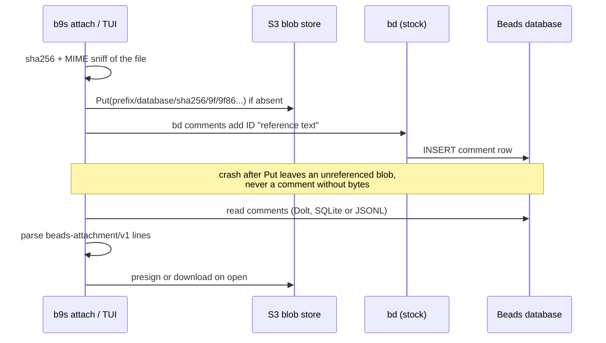

## Context

Operators want to attach screenshots, logs and documents to Beads issues and
open them from b9s, both in the terminal and in the per-person web image.
Beads has no attachment support. An upstream pull request (4316) adds an
`attachments` table and `bd attachment` verbs, but it is not merged.

A first plan ported that pull request to a fork of Beads, moved the bytes to an
S3-compatible blob store and added migration `0069_create_attachments`. Two
facts from the Beads code rule that plan out:

- Upstream already ships its own `0069` (`widen_issue_versions_datetime_precision`),
  and merged migrations are frozen. Any number the fork picks can be taken by
  upstream later, so a fork migration drifts for good.
- Upstream `bd` refuses a database whose schema version is ahead of the binary
  (`SchemaSkewError`). A database that the fork migrated stops working for every
  user of stock `bd`.

b9s must keep serving projects that run stock `bd`, whether or not the fork is
ever accepted. It must also serve an upstream attachments table if one lands.

## Decision

**An attachment is a blob in an S3-compatible store plus an ordinary Beads
comment that references it by content hash. b9s uploads the bytes, writes the
comment with `bd comments add`, and parses reference comments on read. No Beads
schema change and no Beads fork. If an `attachments` table ever exists, b9s also
reads it and merges the two.**



A reference comment has a human line and a machine line:

```
📎 screenshot.png (image/png, 118 KB)
beads-attachment/v1 sha256=9f86d0... size=120832 type=image/png name=screenshot.png
```

Detaching appends a second comment with a `beads-attachment-detach/v1 sha256=...`
line. Beads has no verb to edit or delete a comment, so references are
immutable and the attachment list is the fold of both kinds in time order.

The comment never names a bucket, endpoint or prefix. Those come from b9s
configuration, so a project can move its blobs without rewriting history.

## Options considered

- **Reference comments** (chosen): works with every `bd` version and every
  b9s data source; each attachment is a new row, so Dolt merges never conflict;
  plain `bd show` prints a readable line. Cost: metadata lives in text, so the
  line format is versioned and parsed strictly; only b9s can upload or open.
- **Fork migration plus `bd attachment` verbs**: structured rows and a foreign
  key cascade. Breaks stock `bd` on every migrated database and collides with
  upstream migration numbers.
- **Issue `metadata` JSON field**: no schema change, but every attach is a
  read-modify-write of one cell, so two writers overwrite each other and Dolt
  merges conflict on that cell.

## Consequences

- The blob store package (content-addressed keys, local and S3 backends) moves
  from the fork into b9s unchanged. The fork branch
  `feat/attachments-object-store` is parked, not deleted.
- b9s needs S3 credentials to upload, open or presign. A stock `bd` user sees
  the reference line but cannot open the file.
- Garbage collection scans every comment of a database for references and
  deletes blobs that none reference and that are older than a grace period.
- An upstream `attachments` table, if it lands, becomes a second reader in b9s.
  Re-evaluate this decision if upstream adds attachments with its own blob store.
