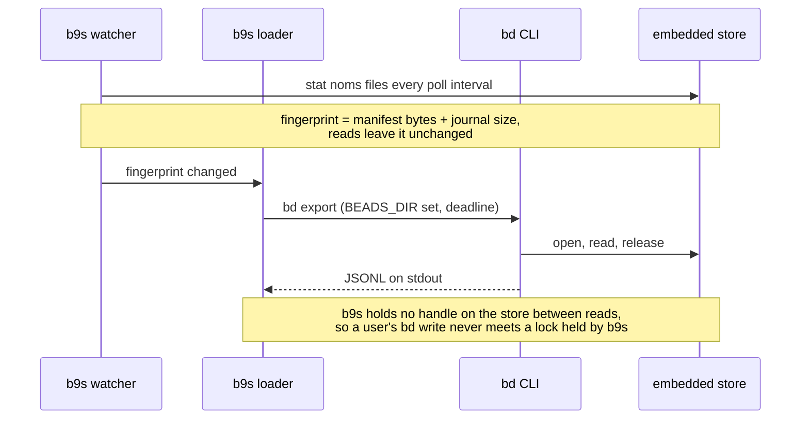

## Context

`bd init` without `--server` is upstream Beads' default. It keeps the database
in an embedded Dolt store at `.beads/embeddeddolt/<dolt_database>/` and writes
`"dolt_mode": "embedded"` to `.beads/metadata.json`. b9s read only a Dolt
server, SQLite or JSONL, so a new Beads user failed at the first step. The fix
must not ask anyone to migrate: b9s serves stock `bd` projects as they are
(ADR 0024 set the same constraint for attachments).

Measurements with `bd` 1.3.0-rc.1 on 2026-09-27:

- **The store takes one process at a time.** With `dolt sql-server` holding the
  store open, `bd update` failed with `the database is locked by another dolt
  process`. `bd` opens the store per command and releases it on exit, so five
  `bd export` runs in parallel with one `bd update` all succeeded.
- **`bd export` is complete and quick.** It prints one JSON object per issue on
  stdout, with labels, dependencies and comments, in about 0.4 s for a small
  project. The format is the JSONL b9s already parses.
- **`bd sql` refuses embedded mode** (`'bd sql' is not yet supported in
  embedded mode`), so no query-level read goes through `bd`.
- **A write changes the store's `noms/manifest` content or the size of its
  chunk journal. A read changes neither**, but it does touch other files:
  sampled every 20 ms during one `bd export`, `journal.idx` shrank from 92394
  to 81920 bytes and back, and temporary `nbs_manifest_*` files came and went.

## Decision

**b9s reads an embedded Dolt project by running `bd export` in the project and
parsing its stdout. It never opens the store itself, and it watches for
changes by fingerprinting the store files instead of asking `bd`.**

- A new source type, `dolt_embedded`, is discovered from `metadata.json` and
  ranks above SQLite and JSONL. A stale `issues.jsonl` beside the store never
  wins over it.
- The reader runs `bd` with `BEADS_DIR` pointed at the project's `.beads`
  directory, under a deadline, and parses stdout only. `bd` writes hints and
  warnings to stderr, which must not reach the JSONL parser.
- A project whose `bd` is missing fails to open with a reason that names the
  missing command, rather than falling back to an export file that may be
  months old.

## Options considered

- **Run `bd export` per read** (chosen): needs nothing beyond the `bd` binary
  that b9s already needs for every write, and follows upstream's own export
  format and schema (`bd schema`). Each reload starts a process, about 0.4 s,
  and the watcher only reloads after a write.
- **Open the store in-process with the Dolt Go driver** (`dolthub/driver`):
  fastest reads, but it holds the store's lock while open, which makes the
  user's own `bd` writes fail. Opening and closing per read avoids that, but
  it adds the whole Dolt engine to the binary and ties b9s to the storage
  format of one Dolt version, which upstream Beads upgrades on its own
  schedule.
- **Start a private `dolt sql-server` on the store**: reuses the server
  reader, but needs the `dolt` binary, which most Beads users do not have,
  and it locks out `bd` writes for as long as it runs (measured above).
- **Tell users to migrate to a server**: the status quo, and the failure this
  decision removes.

## Consequences

- A fresh `bd init` project opens in b9s with no migration and no extra
  install. Server, SQLite and JSONL sources behave as before.
- Every reload of an embedded project costs one `bd` process. A large project
  pays the full export each time, since `bd export` has no incremental mode.
- The change signal depends on Dolt's journal layout (`noms/manifest` and the
  journal file). A Dolt release that writes without touching either would
  leave b9s showing stale data until the next manual reload (`Ctrl-R`). The
  watcher's tests pin the current behaviour against a real `bd`.
- b9s depends on the `bd export` JSONL shape, which upstream also uses for
  interoperability and documents with `bd schema`. A field upstream renames
  shows up as a parse gap, not as a lock or a corrupt store.
- Re-evaluate when upstream `bd` gains a read API for embedded mode (a working
  `bd sql`, or a long-running `bd` server that shares the store), or when
  exports of real projects take longer than the poll interval.
