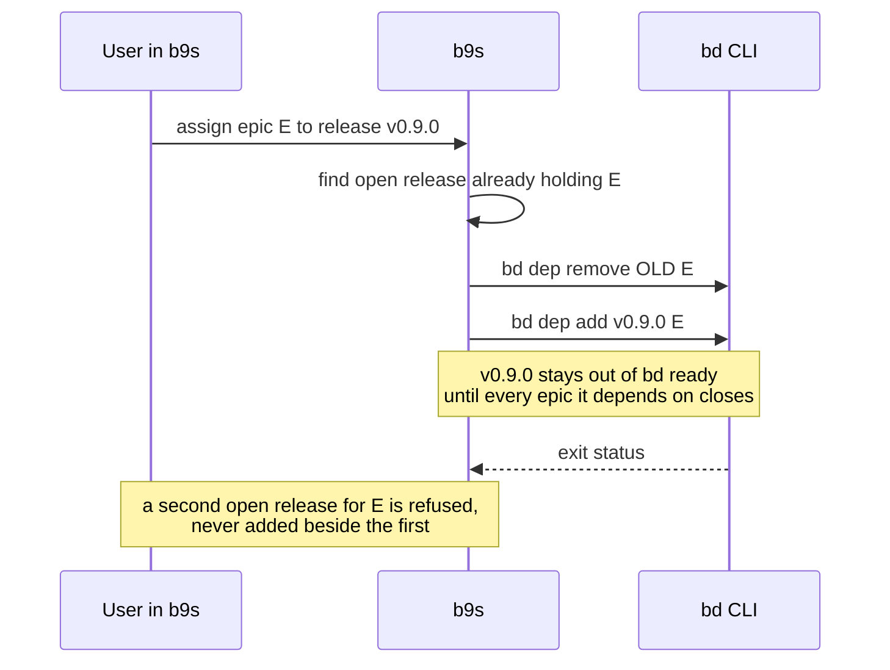

## Context

Epics need to be tied to the release that ships them, and to future releases,
the way Jira ties issues to a fix version. b9s shows epics as a rail and as rows
(ADR 0017, ADR 0018) but has no notion of a release.

b9s makes every write through the `bd` CLI and serves stock `bd` projects
without a migration (ADR 0024, ADR 0025). Any release model must therefore be
built from what `bd` 1.3 already stores:

- **A `milestone` issue type** (`bd create -t milestone`), with `--due` for a
  target date. No project on the shared server uses it yet.
- **Typed dependency edges**: `blocks` (the default, which keeps the dependent
  out of `bd ready` until the dependency closes), `tracks`, `related`,
  `parent-child` and others.
- **Labels**, which are free-form strings.

b9s also carries a `model.Sprint` type and a loader for `.beads/sprints.jsonl`,
inherited from beads_viewer. Neither `bd` nor any Dolt project writes that file,
so the type never holds data.

## Decision

**A release is a `milestone` issue. The release depends on each of its epics
through a `blocks` edge, its due date is the target date, and closing it marks
it released. An epic belongs to at most one open release.**

- **State is derived, from a closed set**: `released` (milestone closed),
  `ready_to_ship` (open, every epic closed), `overdue` (open, due date passed),
  `planned` (any other open milestone). Epics with no open release are listed as
  unscheduled.
- **The link is not parent-child.** Epics already have parents in the hierarchy
  (epic, feature, task), and a release as parent would break it.
- **The link is not a label.** A label has no date and no state, and its value
  is an unbounded string that b9s cannot check.
- **`model.Sprint` and the `sprints.jsonl` loader are deleted.**

## Options considered

- **Milestone issue with `blocks` edges** (chosen): stock `bd`, no migration;
  `bd ready` shows a release as ready exactly when its scope is done. A release
  is itself an issue, so it can carry comments, a description and release notes.
- **Milestone issue with `tracks` edges**: the same entity, but the edge carries
  no gating, so "ready to ship" would be a b9s-only computation invisible to
  `bd` and to agents.
- **A `release:<version>` label on each epic**: cheapest to write, but no due
  date, no state, typos create phantom releases, and nothing stops two versions
  on one epic.
- **A separate release table or file** (like `sprints.jsonl`): needs a schema
  `bd` does not have, so every other tool would ignore it.

## Consequences

- Releases work in every project and every source b9s reads, and agents can
  manage them with plain `bd` commands.
- A release is open in `bd list` output next to ordinary work. Views that list
  work must hide the `milestone` type unless asked.
- The one-open-release rule is enforced only by b9s. A plain `bd dep add` can
  still put an epic in two releases, so the reader must report that state
  instead of picking one silently.
- Re-evaluate if upstream Beads adds a native release or fix-version field.
