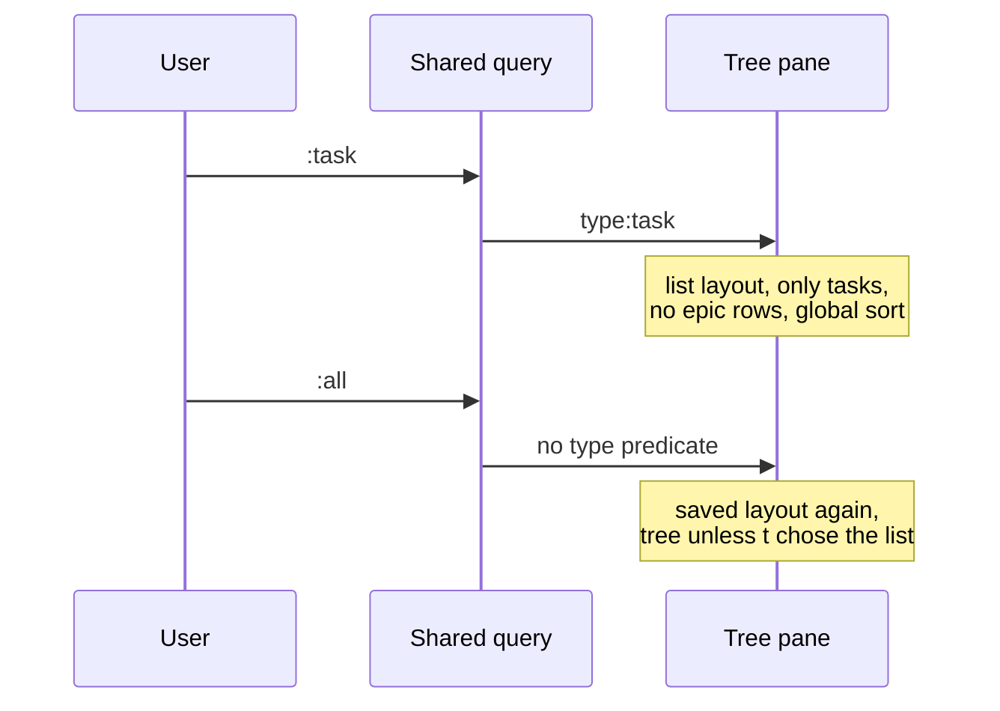

## Context

The tree sorts siblings inside their parent. With the sort on Updated
descending, an issue changed a minute ago still sits under an epic that has not
changed for a week, so the tree never shows the latest activity of a project at
the top.

ADR 0009 made `:task`, `:bug` and the other entity commands replace the `type:`
predicate of the shared query and keep the current view. In the tree a query
match keeps its ancestors on screen, dimmed, as context. For a `type:` query
those ancestors are epics and features, exactly the issues the query asked to
leave out, so `:task` answers with a tree of epics.

A flat mode (bd-39v) existed in the tree model behind the backtick key, but the
global tutorial handler takes the backtick first, so no user could reach it. It
also ignored the text query and the label and assignee filters.

## Decision

**The tree pane has two layouts over the same query, filters and sort: the
tree, and a flat list with one row per matching issue and no context rows.
`t` switches between them, and b9s saves the choice per project in
`.beads/tree-state.json`. A query with a `type:` predicate, positive or
negated, shows the flat list whatever the saved choice.**

This supersedes ADR 0009. Everything else it decided stands: the `:` prompt,
the closed alias table, entity commands that rewrite the `type:` predicate of
the one shared query state (ADR 0001), and the grey completion. Only "keep the
current view" changes: an entity command keeps the view (tree pane, board,
graph) but the tree pane draws its rows as a list while the predicate is there.

## Options considered

- **Layout of the tree pane, forced by `type:`** (chosen): one query state and
  one pane, so filters, marks, the detail pane and every key keep working. The
  list is the same rows the filter already selects, minus the context rows.
- **A separate list view beside tree, board and graph**: bd-8hw.4 removed one
  in February. It needs its own key routing, detail sync and tests, and ADR
  0009 rejected a second place where filtering happens.
- **Keep the tree and hide context rows for `type:` queries**: children of an
  epic would lose the row that anchors their indentation, and the sort would
  still stop at sibling boundaries.
- **Save the layout in the user config like `ui.sort`**: the sort is global on
  purpose (bd-r3l0). Whether a project reads better as a list depends on the
  project: a flat backlog has no hierarchy worth drawing.

## Consequences

- `:task` and `/ type:task` show only tasks, sorted by the active sort across
  the whole project.
- Removing the `type:` predicate returns the tree unless `t` chose the list, so
  a quick type lookup does not change the saved layout.
- A project without a beads directory, such as a Dolt database opened with
  `:project`, has nowhere to save the layout and starts in the tree.
- Folding keys do nothing in the list, which has no children to fold.
- The web UI keeps its own tree and does not follow this decision yet.
- Re-evaluate if users want context rows back for some `type:` queries, for
  example children of one epic: that is the job of `f` and `x`, not of the
  type predicate.
