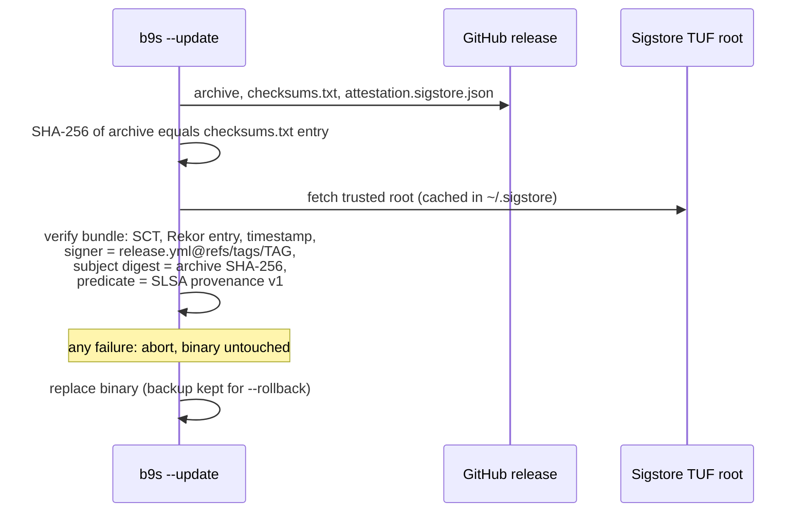

## Context

`b9s --update` downloads a release archive and `checksums.txt` from the same
GitHub release and compares the two. Anyone who can write to the release (a
leaked token, a compromised account session) can replace both files together,
and the updater then installs their binary. The checksum proves the download
was not corrupted in transit. It proves nothing about who built the file.

The release workflow already produced a GitHub build provenance attestation for
each archive, but nothing consumed it, and releases carried no SBOM. The v1.0
security audit (bd-9bsq.4) asked for both.

Two constraints shape the design:

- The anonymous GitHub API allows 60 requests an hour per IP. Fetching the
  attestation from `/repos/.../attestations/<digest>` would fail for users
  behind a shared address, and an updater that fails closed would then refuse
  every update.
- The module builds with Go 1.25.5. `sigstore-go` v1.3.0 requires Go 1.25.8,
  so v1.2.1 is the newest usable version.

## Decision

**The updater refuses to install an archive unless a Sigstore bundle, shipped
as the release asset `attestation.sigstore.json`, proves that
`.github/workflows/release.yml` at that exact tag built it.** Every failure
(missing asset, bad signature, wrong tag, wrong digest, wrong predicate type)
stops the update. Each release also publishes an SPDX SBOM per archive, and the
same attestation covers the SBOMs.

## Options considered

- **Keyless Sigstore bundle as a release asset** (chosen): no key to store or
  rotate, the identity is the workflow file and tag, and the signature sits in
  a public transparency log. The download needs no API quota. Costs a large
  dependency tree.
- **Keyless Sigstore bundle from the GitHub attestations API**: no extra
  asset, but the anonymous rate limit turns into refused updates.
- **An ed25519 key held in a repository secret, public key embedded in b9s**:
  small and simple, but the key is a long-lived secret that a leak of the same
  account compromises, and rotating it strands every installed binary.
- **Checksums only (status quo)**: proves integrity, not origin.

## Consequences

- An attacker who can only upload release assets can no longer ship a binary
  through the updater. An attacker who can push to the repository and run the
  release workflow still can: branch protection and account 2FA guard that.
- Releases up to and including v1.2.0 have no `attestation.sigstore.json`. The
  updater refuses them, so v1.3 is the first release it can install and a
  rollback to an older release goes through `--rollback`, not `--update`.
- The binary grows: the darwin_arm64 archive goes from 8.7 MB to 14.4 MB, and
  the vendor tree grows by about 27 MB.
- The first update on a machine contacts `tuf-repo-cdn.sigstore.dev` and writes
  a cache under `~/.sigstore`.
- The workflow needs `syft` (pinned `anchore/sbom-action/download-syft`) for
  GoReleaser's `sboms` step.
- Re-evaluate when the toolchain moves to Go 1.25.8 or later (upgrade
  `sigstore-go`), or if the binary size becomes a complaint (a slimmer verifier
  or the ed25519 option).
