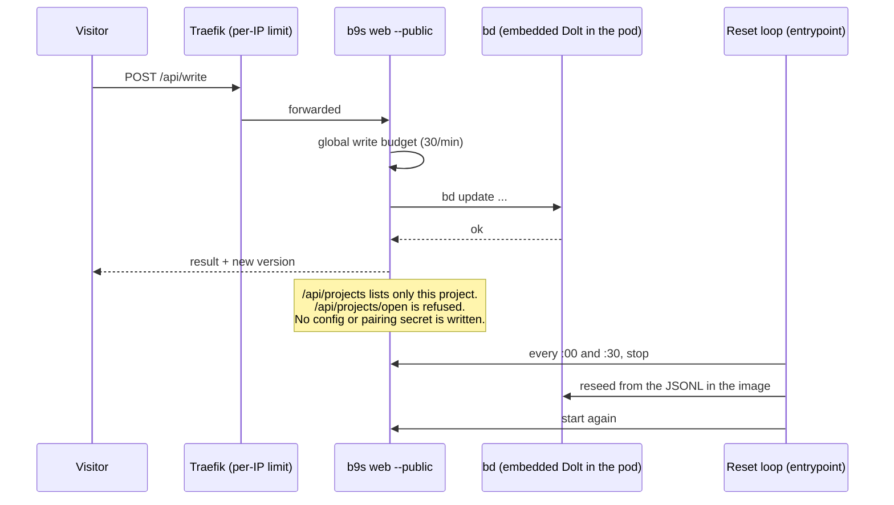

## Context

ADR 0019 serves the mobile web UI from `b9s web`, and ADR 0020 pairs every
browser with a token, so nothing off loopback is served without one. That is
right for a person's real projects, where a write is someone's actual work.

The v1.3 launch needs a board anyone can open from a post, on a phone, without
installing anything: `demo.b9s.osen.co`. A read-only board shows little of
b9s, because dragging a card, closing an issue and adding a comment are the
point. The demo data is a sample project that nobody depends on, so losing a
visitor's edit is acceptable, and a vandalised board only needs to last until
the next reset.

Pairing cannot serve this: there is no one to hand a link to. `--no-token` is
refused off loopback by design, and weakening that check for everyone would
put real projects one flag away from the internet.

## Decision

**Add a separate `--public` mode that serves exactly one project to anyone,
writable, on any address, and make it bound cost instead of controlling
access. Resetting the data is the deployment's job, not the server's.**

What `--public` does:

- No `Auth`, on any address. `NewServer` refuses a public server that also has
  one, and the CLI refuses `--public` with `--no-token`, `--new-token`,
  `--trust-header`, `--owner` or `--projects-root`.
- The project sheet holds only the startup project and probes nothing. Opening
  any project, including "all projects", answers 403. The browser hides the
  project switcher.
- Writes and reloads share one token bucket of 30 per minute for the whole
  server. Per-visitor limits belong to the proxy, because every request
  arrives from it.
- At most 256 open event streams; the next one gets 503.
- No recent-projects entry and no pairing secret are written.
- `--banner` and `--banner-link` put one thin line above the board, so a
  visitor knows the data is shared and temporary.

## Options considered

- **`--public`, writable, reset from outside** (chosen): the demo shows what
  b9s does. The blast radius is one disposable project in one pod with no
  egress. Cost: an anonymous writer can deface the board for up to 30 minutes.
- **Allow `--no-token` off loopback**: one flag for both uses, but it turns a
  safety check for real projects into a matter of remembering a flag.
- **Read-only public mode**: no defacement, but the demo loses dragging,
  closing and commenting, which are what a visitor came to try.
- **Per-visitor sandboxes** (a fresh project per cookie): no visitor sees
  another's edits, but it needs a store per visitor, garbage collection and
  much more memory, for a demo.

## Consequences

- A public server must run where its data is disposable and its network is
  closed: the deployment owns the reset, the per-IP limit and a NetworkPolicy
  that denies egress, because `bd` inside the pod runs on visitor input.
- Visitor text is shown to other visitors. The SPA already escapes all issue
  text and serves a strict CSP, which this mode depends on.
- Re-evaluate if the demo is abused beyond what a 30-minute reset contains, or
  if anyone asks to run `--public` against a real project; the answer to the
  second is a read-only variant, not relaxing this one.
