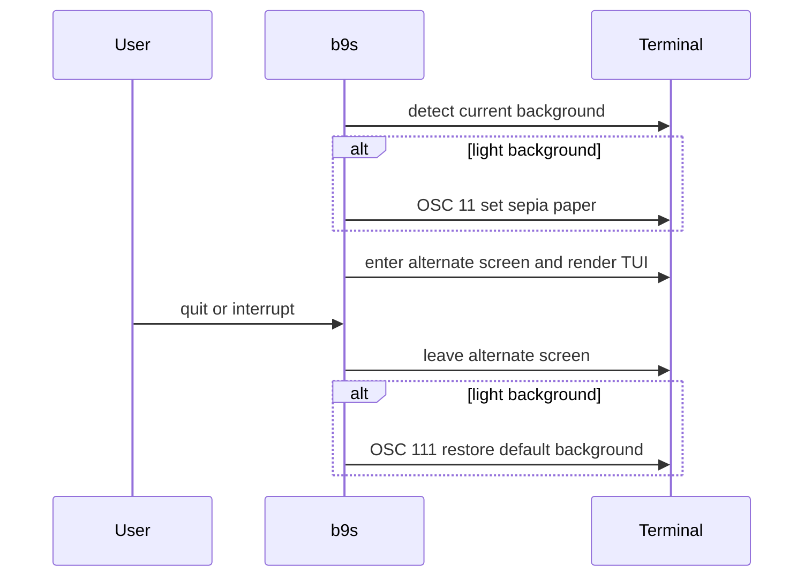

## Context

The light TUI mixed white, blue, grey, and saturated status colors. Its feature,
task, and deferred text did not meet WCAG AA contrast on white. The selected
Sepia mockup uses warm paper with ink blue, moss, oxblood, and ochre accents.
The TUI leaves much of the screen in the terminal's default background, so
changing only styled cells would leave bright gaps around the new palette.

## Decision

**Use one sepia palette for the light half of adaptive TUI colors, and set the
terminal's default background to paper while the light TUI runs.** Set OSC 11
before Bubble Tea enters its alternate screen and send OSC 111 on return to
restore the terminal default. The dark theme remains unchanged. Text and accent
colors must meet 4.5:1 contrast against the paper background. Selection uses
dark ink on a muted tan fill.

## Options considered

- **Set terminal paper while the TUI runs** (chosen): unstyled cells match the
  palette. It depends on terminal support for OSC 11 and OSC 111.
- **Style every cell explicitly**: leaves fewer terminal dependencies, but
  every view and future layout must paint every gap.
- **Keep the current white default**: avoids a terminal command, but the warm
  surfaces become isolated patches on a bright screen.

## Consequences

Terminals without OSC 11 support keep their own background. A forced kill such
as SIGKILL can prevent OSC 111 from running, so the user may need to reset the
terminal background. The palette tests guard light color sourcing and text
contrast. A PTY test guards the set and restore sequence during a normal exit.
Re-evaluate if terminal compatibility or accessibility feedback shows the
paper change causes a practical problem.
