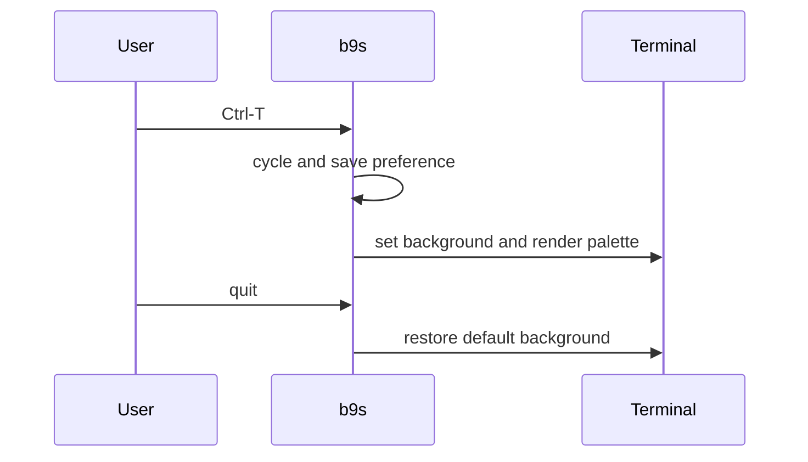

## Context

ADR 0030 defined the Sepia palette for light terminals. Terminal detection alone
does not let a person select that palette on a dark terminal. The web interface
also needs a visible choice.

## Decision

**Offer Automatic, Sepia, and Dracula in both interfaces.** Automatic follows
the terminal's original background or the browser's color scheme. The TUI
cycles choices with Ctrl-T and saves `ui.theme` in the config file. The web
header opens a theme chooser and saves the choice in browser storage. The two
preferences are independent because the TUI config is local to the process,
while a browser may run on another device.

The TUI sets OSC 11 to paper for Sepia and to Dracula's background for a
forced dark theme. Automatic restores the terminal default on an originally
dark terminal. On exit, it sends OSC 111 to restore the user's background.
Adaptive text, surfaces, and Markdown follow the selected palette. The web
palette applies to all views and browser chrome.

## Options considered

- **Separate saved choices** (chosen): each interface reflects the device on
  which it runs and can switch immediately.
- **One server-side choice**: syncs a setting across devices but cannot model
  each device's color scheme or an offline browser.
- **Automatic only**: leaves the selected light theme inaccessible on dark
  devices.

## Consequences

The web and TUI can show different themes for the same project. Terminal
background changes depend on OSC 11 support. A forced kill may prevent OSC 111
from running. The TUI keeps the original terminal detection for the whole
session so a theme switch cannot change what Automatic means.
