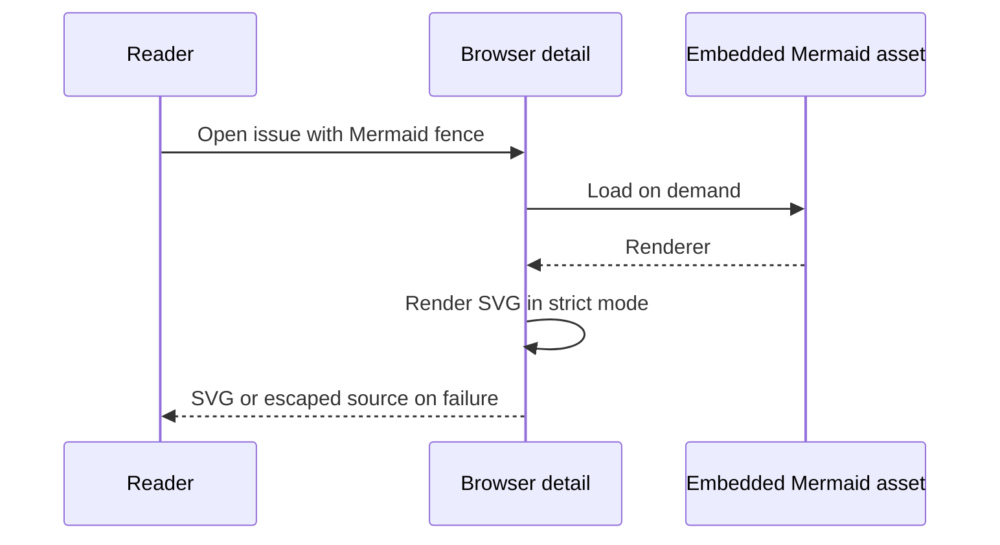

## Context

The terminal detail view renders supported Mermaid fences, but the browser
detail sheet shows their source. The browser already receives the original
Markdown for copy and edit. Some issues contain sequence diagrams too large
to fit a phone screen. A diagram renderer must also handle issue text as
untrusted input.

## Decision

**Load the pinned Mermaid browser bundle when a detail contains a Mermaid
fence. Render that fence as SVG in strict mode, and keep escaped source visible
if rendering fails.** Keep the original Markdown in the issue model. Give wide
SVGs their natural width inside a horizontal scroll container.

## Options considered

- **Embedded Mermaid browser bundle** (chosen): It handles the complete
  sequence syntax, including actors, notes, branches and nested loops. Loading
  it on demand keeps ordinary list and board views small. It adds an embedded
  asset of roughly four megabytes before compression.
- **Server-side terminal renderer**: It reuses the Go dependency but produces
  character diagrams that become wide and hard to read on phones. The browser
  would also need a new API response shape for rendered content.
- **Remote Mermaid service**: It avoids an embedded asset but sends issue text
  to another service and makes diagrams depend on network access.

## Consequences

- The browser can render more Mermaid syntax than the terminal renderer. Both
  keep the original Markdown for copy and edit.
- The first diagram loads a separate local asset. Later diagrams reuse the
  renderer and a bounded cache of rendered sources.
- A failed render leaves escaped source visible. Strict mode disables
  Mermaid click actions and escapes HTML labels from issue text.
- The bundled asset comes from the pinned `mermaid` npm package and is
  committed under `pkg/web/dist` for Go builds without Node.
