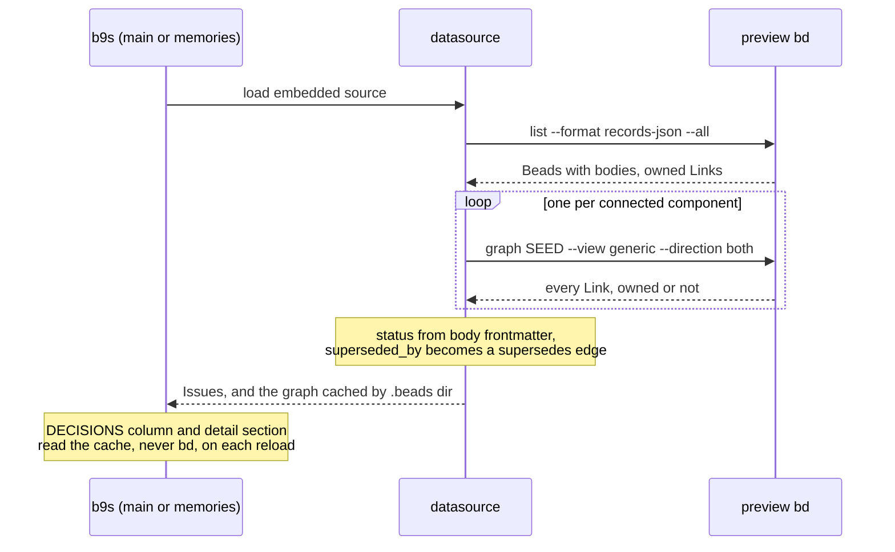

## Context

[ADR 0031](0031-browse-memory-preview-in-a-lazy-tui.md) made `b9s memories` a lazy browser that reads one Memory at a time and shows ADR titles verbatim, without parsing a status. That answers "what does this decision say". It does not answer the questions the POC exists to test: which work follows which decision, which work follows a decision that has since been replaced, and which work has no recorded decision at all. Those are questions about the whole graph, and about the Issue side of it.

Three facts about the pinned preview constrain the answer:

- A Memory has no status field. The imported ADRs carry their status in YAML frontmatter at the top of the body, the same block the ADR files in `docs/adr` start with.
- Links written by `bd link` are owned by no Bead, so the inventory (`bd list --format records-json`) misses them. Only `bd graph --view generic --direction both` returns every Link, one traversal per connected component.
- A graph workspace refuses `bd export` with `capability_unavailable`, so the main b9s TUI cannot load its Issues the way it loads any other embedded store.

On the POC workspace (25 Issues, 32 Memories, 42 Links) the full graph read takes about 11 seconds.

## Decision

**b9s reads the whole graph once, with one inventory call and one traversal per component, and derives every decision view from that read. A Memory's status, number and supersession come from its body frontmatter. The main TUI loads a graph workspace's Issues from the same read and keeps the graph for a DECISIONS tree column and a DECISIONS section in the detail pane.**

`b9s memories` reads the same graph on the first press of `2` (constellation) or `3` (two shores), once per session. Health is one closed value per Issue, worst first: it follows a superseded decision, it is an epic, it has no decision, it follows a proposed decision, or it is fine.

This replaces two points of ADR 0031: the browser now parses a status, from frontmatter rather than from the title, and the decision side of the graph appears in the main TUI. ADR 0031's lazy per-Memory reads for the list view stay as decided.

## Options considered

- **Frontmatter status and one graph read** (chosen): matches how the ADR files already record status, costs one read per reload, and every view agrees on what it shows because it shares the read. A Memory written without frontmatter has no status and reads as "no status".
- **Parse the status from the title** (`ADR 0009 (superseded): …`): works for the import script's titles only, and a retitled Memory silently changes state.
- **Wait for an upstream status field**: correct long term, but blocks the evaluation the POC is for. Filed as a finding instead.
- **One `bd links` per Issue for the column**: about 0.4 seconds per Issue, so 10 seconds for 25 Issues and growing linearly, with no gain over the traversal.

## Consequences

A graph workspace opens in the main TUI instead of failing on `bd export`, but its first frame waits for the full graph read, about 11 seconds on the POC, and each reload pays it again. The DECISIONS column appears only for a graph workspace, on terminals wider than 120 columns unless the user shows it with `|`. The detail section repeats neither the card nor the relations: it lists only `follows` and `cites` Links, with their notes and who else shares each decision. The edge cannot record which version of a Memory was read, so the section says so instead of guessing. Re-evaluate when the preview gains a status field, a bulk Links read, or a version on the edge, or when the read time makes the main TUI feel slow.
