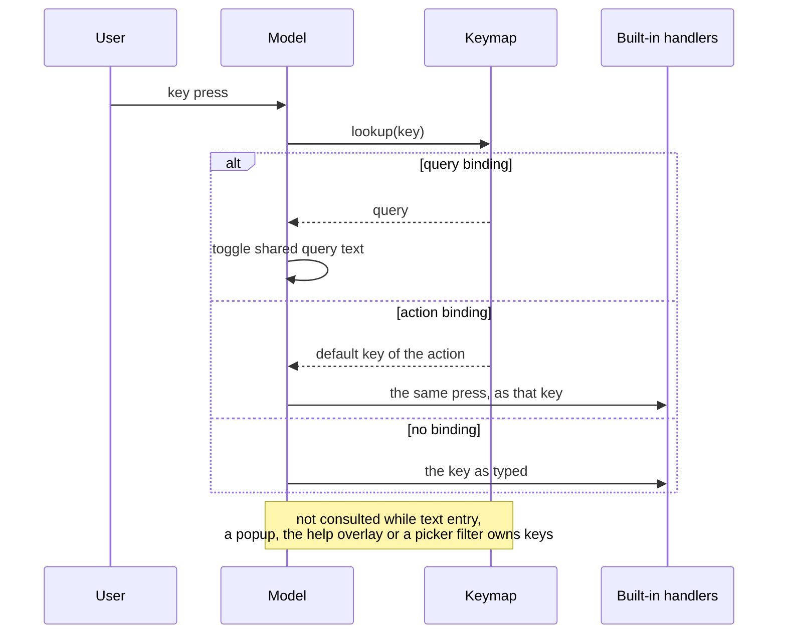

## Context

GitHub issue #14 asks for a type quick filter in the style of the label and assignee selectors, because `/` then `type:epic` is slow for a common question. The owner added that b9s has no shortcut customization: every key is hardcoded in `pkg/ui`, so a user cannot bind a key to a query such as `type:epic` or move a built-in action to another key.

Two constraints shape the answer. ADR 0001 and the status keys (`o`, `i`, `C`) already keep filters as terms of the one query string, so a filter that lives anywhere else breaks the combined filters and the active-filter display. And the keys are handled in many switch statements across views, so a customization layer cannot rewrite them without a large refactor.

## Decision

**`Y` opens a type quick filter whose digits toggle `type:<name>` terms in the shared query. User shortcuts live in a `keybindings:` list in the existing `config.yaml`, each binding a key to a query or to a named built-in action. A binding that breaks a rule is rejected and stops startup with a message that names it.**

Type filter: `Y` switches the header panel to the five types (bug, feature, task, epic, chore), numbered 1 to 5 as in the type legend. A digit toggles its term, `0` removes every type term. Types combine as alternatives, and other terms stay. The state is the query text, so the filter works in list, tree and board, shows in the query bar, and `Esc` clears it.

Keybindings: the section sits in `config.yaml` because `pkg/config` already finds and parses that one file, and a second file would add a second failure mode and a second place to look.

```yaml
keybindings:
  - key: ctrl+t            # one character, ctrl+<letter>, alt+<character>, f1..f12
    query: "type:epic"     # or: action: view_board
    description: Epics     # footer and help text, optional
    override: false        # true to replace a built-in key
```



- **A query binding** sets the shared query. Pressing it again while its query shows clears the query, as `o` does for status.
- **An action binding** presses the key the action stands for. `view_board` is `b`, and it does what `b` does in the current view. The action table is closed and listed in the user guide.
- **Conflict rules, all fatal at startup** (exit code 2, every problem listed with its list position): an unknown action, both or neither of `action` and `query`, an invalid key name, an unknown query field, a duplicate key, a key in the built-in set without `override: true`, and a reserved key. Reserved keys never rebind: `ctrl+c`, `Esc`, `Enter`, `Tab`, `Backspace`, `Space`, the arrows and paging keys, `j k h l G`, the slash, colon, question mark and backtick, and the digits. A config that cannot decode the section also exits with code 2.
- **Guard:** `TestEveryHandledKeyIsKnownToCollisionCheck` scans the UI source for handled keys and fails when one is missing from the built-in or reserved list, so a new built-in key cannot be shadowed without `override: true`.
- Custom bindings lead the footer hints and have a Custom panel in the `?` overlay.

## Options considered

- **Section in `config.yaml`, query or action per binding** (chosen): one file, one loader, small surface, and the action indirection reuses every handler and its view-specific meaning.
- **Separate `keybindings.yaml`** (the sketch in `docs/k9s-inspired-design.md`): clean to hand around, but a second file to find and a second parse path.
- **Per-view binding tables** (`list:`, `tree:`, `board:`): the k9s shape, but it needs every handler to read a table, a large refactor with no request behind it. Re-evaluate if users ask for a key that means different things per view.
- **Warn and skip invalid bindings**: starts faster after a typo, but leaves a key that silently does nothing or something else. The user wrote the file, so a loud stop is the kinder failure.
- **Type quick filter as its own state beside the query**: matches `labelFilter`, but breaks ADR 0001, because the filter would not show in the query bar or compose through `/`.

## Consequences

Users get one-key queries (`type:epic`, `status:open label:urgent`) and can move built-in actions to keys they prefer. The cost is a closed action list that needs a row for each action users ask for, and an override table that must track new built-in keys, which the guard test enforces.

Action bindings inherit the context of the press, so `filter_open` in the detail pane does what `o` does there. A binding cannot target one view only. Remapping does not free the original key: the built-in key keeps working unless an `override` binding claims it.

The sketch in `docs/k9s-inspired-design.md` (Key Binding Config) is not built. Re-evaluate the single-file choice if bindings grow past a screenful, and the action table if a user needs per-view bindings.
