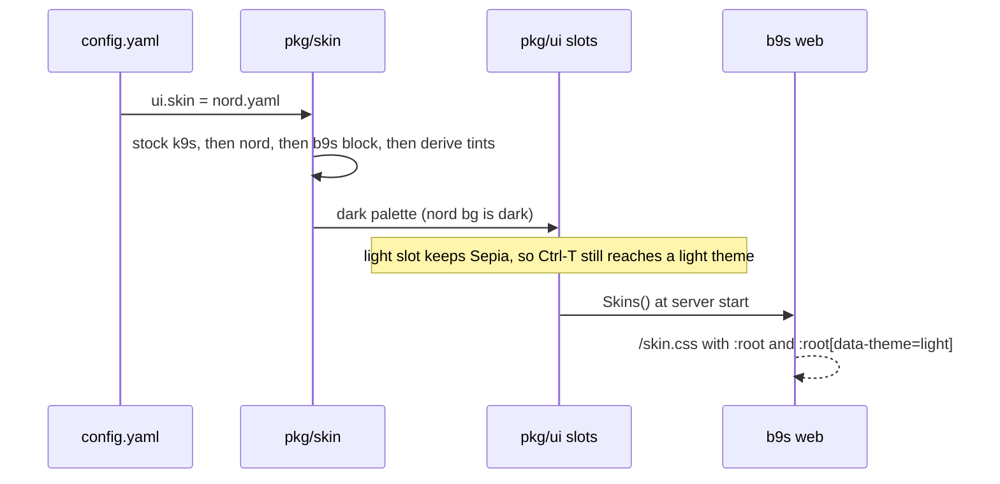

## Context

b9s is modelled on k9s, and many b9s users run both tools side by side. k9s
users theme it with [skin files](https://github.com/derailed/k9s/tree/master/skins):
YAML that colours k9s's body, frame, table and views. b9s had two fixed
palettes, Sepia (ADR 0030, ADR 0032) and Dracula, as Go constants spread over
`pkg/ui` and as hex values in `web/src/app.css`. A user could not give b9s the
look of their k9s, and every new colour had to be added in two languages.

Every b9s style takes a `lipgloss.AdaptiveColor`, which holds a light and a dark
value and resolves at render time from the renderer's background. `Ctrl-T`
(ADR 0031) works by flipping that background, so the TUI already thinks in
exactly two palettes.

## Decision

**b9s reads k9s skin files, and a skin fills the light or the dark theme slot
from the luminance of its background.** `pkg/skin` maps the k9s slots to b9s
colour tokens, lays the user's skin over the stock k9s skin as k9s does, blends
the tints b9s needs from those colours, and applies an optional top-level `b9s:`
block that sets any token directly. Sepia and Dracula become built-in skin files
in the same format, so one pipeline produces every palette. `ui.skin` in the b9s
config names a built-in skin or a file path. b9s never reads the k9s config.

The TUI keeps its two slots and its three `Ctrl-T` choices. A configured skin
replaces the built-in skin of its own slot only, so the other kind of terminal
still has a theme. `b9s web` renders both slots as `/skin.css`, the custom
properties `app.css` reads, so the browser and the terminal show the same skin.

## Options considered

- **Skin per slot** (chosen): fits AdaptiveColor, keeps `Ctrl-T` meaning auto,
  light or dark, and needs no style rebuild. A custom dark skin hides Dracula
  until `ui.skin` changes.
- **Cycle every known skin with `Ctrl-T`**: shows more skins, but every style
  is built once from package-level colours, so a switch would rebuild them all,
  and a light skin on a dark terminal would need the terminal background forced.
- **Read the k9s config and follow its active skin**: zero setup for k9s users,
  but couples b9s to k9s's config layout, context rules and file locations.
- **A b9s-only palette format**: full control, but no k9s skin works as is,
  which defeats the purpose.

## Consequences

Any k9s skin works without edits, and the `b9s:` block covers what k9s has no
slot for (board selection, status tints, eight accents). The palette lives in
one YAML file per skin; Go code holds no hex values, which
`TestAdaptiveColoursComeFromSkins` enforces.

k9s has fewer slots than b9s has roles, so several b9s colours share one k9s
colour; for example open issues, low priority and features all take
`status.addColor`. Contrast is checked only for the built-in skins. A user skin
can be unreadable, as it can in k9s. Colours drawn with fixed `ThemeFg` values
outside the AdaptiveColor globals do not follow the skin yet.

Re-evaluate if users ask to switch skins at runtime, or if k9s changes its skin
schema.
