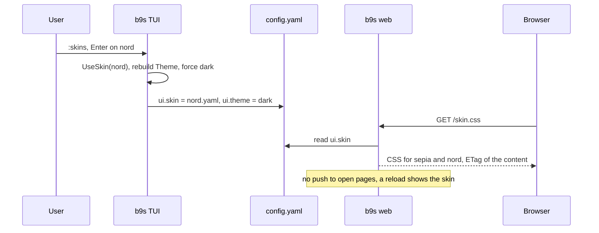

## Context

ADR 0033 made b9s read k9s skin files into its light and dark theme slots, set
once at start from `ui.skin`. It rejected switching skins at runtime because
every style was built once from package-level colours, and it named "users ask
to switch skins at runtime" as the trigger to re-evaluate. Users asked: trying a
skin meant editing `config.yaml` and restarting both the TUI and `b9s web`.

k9s answers the same need with a picker. b9s already has the pattern in
`:projects`: a `:` command opens a centred list, `Enter` applies, `Esc` leaves.

## Decision

**`:skins` opens a picker of the built-in skins and the skin files in
`~/.config/b9s/skins/`. `Enter` loads the skin into its slot, rebuilds the
theme, forces the matching theme, and saves `ui.skin` and `ui.theme`. `b9s web`
reads `ui.skin` on every `/skin.css` request.** Everything else in ADR 0033
stands: k9s skin files, two slots chosen by background luminance, the `b9s:`
override block, and no reading of the k9s config.

A runtime switch rebuilds the `Theme` and gives the new copy to every sub-model
that holds one by value. Forcing the slot's theme makes a light skin show on a
dark terminal, which is what a user who picks it expects. The TUI and the server
are separate processes, so the saved config is the only channel between them;
the server resolves the skin per request without touching the TUI's slot
globals, which concurrent requests would race on.

## Options considered

- **Picker, saved choice, server reads config per request** (chosen): one
  gesture to try a skin, survives a restart, and `b9s web` follows without a
  channel between processes. Costs a config read and a skin parse per
  `/skin.css` request, which is small next to the page load.
- **Picker, choice kept in memory only**: no config writes, but the next start
  and `b9s web` show the old skin, so the user still edits the config.
- **Cycle skins with `Ctrl-T`**: no new command, but `Ctrl-T` already means
  automatic, light or dark (ADR 0031), and a long cycle is slow to reach a skin.
- **Watch the config and push to open pages**: the browser updates without a
  reload, but needs a file watcher and an event type for one cosmetic change.

## Consequences

Trying a skin is `:skins`, `j`, `Enter`. A skin that does not load leaves the
current one on screen and shows the error in the status bar. When the config
could not be read at start, b9s applies the skin but does not save it, so a
damaged config is never overwritten.

Any `Theme` field added to a sub-model must be refreshed in `switchSkin`;
`TestSwitchSkinReachesEveryThemeCopy` walks the model by reflection and fails
when one is missed. Colours drawn with fixed `ThemeFg` values still do not
follow the skin (ADR 0033).

`/skin.css` has an ETag computed from its content, so browsers revalidate it and
a changed skin is never served from cache.

Re-evaluate if open pages must change skin without a reload, or if per-project
skins are wanted.
