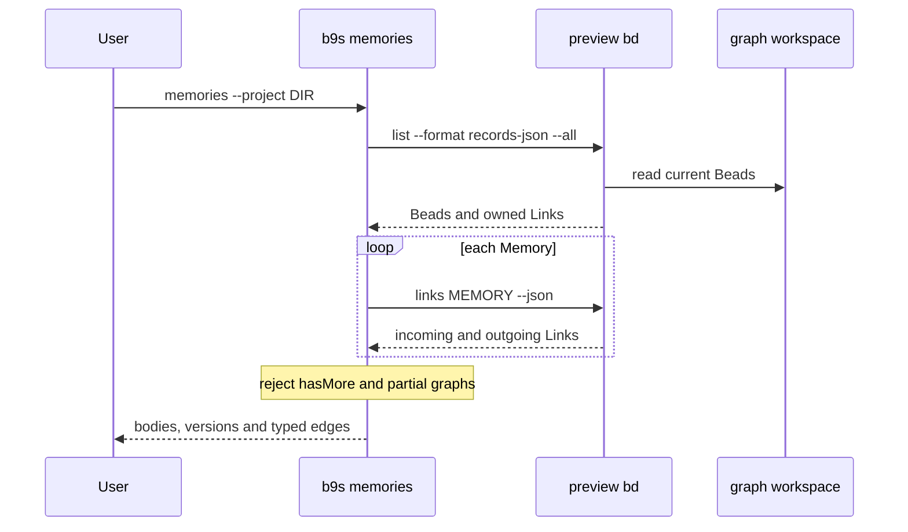

## Context

The Memory Beads integration branch introduces a graph schema that the existing b9s Issue readers do not understand. The preview is restricted to new workspaces and can change before release. Its embedded Dolt store is locked by an open process, while b9s normally holds its server reader open. The preview CLI exposes current Bead records and incident Links, but `bd export` does not provide the graph records that b9s needs.

## Decision

**Add a separate, read-only `b9s memories` command for graph preview workspaces. Read through the matching preview `bd` binary, and refuse incomplete snapshots.**

## Options considered

- **Preview CLI** (chosen): works for embedded and server workspaces, follows the preview's own schema, and leaves existing b9s readers unchanged. It starts one process per Memory to see incoming Links.
- **Direct Dolt queries**: could be faster but couples b9s to an experimental schema and risks an embedded-store lock.
- **BDP HTTP**: provides pagination in server mode, but the embedded preview has no BDP server. It would exclude the easiest local trial.

## Consequences

The view can show a Memory, its current version and both Link directions in a fresh preview workspace. It cannot show a complete graph above the CLI's inventory limit of 1,000 Beads, so it reports an error instead. A workspace needs the integration-branch `bd` on `PATH`. Historical versions and mutation remain in `bd`. Reconsider this adapter when BDP serves embedded workspaces or offers a stable paginated read path for both modes.
