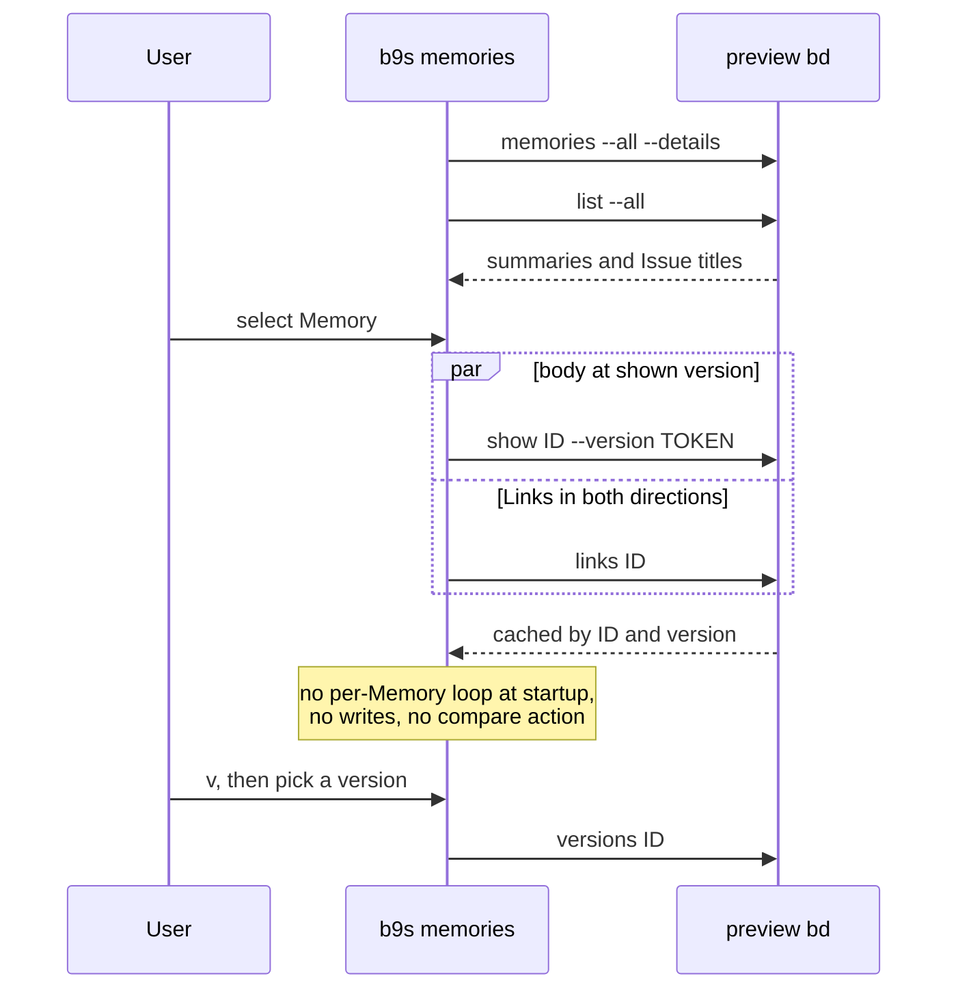

## Context

[ADR 0036](0036-read-memory-preview-through-bd-cli.md) added `b9s memories`, which read the whole graph up front and printed it. It ran `bd links` once per Memory to see incoming Links, because Links owned by an Issue do not appear in the Memory's own record. On the POC workspace that took 14.7 seconds for 32 Memories, before the first line appeared. Each `bd` call against the embedded preview store costs about 0.4 seconds, so the delay grows with every Memory added.

The preview CLI offers reads that make most of that work unnecessary. `bd memories --all --details --format records-json` returns every Memory's summary, with matched fields and an excerpt, in one call. `bd show ID --json --version TOKEN` returns a body and its owned Links at a retained version. `bd versions ID --json` lists the versions bd retains, newest first. None of these needs a direct Dolt connection.

A reviewer evaluating the preview needs to read a Memory, see what cites it, follow a Link, and read an older version. A printed dump does not support any of that.

## Decision

**`b9s memories` opens a separate read-only TUI that lists Memory summaries and reads a Memory's body, Links and versions only when it is selected. Results are cached per Memory and version, and `--print` or `--id` keep the plain output.**

The list comes from one `bd memories` call and the Issue titles from one `bd list` call, both started together. Selecting a Memory starts `bd show` and `bd links` for that Memory. A reply that arrives after the selection moved on is cached, not shown. Search is the preview's literal match over title and body, and the view says so. The browser does not parse a status out of ADR titles: titles are shown verbatim.

## Options considered

- **Separate lazy TUI** (chosen): first frame after two calls, one Memory costs two calls, and the released Issue TUI is unchanged. Incoming Links on a retained version still come from the current graph, because the preview offers no historical incoming read.
- **A Memory view inside the main TUI**: one application, but it would mix the graph model into the Issue model's query state, sorting and writer before the preview is stable.
- **Keep the eager printed view**: simplest, but its startup cost grows with the Memory count and it cannot show older versions or follow Links.
- **Prefetch all Links in the background**: fast navigation after a while, but it repeats the per-Memory loop and competes with the reads the user is waiting for.

## Consequences

The list appears after one `bd memories` call, about half a second on the POC, and each Memory is read once per version. It shows retained versions, not full history, and it labels a non-current version as such. Following a Link to an Issue only names the `bd show` command, since the Issue model lives in the main TUI. The printed path still reads every selected Memory's Links, and `--id` restricts that to one Memory. Search has no synonyms or ranking beyond what bd provides. A structured status field on Memories, a historical Links read, or a BDP server for embedded workspaces would each be a reason to revisit this design.
