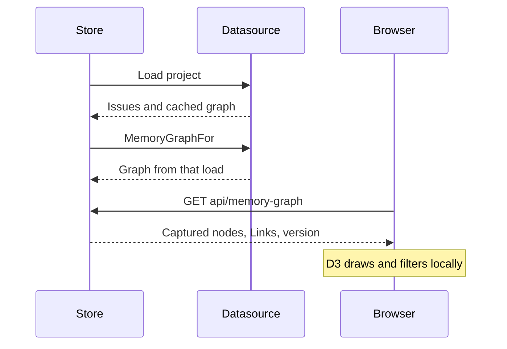

## Context

The terminal constellation cannot show directed Links legibly at ordinary terminal sizes. Braille wires, labels and arrowheads overlap. Focus wires, matrix and chips answer row-level questions well, but a spatial graph needs browser graphics.

## Decision

**Render the constellation with D3 force layout in b9s web. Keep focus wires, matrix and chips in the terminal.** This replaces the terminal constellation part of ADR 0038. Its one-graph-read contract remains in force.

The web Store captures `datasource.MemoryGraphFor` with each successful project load and associates it with the Store version. `GET /api/memory-graph` serves that captured value through the same pairing protection as other reads. A request never runs `bd`. A failed reload keeps the previous snapshot. Opening a non-graph project clears the graph.

Memories and Issues have distinct shapes. Status and Issue health determine colour. Directed arrowheads, solid follows Links, dashed cites Links and supersedes chains preserve the graph's meanings. Selection shows bodies and Link notes, while hover and keyboard focus highlight neighbours. Problems filtering uses the datasource's verdict, so browser and terminal agree.

## Options considered

- **D3 in the existing browser app** (chosen): readable vector geometry, existing authentication and snapshot lifecycle, no extra service.
- **Keep terminal force layout**: no browser required, but character cells cannot resolve crossing wires and labels reliably.
- **Read the preview CLI on each request**: simple handler, but repeats expensive traversal and permits Issues and decisions from different loads.

## Consequences

The terminal loses key `5` and directs readers to `b9s web`. The browser bundle includes D3 force layout. The graph endpoint includes Memory bodies, protected by the same project-level access as Issue bodies. Large graphs cost layout time and response bytes. Re-evaluate when graph size requires a bounded subgraph or upstream provides a graph snapshot API.
