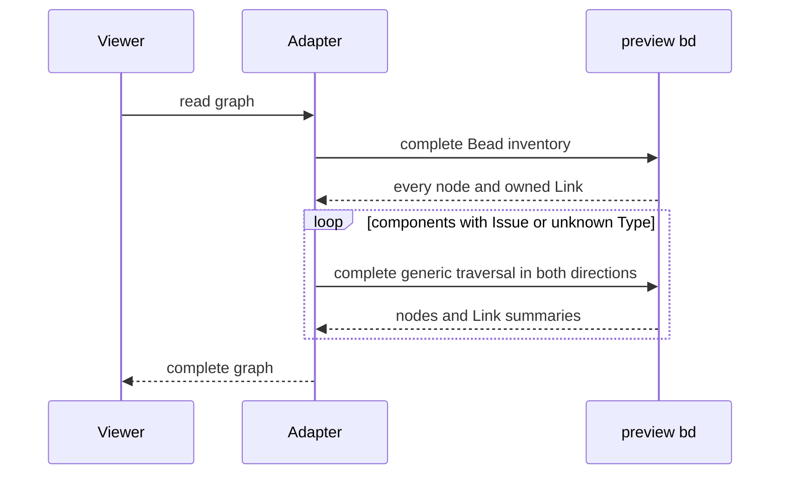

## Context

ADR 0038 reads each graph component through the preview CLI. On the pinned
preview, an unpruned read takes 13.18 seconds for 57 Beads and 42 Links.
Starting six traversals together previously took 15.39 seconds because the
embedded store serializes access.

The pinned `preview-memory-v2` descriptor owns every outgoing informational
Link. Complete inventory records include those owned Links. Informational
Links from Issues have no owner. This distinction is enforced by
`graphstore.beadEndpointInTx` and `memoryOwnedLinksInTx` in preview commit
`1f3466b5dfcb8c76ecb9ceaf4b847df695131f96`.

## Decision

**Use the complete inventory for all nodes and Memory-owned Links. Traverse
components containing an Issue or an unknown Bead Type. Keep complete owned
Link records ahead of traversal summaries when deduplicating.**

This supersedes ADR 0038's traversal of every component. Its complete-graph
requirement, frontmatter interpretation and shared graph cache remain in force.

An unowned Link must have an Issue source in the pinned preview, so traversing
every Issue component finds it, including incoming Links to an otherwise
isolated Memory. Memory-only components are already complete in the inventory.
Unknown Types receive traversal because their ownership rules are unknown.
Partial inventories and incomplete traversals still fail.

## Options considered

- **Descriptor-based roots** (chosen): preserves every node and Link while
  avoiding redundant embedded database openings.
- **More concurrent CLI processes**: increases lock contention and repeats
  work before neighboring roots become known.
- **Skip nodes with no owned Links**: unsafe for Issues, which can have
  unowned outgoing Links.
- **Direct SQL or a persistent server**: would change the storage boundary and
  preview deployment. Embedded BDP serving is unavailable in this revision.

## Consequences

The measured optimized read takes 6.89 seconds. An opt-in real-workspace test
compares every node and edge, including properties available in the inventory,
against an unpruned traversal and requires the optimized read below 11 seconds.
Unit guards cover Memory-only Links, isolated nodes, Issue-only Links, unknown
Types, complete owned properties and incomplete traversal refusal.

Recheck the descriptor contract when changing the pinned preview. Traversal
summaries do not contain all unowned Link properties. Individual Memory detail
reads use `bd links` to obtain those properties.
