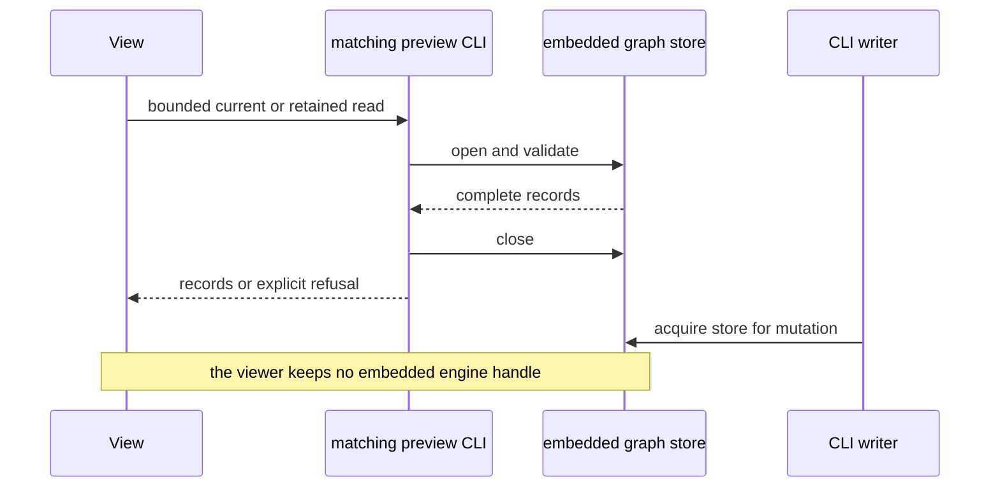

## Context

Native Memory views read the pinned graph preview through its CLI, as decided
in ADRs 0037 and 0040. A complete 57-Bead, 42-Link read takes 5.07–7.96 seconds
in the local investigation. Frontmatter parsing takes 44.8 microseconds per
snapshot, so avoiding ADR parsing does not address that latency.

[The transport investigation](../memory-read-research.md) compared the pinned
CLI, direct SQL and BDP using isolated copies. Clean current records matched.
Persistent SQL took about 3.3 ms warm, but the shortcut accepted retained heads
when the CLI rejected schema drift or inconsistent current payloads. Holding
an embedded engine open blocked a CLI writer. An ordinary SQL server allowed
a writer to complete while a read transaction retained its snapshot.

BDP read both complete collections in about 398 ms warm. Each continuation
preserved its original records, while a fresh collection or resource could
observe a later write. The service has no historical version endpoint or
global graph revision fence and cannot serve the pinned embedded workspace.

## Decision

**Keep the matching preview CLI for embedded Memory reads and retained
versions. Do not introduce a direct SQL Memory reader or automatic graph
refresh from these measurements.**

This confirms the transport boundary in ADRs 0037 and 0040. It does not
supersede their lazy detail reads, ownership rules or graph completeness
requirements. BDP is the preferred candidate for an ordinary-server transport
when a common snapshot/fence and a retained-version strategy are available.

## Options considered

- **Matching CLI, cached and lazy** (chosen): preserves current validation,
  retained versions and embedded lock release. Repeated processes remain
  expensive, and multiple reads do not establish a graph-wide atomic snapshot.
- **Persistent embedded SQL**: fast local reads, but retains the engine lock
  against CLI writers. Rejected for the interactive preview.
- **Direct server SQL**: fast and supports a consistent read transaction, but
  requires private schema coupling and the complete validation that the
  measured shortcut lacks. Clean-record parity is insufficient.
- **BDP for ordinary-server workspaces**: preserves provider validation and
  paginates complete collections. It requires server deployment, a common
  snapshot contract across collections, and a separate version-read strategy.

## Consequences

The production reader remains unchanged. Native Memory bodies need no ADR
frontmatter, and their absence must not be treated as a transport optimization.
The observed latency remains an accepted limitation of this preview.

Optional live updates need one bounded refresh at a time, coalesced
invalidations and a stable revision around the complete acquisition. Preserve
selection by canonical ID and retained versions by their opaque tokens. Keep
the last accepted graph when a refresh fails, with an explicit stale state.
Incoming Links and unowned Issue Links need graph-level invalidation.
Stored Link direction remains independent of update activity.

Reconsider when BDP supports embedded serving, a common snapshot or graph
revision fence, and a supported retained-version path, or when the user chooses
an ordinary-server deployment with an explicit hybrid version strategy. A
stable supported storage schema with corruption/refusal parity would also
justify another SQL evaluation. Any replacement needs those checks before a
production reader changes.
