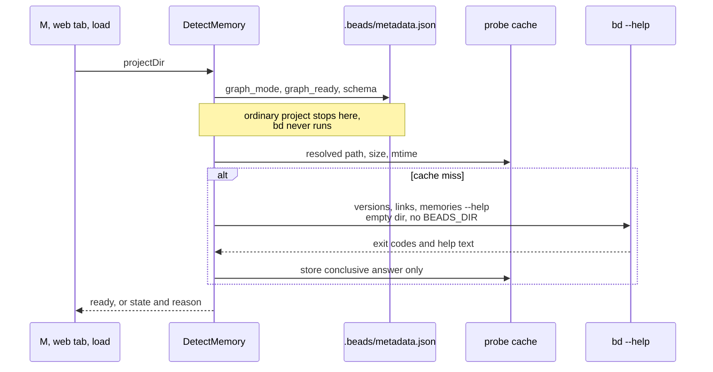

## Context

ADR 0044 ships the Memory views in regular b9s and detects support from ready
workspace metadata and from the results of actual reads. That leaves two gaps.

A graph workspace opened with a released `bd` runs the slow graph read at every
load only to have bd refuse it, and the MEMORY LINKS column and Memory detail are
computed from whatever that refusal leaves behind. And `M`, the web Memory tab
and `b9s memories` can only explain a failure after a read has been attempted,
so the explanation for "this bd has no Memory Beads" is a translated CLI error
rather than a statement of what is missing.

One b9s binary must work against any bd, released or preview. Memory Beads is
an upstream proposal (gastownhall/beads #5877, tracker #6535, phases #6536 to
#6542, all open on this date). No released bd contains it, and upstream defines
no capability token yet. The preview build reports the same semver as a
release (`1.3.0`), and its `branch` names a checkout rather than a feature.

## Decision

**Before any Memory read, combine the workspace metadata with a bounded probe
of bd's help output, and skip Memory-only work unless both say ready. `M`, the
web tab and `b9s memories` stay available and explain the result in one line.**

- **State.** `DetectMemory` returns one of `ready`, `not_enabled` (not a ready
  graph workspace, or a graph schema newer than 6), `unsupported` (bd missing or
  without a Memory dialect) and `off`, each with a one-line reason.
- **Probe ladder.** The `preview-v2` dialect requires all three of
  `bd versions --help` and `bd links --help` exiting 0, and `bd memories --help`
  mentioning `records-json`. Upstream Beads History may ship `versions` and
  `links` without Memory records, so the first two alone are not enough. Each
  call is bounded to 2 seconds and runs in an empty temporary directory with
  `BEADS_DIR` and `BEADS_DB` removed, so the probe cannot open, lock or migrate
  a database.
- **Cache.** The answer is kept per resolved bd path, size and modification
  time in `$XDG_CACHE_HOME/b9s/bd-capabilities.json`, written by rename. A
  timeout or cancellation says nothing about the binary and is never cached.
  `--reprobe` drops the entry for a bd replaced in place.
- **Skipped work.** Unless ready, the load does not run the graph read: Issues
  come from `bd export`, and any graph cached for that workspace is dropped, so
  the MEMORY LINKS column and Memory detail disappear rather than go stale.
- **Explained, not hidden.** `M` keeps its key and help entry and shows
  "Memories unavailable: <reason>" in the status bar. `/api/memory-graph`
  answers `available: false` with a `reason`, which the web tab shows.
  `b9s memories` prints the reason and state and exits 2.
- **Lever.** `B9S_MEMORY=off`, or `memory: off` in the config, returns `off`
  before bd runs. No value forces Memory on against a failing detection.

ADR 0044 stays in force: there is still no version or branch gate, failures of
actual reads are still explained from typed causes, and no view enables or
migrates a workspace.

## Options considered

- **Help-output probe with workspace metadata** (chosen): never opens a
  database, costs one `stat` on a cached start, and distinguishes the preview
  from both releases and a History-only upstream. It is specific to the preview
  and has to grow a rung when upstream ships its own dialect.
- **Version or branch gate**: rejected. The preview reports `1.3.0` like a
  release, forks and release candidates misreport, and upstream has named no
  target version. ADR 0044 already ruled this out.
- **`memory` in `bd types --json`**: the likely upstream signal, but it opens
  the database, and on the shared server that reaches the migration gate. It
  becomes a rung once upstream lands phase 1 (#6537), run from a neutral
  directory.
- **Rely on read failures alone (ADR 0044 as it stood)**: no probe to maintain,
  but every load of a graph workspace with a released bd pays for a refused
  graph read, and the explanation can only follow a failure.
- **Hide `M` and the web tab when unsupported**: rejected by the user. A hidden
  feature cannot tell someone who expects it what is missing.

## Consequences

A released bd costs ordinary projects nothing and graph workspaces three help
calls, once per binary. Memory views appear by themselves once a compatible bd
is on `PATH`, after a fresh probe. The preview rung is tied to the preview's
command surface: when upstream ships Memory Beads, its dialect needs a parser
and a probe rung (bd-db5q.23.8), and an explicit capability token, once
upstream defines one, should replace both (bd-db5q.23.9). Re-evaluate when
either lands, or when a bd release changes the help text the probe reads.
