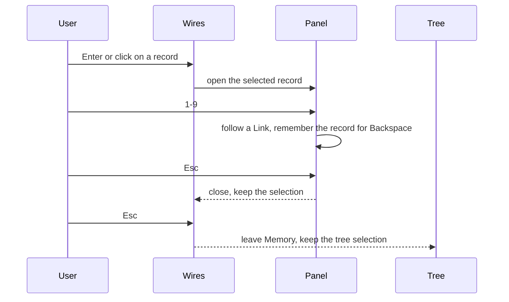

## Context
[ADR 0049](0049-draw-terminal-memory-wires-as-uml-connectors.md) drew the
terminal wires as UML connectors in light box glyphs. In a recording of the
wires, three problems showed:

- When several Issues link to one Memory, their runs merged into one trunk
  before the head, so a reader could not tell which kind belonged to which
  Issue. The light `─` and `╌` strokes were also hard to see next to the text.
- `Enter` on a Memory left the wires for the Memory list, and `Esc` from there
  did not return to the wires. An Issue had no detail at all.
- The tree opens a record in a side panel. The wires did not.

The mockups in `docs/mockups/memory-wires-tui/` compared four wire layouts
(W0 to W3), heavy strokes (H) and three detail layouts (D1 to D3). The owner
chose W1, H and D1.

## Decision
**Each Link draws its own heavy run, with its kind word, colour and UML head,
and the trunk only joins the runs. `Enter` or a click opens the selected
record, Issue or Memory, in a detail panel beside the wires, which `Esc`
closes.**

| Link kind  | UML connector        | Line | Head (out / back) |
|------------|----------------------|------|-------------------|
| follows    | realization          | `┅`  | `▷` / `◁`         |
| depends on | dependency           | `┅`  | `>` / `<`         |
| cites      | directed association | `━`  | `>` / `<`         |
| related    | association          | `━`  | none              |

- With a Memory selected, each Issue's run carries its own Link. With an Issue
  selected, the Issue's run is shared and each Memory's run carries its Link.
- The kind word (`cites`, `follows`, `depends on`) sits in the run on terminals
  of 80 columns or more, where the lane is 20 columns wide. Narrower lanes keep
  the stroke and head and drop the word.
- The panel replaces the lower Links strip and uses the tree's detail keys:
  `1`-`9` follow a Link, `Backspace` goes back, `J`/`K` scroll and `\` expands
  it. It follows the cursor. Below 100 columns it takes the full width.
- `Esc` closes the panel before it leaves Memory wires, so the first `Esc`
  always returns to the wires.
- A mouse event goes to the Memory view while it is visible, so a click selects
  a wires record and never moves the hidden tree.

## Options considered
- **W1, per-Link runs with words** (chosen): each Link is legible on its own
  row; the trunk carries no meaning.
- **W0, merged trunk with one head**: compact, but loses the kind per Issue.
- **W2, numbered runs with a key below**: legible, but the reader looks away
  from the wire to read its kind.
- **W3, bracketed labels instead of wires**: no geometry to follow.
- **D1, side panel** (chosen): matches the tree's detail.
- **D2, full-screen detail**: hides the wires the record came from.
- **D3, detail below the wires**: shares the height with the wires.

## Consequences
The heavy strokes read better but leave no visual difference between a selected
and an unselected wire weight, so selection stays with colour and the
highlighted record. The kind word needs a 20-column lane, which takes columns
from the Issue and Memory titles on terminals of 80 columns or more. The Memory
list is no longer reached by `Enter`; `1` opens it, as before. A new Link kind
still needs a row in `umlConnectors` and in the web `uml()` table.
