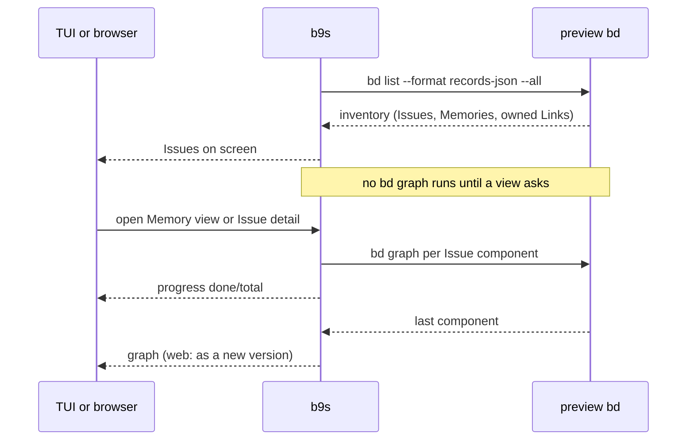

## Context
A graph workspace refuses `bd export`, so b9s loads its Issues through the
preview CLI. Until now that load read the whole Memory graph: the inventory
(`bd list --format records-json --all`) and then one `bd graph` traversal per
component that holds an Issue. The traversals supply the unowned Issue Links
that the Memory views and the tree's MEMORY LINKS column draw. The web Store
captured the same graph with each load, so `/api/memory-graph` never ran `bd`.

On the preview workspace this made the first paint take 5.9 to 7.3 s, against
about 0.9 s for the inventory alone. Each traversal costs 0.7 to 0.9 s, and
the load waited on every one of them, although most sessions never open a
Memory view. The owner asked that Memories load only when requested, with a
progress bar while a slow read runs.

The Issues themselves do not need the traversals. The inventory owns every
Issue and its `child-of` and `preview-blocks-v1` Links, so dependencies come
out the same from the inventory alone.

## Decision
**A load reads only the inventory, and the Memory graph is read on the first
request for it: the Memory view in either UI, an Issue detail in the terminal,
or `/api/memory-graph` and `/api/issue` on the web. While the read runs, both
UIs show how many Issue components it has traversed out of how many. A graph
that was read is read again after a reload, and stays on screen until the new
one arrives.**

- **Terminal.** `MemoryBrowser.graphCmd` streams progress messages from the
  read and keeps only the latest count. The Memory view and the tree detail's
  MEMORY LINKS section show `Reading Memory Links ▰▰▱ d/t`, or "Reading the
  Memory inventory…" before the count is known. An Issue detail starts a
  hidden browser that reads the graph without opening the Memory view.
- **Web.** The Store starts one background read on the first request and
  answers `loading: true` with `done` and `total`. `web/src/memory.ts` polls
  every 250 ms and draws a progress bar. A finished read raises the version and
  publishes `changed`, so the browser fetches the snapshot, the graph and the
  open detail again. A failed read is reported to one request, and the next
  request retries it.
- The shared datasource cache keeps a graph that a view stored, and a reload of
  the Issues does not drop it.

## Options considered
- **Read on request, with progress** (chosen): startup costs the inventory
  only. The first Memory view or detail waits for the traversals, and shows
  how far they are.
- **Read the graph in the background right after the first paint**: the
  MEMORY LINKS column would fill in without a request, but every session would
  pay the traversals in CPU and `bd` processes, which is the cost the owner
  asked to remove.
- **Keep the load-time read and only add a progress bar**: the first paint
  would still wait 6 to 7 s on a workspace that never opens a Memory view.
- **Traverse fewer components**: ADR 0040 already limits traversals to
  components that can hold unowned Links. The remaining ones are needed.

## Consequences
- The tree's MEMORY LINKS column appears once the graph has been read, not at
  startup. The E2E gating test shows the Issue detail before it presses `M`.
- `/api/memory-graph` and `/api/issue` can start a `bd` read. Each project has
  at most one read in flight, and a read that finishes after a project switch
  is dropped.
- A finished web read is a new version, so a graph newer than the snapshot
  refreshes the snapshot instead of asking the reader to retry.
- `B9S_MEMORY=off` (ADR 0046) now saves the traversals too, since the load no
  longer runs them.
- Re-evaluate if the preview CLI gains one call that returns every Link, which
  would make the full graph as cheap as the inventory.
