# LLM-Assisted Issue Management: Research Findings

Research into how existing projects use local/cheap LLMs for issue tracking, task creation, and developer workflow automation. Focused on patterns from Steve Yegge's Beads ecosystem, Charmbracelet's tooling, and independent projects.

---

## 1. Steve Yegge's Beads: Agentic Memory Compaction

Beads (`steveyegge/beads`) uses LLMs for a single, focused task: compacting old closed issues. Issues older than 30 days get summarized by an LLM, replacing verbose descriptions with concise summaries. This keeps the JSONL file lean while preserving searchable context. Supports both API-based (Anthropic) and agent-driven flows where a coding agent generates the summary itself.

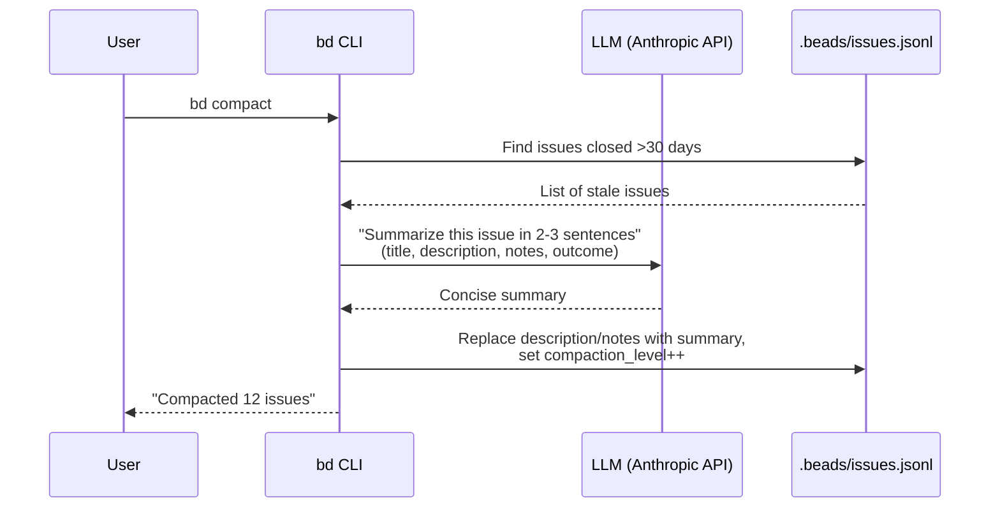

### Agent-Driven Compaction (Alternative Flow)

When no API key is configured, the coding agent (e.g. Claude Code) generates the summary itself and applies it via CLI. This avoids any API cost entirely since the agent is already running.

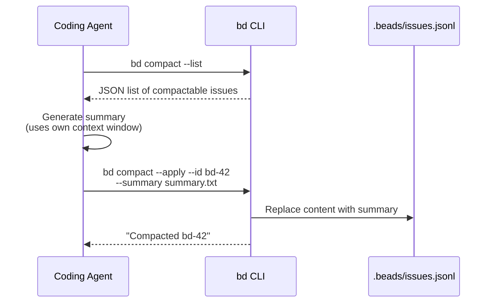

---

## 2. Steve Yegge's Gas Town: Multi-Agent Task Orchestration

Gas Town (`steveyegge/gastown`) orchestrates 20-30 parallel AI coding agents. It does not use LLMs for issue creation. Instead, it uses Beads as a shared coordination layer: a "Mayor" agent (Claude Code instance) triages issues, creates work bundles ("Convoys"), and assigns them to ephemeral worker agents ("Polecats") via a mailbox system. The LLMs here are the agents themselves, not a separate inference call.

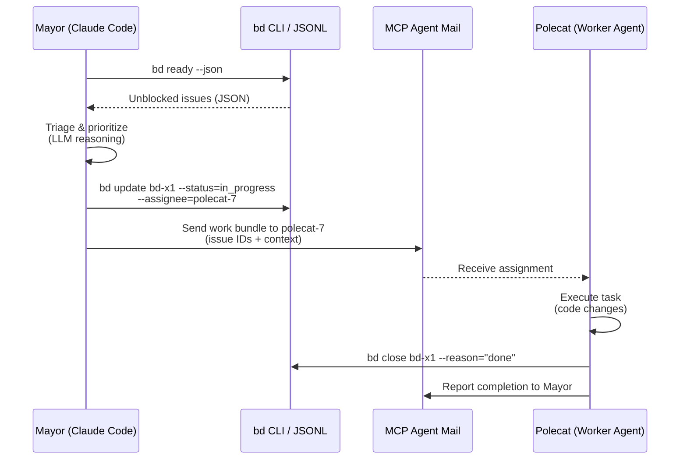

---

## 3. Steve Yegge's Efrit: Natural Language to Editor Actions

Efrit (`steveyegge/efrit`) is a native Elisp coding agent in Emacs. It translates natural language commands into editor operations. Other agents can interact with it via a file-based JSON queue. The LLM here is the agent model itself (Claude), not a local model. Relevant pattern: natural language input mapped to structured tool calls.

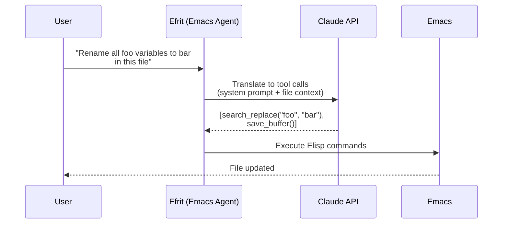

---

## 4. Charmbracelet Mods: Pipe-Based LLM Processing

Mods (`charmbracelet/mods`) pipes stdin through an LLM and outputs the result. No issue tracking, but the architectural pattern is directly relevant: take unstructured text, send to a model, get structured output. Supports OpenAI, Cohere, Groq, LocalAI, Gemini. Sunsetting March 2026 in favor of Crush.

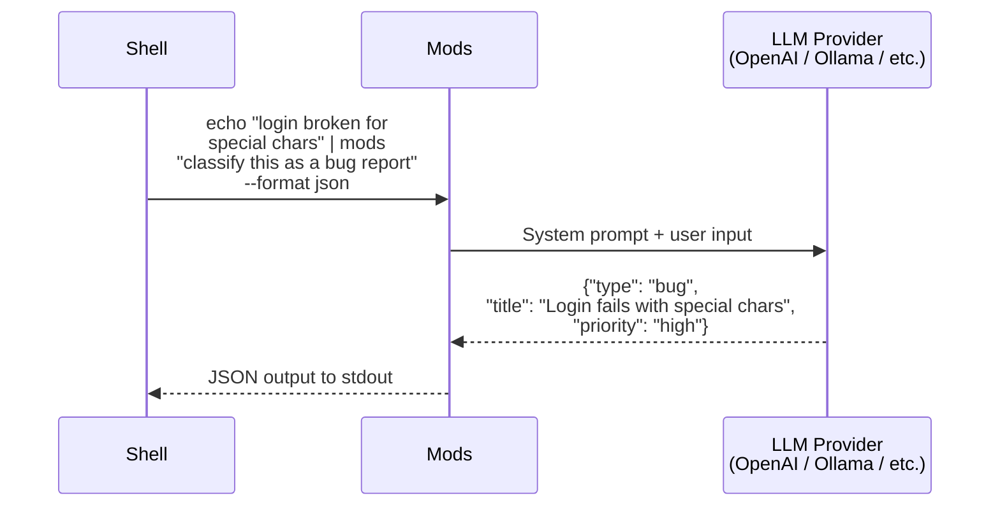

---

## 5. Charmbracelet Crush: Multi-Model Agentic Terminal

Crush (`charmbracelet/crush`) is the successor to Mods. A full agentic coding tool in the terminal, built on Bubble Tea. Supports switching LLMs mid-session. Uses `catwalk` as the provider abstraction layer (supports Ollama for local models, plus all major APIs). Has MCP extensibility for tool use.

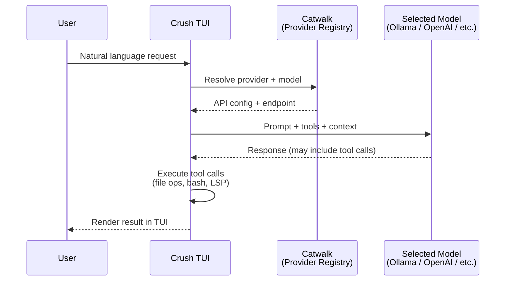

### Catwalk Provider Abstraction

Catwalk (`charmbracelet/catwalk`) is the key reusable piece. It is a Go library that provides a unified interface across 10+ LLM providers. Each provider has embedded JSON config (endpoint URLs, auth patterns, model lists). This is the pattern to adopt if supporting multiple backends.

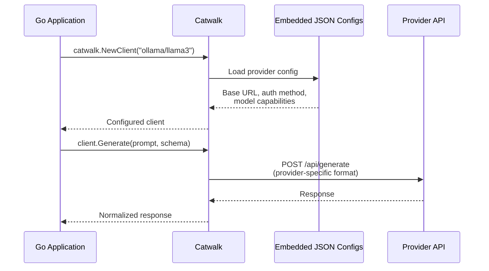

---

## 6. IssueDB: Natural Language Issue Creation via Ollama

IssueDB (`issuedb-cli`) has the most directly relevant pattern: a `--ollama` CLI flag that accepts natural language and creates structured issues. It connects to a local Ollama instance, sends the natural language with a system prompt describing the issue schema, and parses the structured JSON response into CLI commands.

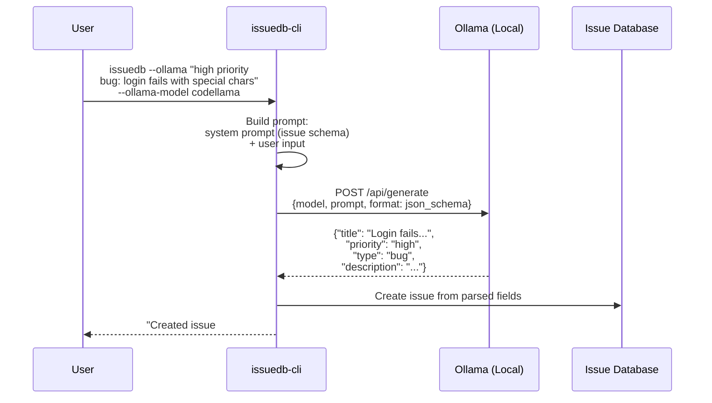

### Key Configuration

IssueDB uses environment variables for zero-config setup:
- `OLLAMA_MODEL` (default: llama3.2)
- `OLLAMA_HOST` (default: localhost)
- `OLLAMA_PORT` (default: 11434)

---

## 7. Jiragen: Context-Aware Issue Generation

Jiragen (`Abdellah-Laassairi/jiragen`) indexes your codebase into a vector store, then uses that context alongside the user's natural language to generate rich, context-aware JIRA issues. It uses LiteLLM as an abstraction layer, supporting Ollama (phi4, llama2, codellama) and OpenAI. The key differentiator: it knows about your codebase, so generated issues reference actual files and components.

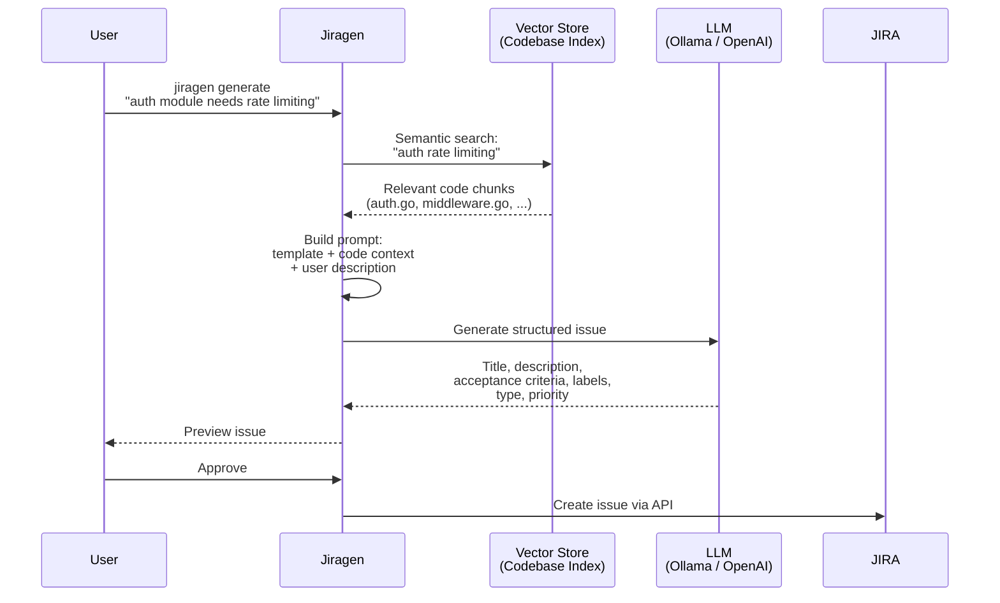

### Codebase Indexing (One-Time Setup)

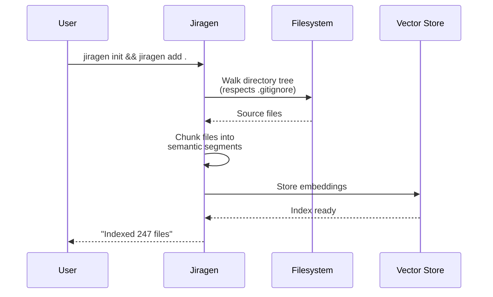

---

## 8. Ollama Go SDK: Structured Output Pattern

This is the raw building block pattern for any Go application that wants to extract structured data from natural language using a local model. The key technique: pass a JSON schema as the `format` parameter, and Ollama constrains the model's output to match that schema. Use `temperature: 0` for maximum schema adherence.

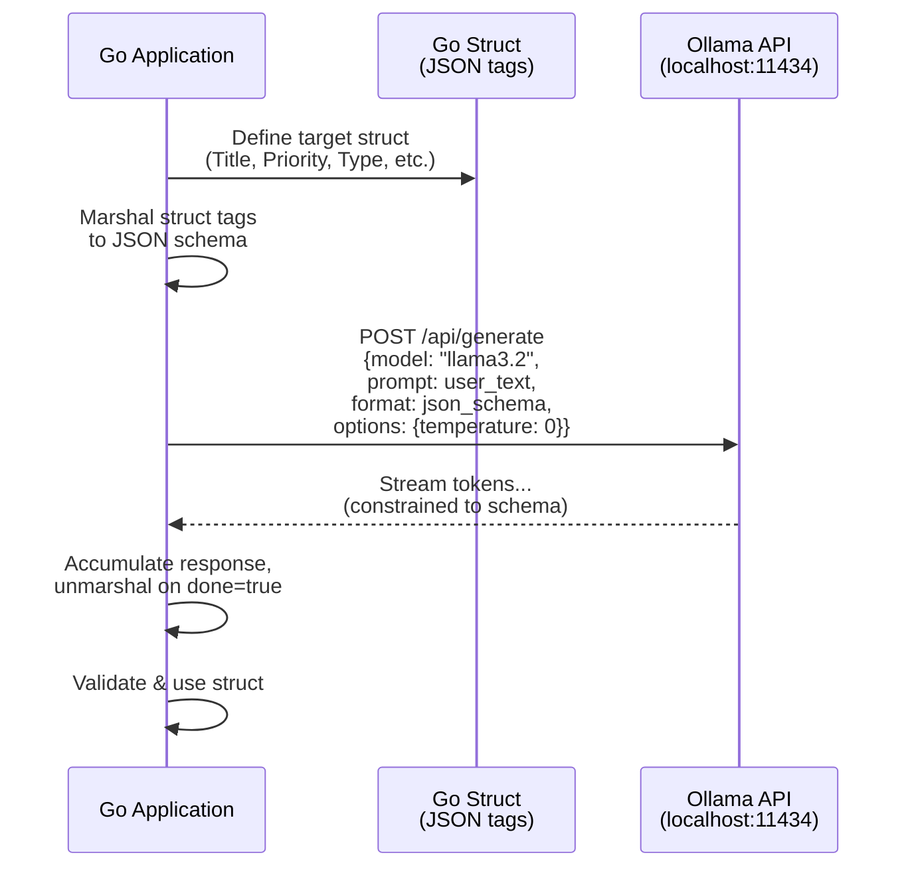

### Go Code Pattern

```go
// 1. Define the target struct
type IssueFromNL struct {
    Title       string `json:"title"`
    Description string `json:"description"`
    Priority    string `json:"priority"` // P0-P4
    Type        string `json:"type"`     // bug, feature, task
    Labels      string `json:"labels"`   // comma-separated
}

// 2. Build JSON schema from struct
schema := map[string]any{
    "type": "object",
    "properties": map[string]any{
        "title":       map[string]any{"type": "string"},
        "description": map[string]any{"type": "string"},
        "priority":    map[string]any{"type": "string", "enum": []string{"P0","P1","P2","P3","P4"}},
        "type":        map[string]any{"type": "string", "enum": []string{"bug","feature","task","epic","chore"}},
        "labels":      map[string]any{"type": "string"},
    },
    "required": []string{"title", "priority", "type"},
}

// 3. Call Ollama with schema constraint
req := &api.GenerateRequest{
    Model:   "llama3.2",
    Prompt:  "Create an issue from: " + userInput,
    Format:  schemaJSON,
    Options: map[string]any{"temperature": 0},
}
```

---

## Summary: LLM Usage by Project

| Project | LLM Task | Model Used | Local? | Cost |
|---------|----------|------------|--------|------|
| **Beads** (compact) | Summarize old issues | Anthropic API or agent's own model | No (API) or Yes (agent) | Low (batch, infrequent) |
| **Gas Town** | Agent reasoning, task triage | Claude Code (the agent itself) | No | High (but it IS the agent) |
| **Efrit** | NL to editor commands | Claude API | No | Medium |
| **Mods** | Pipe stdin through LLM | Any (OpenAI, Ollama, etc.) | Optional | Varies |
| **Crush** | Agentic coding | Any via Catwalk | Optional (Ollama) | Varies |
| **IssueDB** | NL to structured issue | Ollama (codellama, llama3.2) | Yes | Free |
| **Jiragen** | Context-aware issue gen | Ollama or OpenAI via LiteLLM | Optional | Low-Free |
| **Ollama SDK** | Structured extraction | Any Ollama model | Yes | Free |

### Key Takeaways

1. **Structured output is the core pattern**: Every project that creates issues from NL uses JSON schema constraints to force the model into producing parseable output.

2. **Ollama is the standard for local/free**: All Go-based projects that support local models use Ollama. The API is simple (single HTTP POST), and the Go SDK is mature.

3. **Small models work fine for extraction**: Issue creation is a classification + extraction task, not a reasoning task. Models like llama3.2 (3B), phi4, and codellama handle it well at `temperature: 0`.

4. **Two viable architectures**: (a) Single text input that produces a complete issue in one shot (IssueDB pattern), or (b) generate a preview that the user can tweak before saving (Jiragen pattern).

5. **Catwalk is worth considering**: If multi-provider support matters, Charmbracelet's `catwalk` library is a production-quality Go abstraction across 10+ providers including Ollama.
