# LLM-Assisted Issue Management: Research Findings

Research into how existing projects use local/cheap LLMs for issue tracking, task creation, and developer workflow automation. Focused on patterns from Steve Yegge's Beads ecosystem, Charmbracelet's tooling, and independent projects.

---

## 1. Steve Yegge's Beads: Agentic Memory Compaction

Beads (`steveyegge/beads`) uses LLMs for a single, focused task: compacting old closed issues. Issues older than 30 days get summarized by an LLM, replacing verbose descriptions with concise summaries. This keeps the JSONL file lean while preserving searchable context. Supports both API-based (Anthropic) and agent-driven flows where a coding agent generates the summary itself.

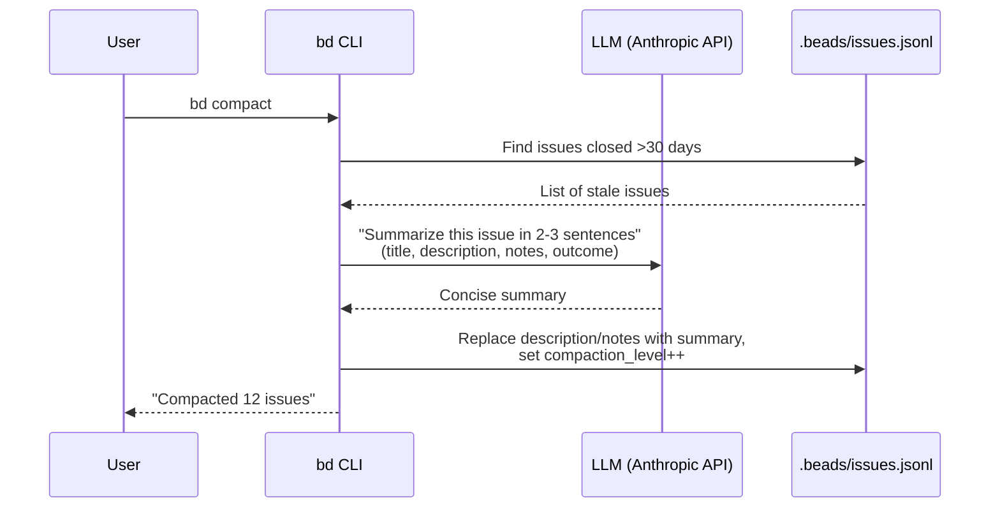
```mermaid
sequenceDiagram
    participant User
    participant bd CLI
    participant LLM as LLM (Anthropic API)
    participant JSONL as .beads/issues.jsonl

    User->>bd CLI: bd compact
    bd CLI->>JSONL: Find issues closed >30 days
    JSONL-->>bd CLI: List of stale issues
    bd CLI->>LLM: "Summarize this issue in 2-3 sentences"<br/>(title, description, notes, outcome)
    LLM-->>bd CLI: Concise summary
    bd CLI->>JSONL: Replace description/notes with summary,<br/>set compaction_level++
    bd CLI-->>User: "Compacted 12 issues"
```

### Agent-Driven Compaction (Alternative Flow)

When no API key is configured, the coding agent (e.g. Claude Code) generates the summary itself and applies it via CLI. This avoids any API cost entirely since the agent is already running.

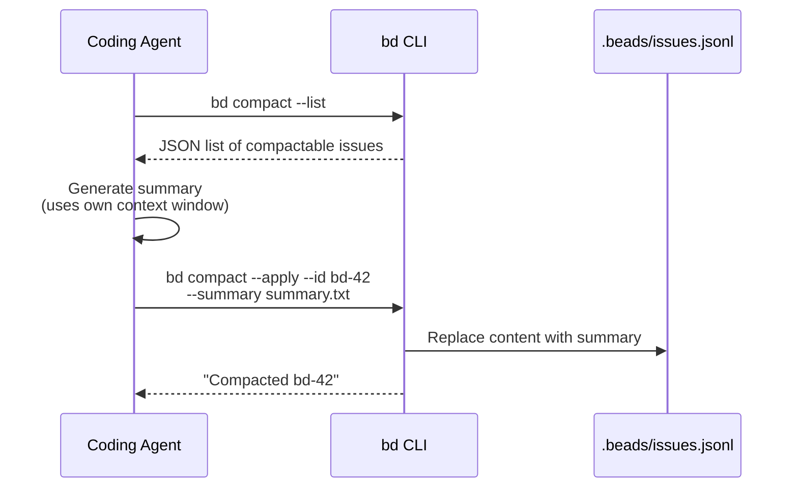
```mermaid
sequenceDiagram
    participant Agent as Coding Agent
    participant bd CLI
    participant JSONL as .beads/issues.jsonl

    Agent->>bd CLI: bd compact --list
    bd CLI-->>Agent: JSON list of compactable issues
    Agent->>Agent: Generate summary<br/>(uses own context window)
    Agent->>bd CLI: bd compact --apply --id bd-42<br/>--summary summary.txt
    bd CLI->>JSONL: Replace content with summary
    bd CLI-->>Agent: "Compacted bd-42"
```

---

## 2. Steve Yegge's Gas Town: Multi-Agent Task Orchestration

Gas Town (`steveyegge/gastown`) orchestrates 20-30 parallel AI coding agents. It does not use LLMs for issue creation. Instead, it uses Beads as a shared coordination layer: a "Mayor" agent (Claude Code instance) triages issues, creates work bundles ("Convoys"), and assigns them to ephemeral worker agents ("Polecats") via a mailbox system. The LLMs here are the agents themselves, not a separate inference call.

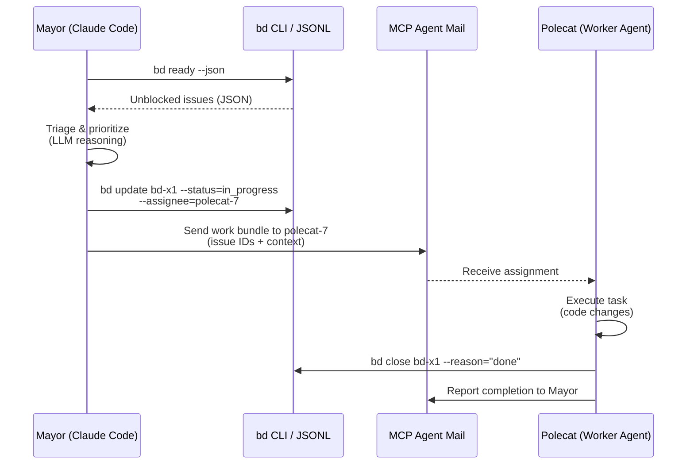
```mermaid
sequenceDiagram
    participant Mayor as Mayor (Claude Code)
    participant Beads as bd CLI / JSONL
    participant Mail as MCP Agent Mail
    participant Worker as Polecat (Worker Agent)

    Mayor->>Beads: bd ready --json
    Beads-->>Mayor: Unblocked issues (JSON)
    Mayor->>Mayor: Triage & prioritize<br/>(LLM reasoning)
    Mayor->>Beads: bd update bd-x1 --status=in_progress<br/>--assignee=polecat-7
    Mayor->>Mail: Send work bundle to polecat-7<br/>(issue IDs + context)
    Mail-->>Worker: Receive assignment
    Worker->>Worker: Execute task<br/>(code changes)
    Worker->>Beads: bd close bd-x1 --reason="done"
    Worker->>Mail: Report completion to Mayor
```

---

## 3. Steve Yegge's Efrit: Natural Language to Editor Actions

Efrit (`steveyegge/efrit`) is a native Elisp coding agent in Emacs. It translates natural language commands into editor operations. Other agents can interact with it via a file-based JSON queue. The LLM here is the agent model itself (Claude), not a local model. Relevant pattern: natural language input mapped to structured tool calls.

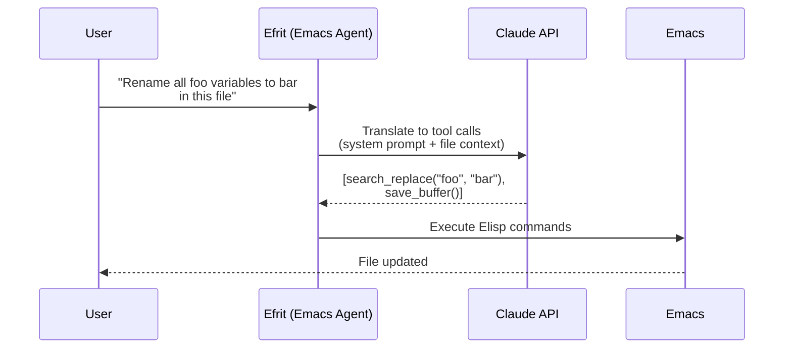
```mermaid
sequenceDiagram
    participant User
    participant Efrit as Efrit (Emacs Agent)
    participant LLM as Claude API
    participant Emacs

    User->>Efrit: "Rename all foo variables to bar<br/>in this file"
    Efrit->>LLM: Translate to tool calls<br/>(system prompt + file context)
    LLM-->>Efrit: [search_replace("foo", "bar"),<br/>save_buffer()]
    Efrit->>Emacs: Execute Elisp commands
    Emacs-->>User: File updated
```

---

## 4. Charmbracelet Mods: Pipe-Based LLM Processing

Mods (`charmbracelet/mods`) pipes stdin through an LLM and outputs the result. No issue tracking, but the architectural pattern is directly relevant: take unstructured text, send to a model, get structured output. Supports OpenAI, Cohere, Groq, LocalAI, Gemini. Sunsetting March 2026 in favor of Crush.

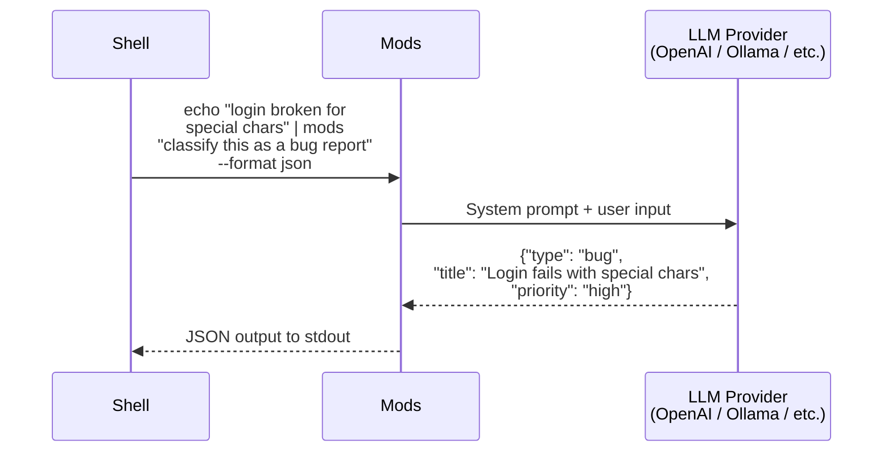
```mermaid
sequenceDiagram
    participant Shell
    participant Mods
    participant LLM as LLM Provider<br/>(OpenAI / Ollama / etc.)

    Shell->>Mods: echo "login broken for<br/>special chars" | mods<br/>"classify this as a bug report"<br/>--format json
    Mods->>LLM: System prompt + user input
    LLM-->>Mods: {"type": "bug",<br/>"title": "Login fails with special chars",<br/>"priority": "high"}
    Mods-->>Shell: JSON output to stdout
```

---

## 5. Charmbracelet Crush: Multi-Model Agentic Terminal

Crush (`charmbracelet/crush`) is the successor to Mods. A full agentic coding tool in the terminal, built on Bubble Tea. Supports switching LLMs mid-session. Uses `catwalk` as the provider abstraction layer (supports Ollama for local models, plus all major APIs). Has MCP extensibility for tool use.

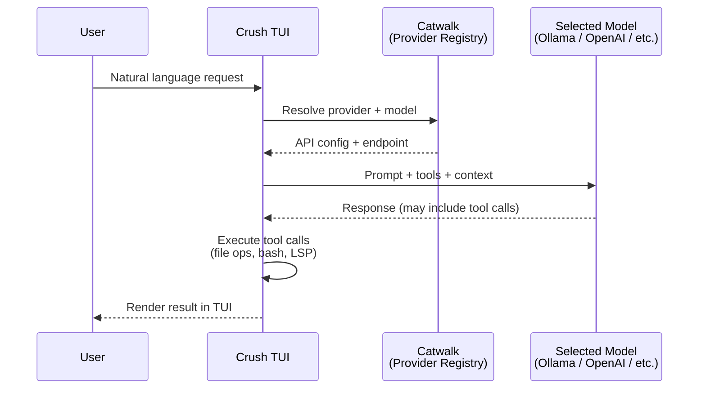
```mermaid
sequenceDiagram
    participant User
    participant Crush as Crush TUI
    participant Catwalk as Catwalk<br/>(Provider Registry)
    participant Model as Selected Model<br/>(Ollama / OpenAI / etc.)

    User->>Crush: Natural language request
    Crush->>Catwalk: Resolve provider + model
    Catwalk-->>Crush: API config + endpoint
    Crush->>Model: Prompt + tools + context
    Model-->>Crush: Response (may include tool calls)
    Crush->>Crush: Execute tool calls<br/>(file ops, bash, LSP)
    Crush-->>User: Render result in TUI
```

### Catwalk Provider Abstraction

Catwalk (`charmbracelet/catwalk`) is the key reusable piece. It is a Go library that provides a unified interface across 10+ LLM providers. Each provider has embedded JSON config (endpoint URLs, auth patterns, model lists). This is the pattern to adopt if supporting multiple backends.

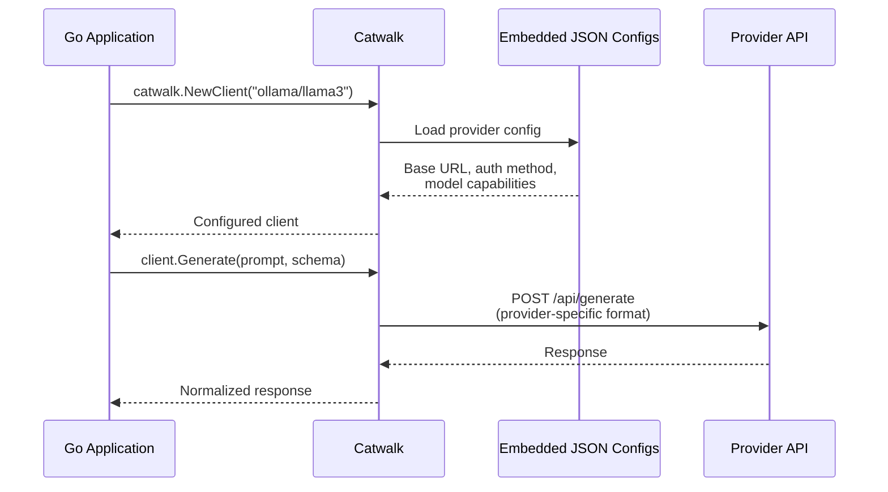
```mermaid
sequenceDiagram
    participant App as Go Application
    participant CW as Catwalk
    participant Config as Embedded JSON Configs
    participant API as Provider API

    App->>CW: catwalk.NewClient("ollama/llama3")
    CW->>Config: Load provider config
    Config-->>CW: Base URL, auth method,<br/>model capabilities
    CW-->>App: Configured client
    App->>CW: client.Generate(prompt, schema)
    CW->>API: POST /api/generate<br/>(provider-specific format)
    API-->>CW: Response
    CW-->>App: Normalized response
```

---

## 6. IssueDB: Natural Language Issue Creation via Ollama

IssueDB (`issuedb-cli`) has the most directly relevant pattern: a `--ollama` CLI flag that accepts natural language and creates structured issues. It connects to a local Ollama instance, sends the natural language with a system prompt describing the issue schema, and parses the structured JSON response into CLI commands.

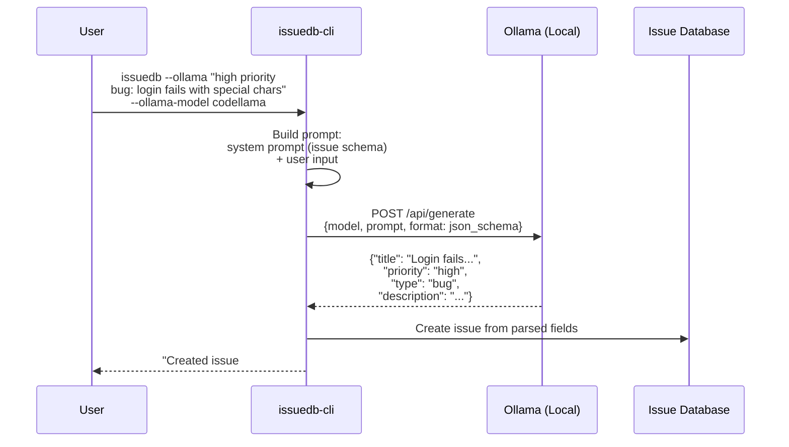
```mermaid
sequenceDiagram
    participant User
    participant CLI as issuedb-cli
    participant Ollama as Ollama (Local)
    participant DB as Issue Database

    User->>CLI: issuedb --ollama "high priority<br/>bug: login fails with special chars"<br/>--ollama-model codellama
    CLI->>CLI: Build prompt:<br/>system prompt (issue schema)<br/>+ user input
    CLI->>Ollama: POST /api/generate<br/>{model, prompt, format: json_schema}
    Ollama-->>CLI: {"title": "Login fails...",<br/>"priority": "high",<br/>"type": "bug",<br/>"description": "..."}
    CLI->>DB: Create issue from parsed fields
    CLI-->>User: "Created issue #42" (JSON output)
```

### Key Configuration

IssueDB uses environment variables for zero-config setup:
- `OLLAMA_MODEL` (default: llama3.2)
- `OLLAMA_HOST` (default: localhost)
- `OLLAMA_PORT` (default: 11434)

---

## 7. Jiragen: Context-Aware Issue Generation

Jiragen (`Abdellah-Laassairi/jiragen`) indexes your codebase into a vector store, then uses that context alongside the user's natural language to generate rich, context-aware JIRA issues. It uses LiteLLM as an abstraction layer, supporting Ollama (phi4, llama2, codellama) and OpenAI. The key differentiator: it knows about your codebase, so generated issues reference actual files and components.

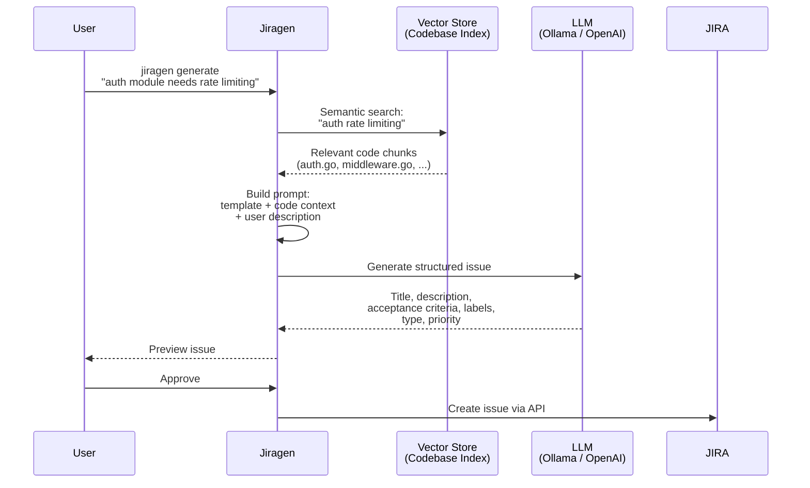
```mermaid
sequenceDiagram
    participant User
    participant Jiragen
    participant VectorDB as Vector Store<br/>(Codebase Index)
    participant LLM as LLM<br/>(Ollama / OpenAI)
    participant JIRA

    User->>Jiragen: jiragen generate<br/>"auth module needs rate limiting"
    Jiragen->>VectorDB: Semantic search:<br/>"auth rate limiting"
    VectorDB-->>Jiragen: Relevant code chunks<br/>(auth.go, middleware.go, ...)
    Jiragen->>Jiragen: Build prompt:<br/>template + code context<br/>+ user description
    Jiragen->>LLM: Generate structured issue
    LLM-->>Jiragen: Title, description,<br/>acceptance criteria, labels,<br/>type, priority
    Jiragen-->>User: Preview issue
    User->>Jiragen: Approve
    Jiragen->>JIRA: Create issue via API
```

### Codebase Indexing (One-Time Setup)

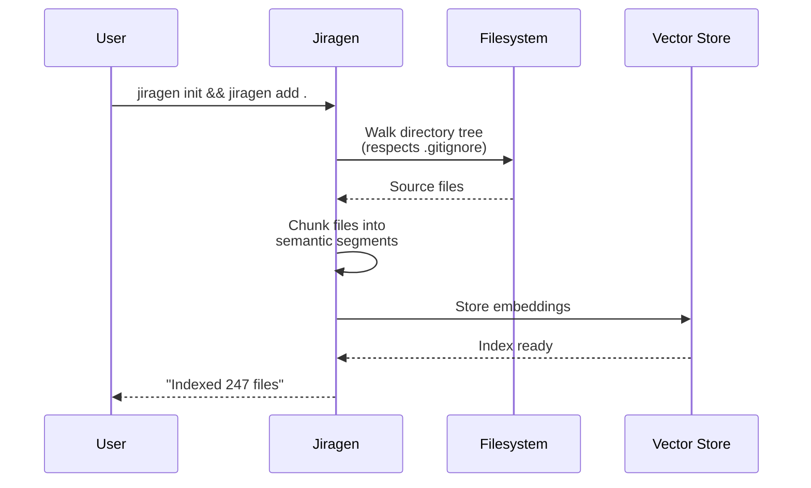
```mermaid
sequenceDiagram
    participant User
    participant Jiragen
    participant FS as Filesystem
    participant VectorDB as Vector Store

    User->>Jiragen: jiragen init && jiragen add .
    Jiragen->>FS: Walk directory tree<br/>(respects .gitignore)
    FS-->>Jiragen: Source files
    Jiragen->>Jiragen: Chunk files into<br/>semantic segments
    Jiragen->>VectorDB: Store embeddings
    VectorDB-->>Jiragen: Index ready
    Jiragen-->>User: "Indexed 247 files"
```

---

## 8. Ollama Go SDK: Structured Output Pattern

This is the raw building block pattern for any Go application that wants to extract structured data from natural language using a local model. The key technique: pass a JSON schema as the `format` parameter, and Ollama constrains the model's output to match that schema. Use `temperature: 0` for maximum schema adherence.

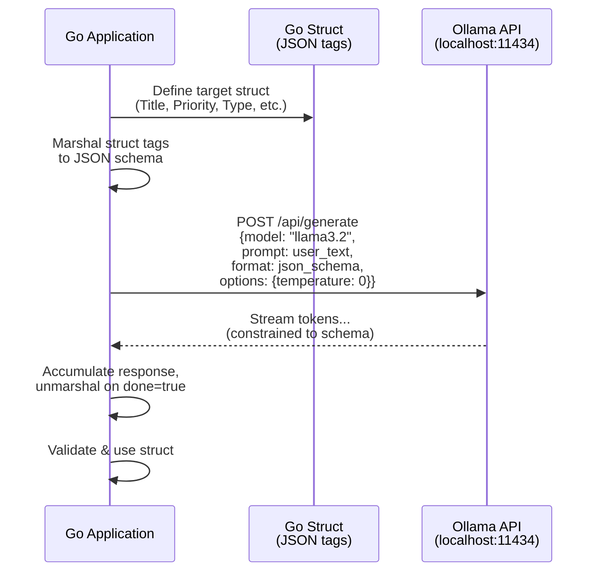
```mermaid
sequenceDiagram
    participant App as Go Application
    participant Schema as Go Struct<br/>(JSON tags)
    participant Ollama as Ollama API<br/>(localhost:11434)

    App->>Schema: Define target struct<br/>(Title, Priority, Type, etc.)
    App->>App: Marshal struct tags<br/>to JSON schema
    App->>Ollama: POST /api/generate<br/>{model: "llama3.2",<br/>prompt: user_text,<br/>format: json_schema,<br/>options: {temperature: 0}}
    Ollama-->>App: Stream tokens...<br/>(constrained to schema)
    App->>App: Accumulate response,<br/>unmarshal on done=true
    App->>App: Validate & use struct
```

### Go Code Pattern

```go
// 1. Define the target struct
type IssueFromNL struct {
    Title       string `json:"title"`
    Description string `json:"description"`
    Priority    string `json:"priority"` // P0-P4
    Type        string `json:"type"`     // bug, feature, task
    Labels      string `json:"labels"`   // comma-separated
}

// 2. Build JSON schema from struct
schema := map[string]any{
    "type": "object",
    "properties": map[string]any{
        "title":       map[string]any{"type": "string"},
        "description": map[string]any{"type": "string"},
        "priority":    map[string]any{"type": "string", "enum": []string{"P0","P1","P2","P3","P4"}},
        "type":        map[string]any{"type": "string", "enum": []string{"bug","feature","task","epic","chore"}},
        "labels":      map[string]any{"type": "string"},
    },
    "required": []string{"title", "priority", "type"},
}

// 3. Call Ollama with schema constraint
req := &api.GenerateRequest{
    Model:   "llama3.2",
    Prompt:  "Create an issue from: " + userInput,
    Format:  schemaJSON,
    Options: map[string]any{"temperature": 0},
}
```

---

## Summary: LLM Usage by Project

| Project | LLM Task | Model Used | Local? | Cost |
|---------|----------|------------|--------|------|
| **Beads** (compact) | Summarize old issues | Anthropic API or agent's own model | No (API) or Yes (agent) | Low (batch, infrequent) |
| **Gas Town** | Agent reasoning, task triage | Claude Code (the agent itself) | No | High (but it IS the agent) |
| **Efrit** | NL to editor commands | Claude API | No | Medium |
| **Mods** | Pipe stdin through LLM | Any (OpenAI, Ollama, etc.) | Optional | Varies |
| **Crush** | Agentic coding | Any via Catwalk | Optional (Ollama) | Varies |
| **IssueDB** | NL to structured issue | Ollama (codellama, llama3.2) | Yes | Free |
| **Jiragen** | Context-aware issue gen | Ollama or OpenAI via LiteLLM | Optional | Low-Free |
| **Ollama SDK** | Structured extraction | Any Ollama model | Yes | Free |

### Key Takeaways

1. **Structured output is the core pattern**: Every project that creates issues from NL uses JSON schema constraints to force the model into producing parseable output.

2. **Ollama is the standard for local/free**: All Go-based projects that support local models use Ollama. The API is simple (single HTTP POST), and the Go SDK is mature.

3. **Small models work fine for extraction**: Issue creation is a classification + extraction task, not a reasoning task. Models like llama3.2 (3B), phi4, and codellama handle it well at `temperature: 0`.

4. **Two viable architectures**: (a) Single text input that produces a complete issue in one shot (IssueDB pattern), or (b) generate a preview that the user can tweak before saving (Jiragen pattern).

5. **Catwalk is worth considering**: If multi-provider support matters, Charmbracelet's `catwalk` library is a production-quality Go abstraction across 10+ providers including Ollama.

---

# Part 2: Model Routing and Task Offloading

The sections above cover how projects use LLMs to create/manage issues. But there's a deeper problem: when a coding agent (like Claude Code) calls `bd create` or `bd update`, it sends the full conversation context (50K+ tokens) just to generate a 20-token shell command. The sections below explore patterns for routing mechanical tasks to cheap/fast models, avoiding the full context overhead entirely.

---

## 9. RouteLLM: Drop-In Model Router

RouteLLM (`lm-sys/RouteLLM`) is a framework for routing LLM requests between a strong model and a weak model based on query complexity. It acts as a drop-in replacement for OpenAI's client, transparently routing simple requests to a cheap model and complex ones to an expensive model. Achieves up to 85% cost reduction with minimal quality loss on benchmarks.

The router uses a trained classifier (matrix factorization, BERT-based, or causal LLM) that scores each prompt on a 0-1 complexity scale. Below a configurable threshold, the request goes to the weak model.

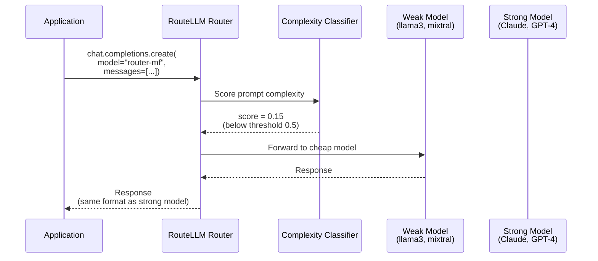
```mermaid
sequenceDiagram
    participant App as Application
    participant Router as RouteLLM Router
    participant Classifier as Complexity Classifier
    participant Weak as Weak Model<br/>(llama3, mixtral)
    participant Strong as Strong Model<br/>(Claude, GPT-4)

    App->>Router: chat.completions.create(<br/>model="router-mf",<br/>messages=[...])
    Router->>Classifier: Score prompt complexity
    Classifier-->>Router: score = 0.15<br/>(below threshold 0.5)
    Router->>Weak: Forward to cheap model
    Weak-->>Router: Response
    Router-->>App: Response<br/>(same format as strong model)
```

### Why It Matters for Beadwork

A `bd create --title="Fix login bug" --priority=1 --type=bug` command is trivially simple. RouteLLM's classifier would score it near 0 and route it to a local Ollama model, avoiding the 50K-token round trip through Claude's API entirely.

---

## 10. Crush Dual-Model Pattern: Coder Agent + Task Agent

Crush (`charmbracelet/crush`) implements a two-tier agent architecture. The main "Coder Agent" handles complex reasoning with a large model, but delegates mechanical subtasks to a separate "Task Agent" running a smaller, cheaper model. The Task Agent has restricted tools and a minimal system prompt, keeping its context window small.

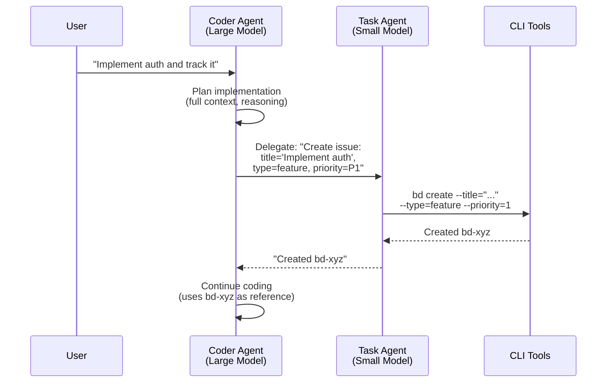
```mermaid
sequenceDiagram
    participant User
    participant Coder as Coder Agent<br/>(Large Model)
    participant Task as Task Agent<br/>(Small Model)
    participant Tools as CLI Tools

    User->>Coder: "Implement auth and track it"
    Coder->>Coder: Plan implementation<br/>(full context, reasoning)
    Coder->>Task: Delegate: "Create issue:<br/>title='Implement auth',<br/>type=feature, priority=P1"
    Task->>Tools: bd create --title="..."<br/>--type=feature --priority=1
    Tools-->>Task: Created bd-xyz
    Task-->>Coder: "Created bd-xyz"
    Coder->>Coder: Continue coding<br/>(uses bd-xyz as reference)
```

### Key Design Decisions

The Task Agent receives only the specific instruction, not the Coder Agent's full conversation history. Its system prompt is a minimal schema description (what fields exist, valid values). This keeps input tokens under 1K per call, compared to 50K+ for the main agent.

---

## 11. Gas Town Formulas: Deterministic Workflows (Zero LLM Cost)

Gas Town (`steveyegge/gastown`) uses "Formulas" for orchestrating mechanical task sequences. A Formula is a declarative TOML workflow definition that drives a sequence of bd commands without any LLM involvement. The Mayor agent decides *which* Formula to execute (that's the reasoning step), but the Formula execution itself is pure deterministic logic.

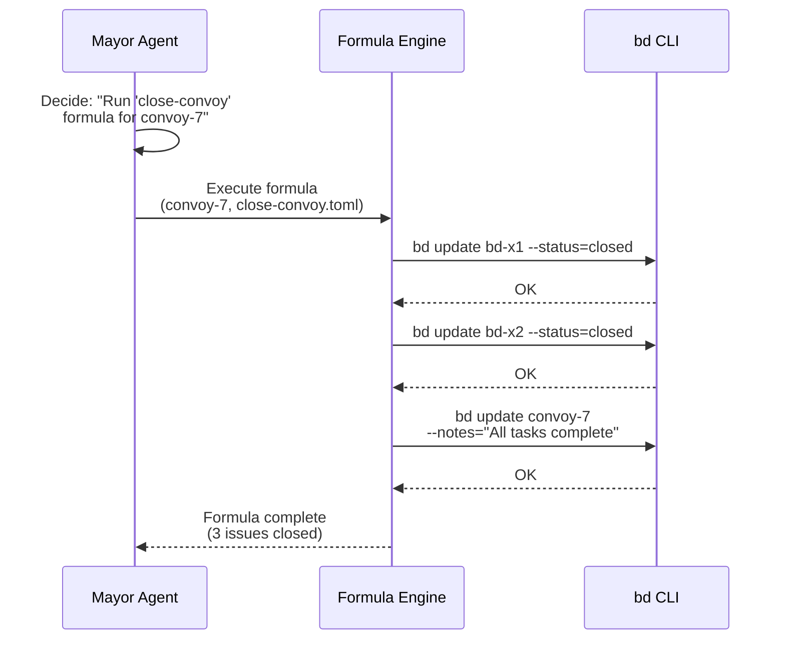
```mermaid
sequenceDiagram
    participant Mayor as Mayor Agent
    participant Engine as Formula Engine
    participant BD as bd CLI

    Mayor->>Mayor: Decide: "Run 'close-convoy'<br/>formula for convoy-7"
    Mayor->>Engine: Execute formula<br/>(convoy-7, close-convoy.toml)
    Engine->>BD: bd update bd-x1 --status=closed
    BD-->>Engine: OK
    Engine->>BD: bd update bd-x2 --status=closed
    BD-->>Engine: OK
    Engine->>BD: bd update convoy-7<br/>--notes="All tasks complete"
    BD-->>Engine: OK
    Engine-->>Mayor: Formula complete<br/>(3 issues closed)
```

### Why It Matters

Formulas prove that many task management operations don't need an LLM at all. Creating an issue with known fields, closing a batch of issues, updating status: these are deterministic operations that can be encoded as templates. The LLM's job is to decide *what* to do, not to generate the shell command.

---

## 12. Claude Code Hooks: Local Interception (Zero API Cost)

Claude Code supports PreToolUse hooks that can intercept tool calls before they execute. A hook can inspect the tool name and arguments, handle the call locally (e.g., by running `bd create` directly), and return the result without the LLM ever seeing the full context. This is the most directly applicable pattern for beadwork.

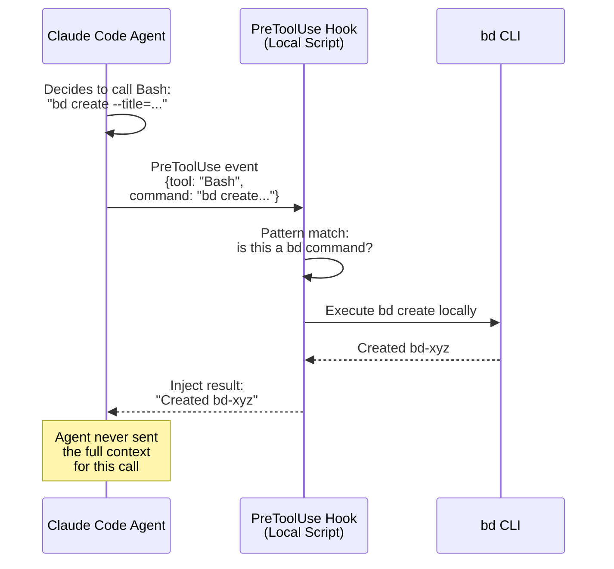
```mermaid
sequenceDiagram
    participant Agent as Claude Code Agent
    participant Hook as PreToolUse Hook<br/>(Local Script)
    participant BD as bd CLI

    Agent->>Agent: Decides to call Bash:<br/>"bd create --title=..."
    Agent->>Hook: PreToolUse event<br/>{tool: "Bash",<br/>command: "bd create..."}
    Hook->>Hook: Pattern match:<br/>is this a bd command?
    Hook->>BD: Execute bd create locally
    BD-->>Hook: Created bd-xyz
    Hook-->>Agent: Inject result:<br/>"Created bd-xyz"
    Note over Agent: Agent never sent<br/>the full context<br/>for this call
```

### Limitations

Hooks run locally and can intercept/modify tool calls, but they can't prevent the LLM from generating the tool call in the first place. The 50K-token input is already sent when the LLM decides to call `bd create`. Hooks help with execution efficiency but don't solve the context-sending problem. The real savings come from combining hooks with a model router that sends the "generate the bd command" step to a cheap model.

---

## 13. Speakeasy Dynamic Tool Discovery: 96.7% Token Reduction

Speakeasy's research showed that including all available tool schemas in every LLM request wastes massive amounts of tokens. Their solution: lazy-load tool schemas. Instead of sending 50 tool definitions (thousands of tokens) in every request, send a `discover_tools` meta-tool. The LLM calls `discover_tools("issue management")`, gets back only the 3 relevant tool schemas, and then calls the specific tool.

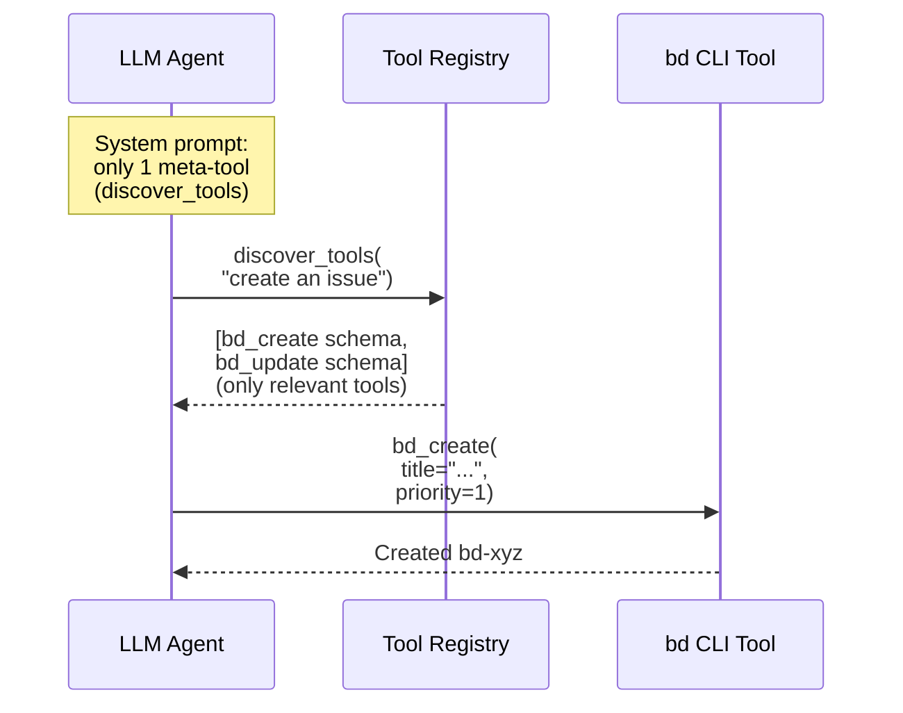
```mermaid
sequenceDiagram
    participant Agent as LLM Agent
    participant Registry as Tool Registry
    participant Tool as bd CLI Tool

    Note over Agent: System prompt:<br/>only 1 meta-tool<br/>(discover_tools)
    Agent->>Registry: discover_tools(<br/>"create an issue")
    Registry-->>Agent: [bd_create schema,<br/>bd_update schema]<br/>(only relevant tools)
    Agent->>Tool: bd_create(<br/>title="...",<br/>priority=1)
    Tool-->>Agent: Created bd-xyz
```

### Why It Matters

In Claude Code, the system prompt includes descriptions of every available tool (Bash, Read, Write, Edit, Grep, Glob, etc.). For a simple `bd create` call, only the Bash tool definition is needed. Dynamic tool discovery could reduce the system prompt from thousands of tokens to under 100 for mechanical operations.

---

## 14. Google ADK Workflow Agents: Non-LLM Orchestration

Google's Agent Development Kit (ADK) provides workflow agents that orchestrate sequences without using an LLM for the orchestration itself. `SequentialAgent` runs steps in order, `ParallelAgent` runs them concurrently, `LoopAgent` repeats until a condition is met. Only the leaf tasks (actual reasoning) use an LLM; the workflow structure is deterministic code.

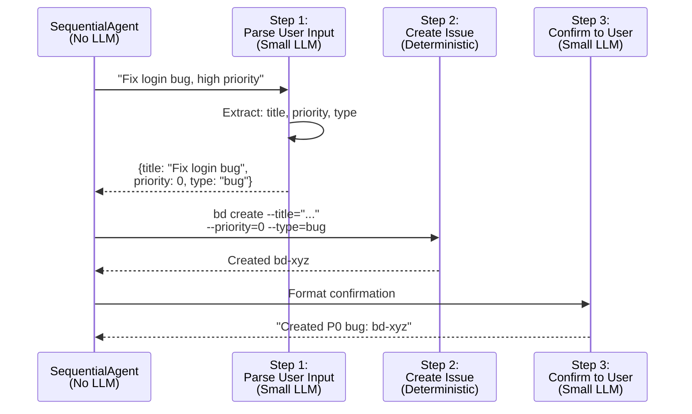
```mermaid
sequenceDiagram
    participant Orchestrator as SequentialAgent<br/>(No LLM)
    participant Step1 as Step 1:<br/>Parse User Input<br/>(Small LLM)
    participant Step2 as Step 2:<br/>Create Issue<br/>(Deterministic)
    participant Step3 as Step 3:<br/>Confirm to User<br/>(Small LLM)

    Orchestrator->>Step1: "Fix login bug, high priority"
    Step1->>Step1: Extract: title, priority, type
    Step1-->>Orchestrator: {title: "Fix login bug",<br/>priority: 0, type: "bug"}
    Orchestrator->>Step2: bd create --title="..."<br/>--priority=0 --type=bug
    Step2-->>Orchestrator: Created bd-xyz
    Orchestrator->>Step3: Format confirmation
    Step3-->>Orchestrator: "Created P0 bug: bd-xyz"
```

### Why It Matters

This pattern separates the "understand what to do" step (needs an LLM) from the "execute the command" step (deterministic) and the "format the result" step (tiny LLM call). For beadwork, the expensive step (understanding intent) could use a small local model, while command execution is pure code.

---

## Updated Summary: Model Routing by Project

| Project | Routing Strategy | Mechanical Task Handling | Token Savings |
|---------|-----------------|-------------------------|---------------|
| **RouteLLM** | Classifier-based routing | Weak model for simple queries | ~85% cost reduction |
| **Crush** | Dual-agent (Coder + Task) | Task Agent with minimal context | ~95% per delegated call |
| **Gas Town** | Formulas (deterministic TOML) | No LLM for orchestration | 100% (no LLM used) |
| **Claude Code Hooks** | PreToolUse interception | Local execution, bypass API | Execution only (not generation) |
| **Speakeasy** | Dynamic tool discovery | Lazy-load tool schemas | 96.7% token reduction |
| **Google ADK** | Workflow agents | Deterministic orchestration | LLM only at leaf tasks |

### Key Takeaways for Beadwork

1. **The real problem is context, not capability**: A 3B local model can generate `bd create --title="X" --priority=1` just fine. The waste is in sending 50K tokens of conversation context to Claude's API for a task that needs 200 tokens of input.

2. **Three viable approaches** (can be combined):
   - **(a) Deterministic templates**: For operations with known fields (create, update, close), skip the LLM entirely. Map structured input (from the TUI edit modal or agent instructions) directly to bd CLI commands. This is what Gas Town's Formulas do.
   - **(b) Local model delegation**: Route bd-related tool calls to a local Ollama model with a minimal system prompt (just the bd CLI schema). The local model generates the command with ~200 tokens of context instead of 50K.
   - **(c) Hook-based interception**: Use Claude Code hooks to intercept bd-related Bash calls and execute them locally, avoiding API round-trips for execution (though not for generation).

3. **Hybrid is best**: Use deterministic templates for the 80% of cases where the agent's intent maps cleanly to a bd command (e.g., "create a P1 bug titled X"). Fall back to a local model for the 20% of cases that need NL interpretation (e.g., "track the work we just discussed"). Never send bd commands to the expensive model.
