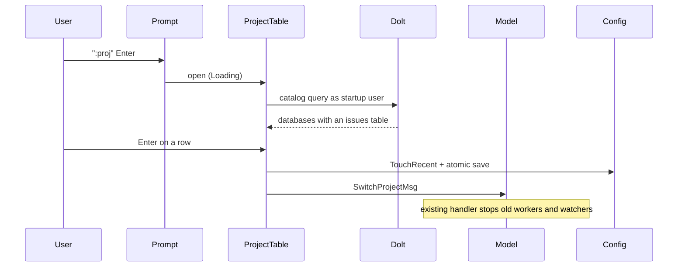

# Recent Projects and the `:` Command Prompt (k9s-style)

**Date:** 2026-09-14
**Design task:** bd-54q8

## Contents

- [Overview](#overview)
- [How k9s does it](#how-k9s-does-it)
- [Decisions](#decisions)
- [Recent projects](#recent-projects)
- [The `:` command prompt](#the--command-prompt)
- [The `:project` table](#the-project-table)
- [Architecture](#architecture)
- [Error handling](#error-handling)
- [Testing](#testing)
- [Documentation and ADRs](#documentation-and-adrs)
- [Implementation breakdown](#implementation-breakdown)

## Overview

The header project picker lists every project found by scanning
`discovery.scan_paths`. Starting b9s in one folder should instead show that
folder's project plus a short list of projects recently viewed, the way k9s
shows favourite namespaces. Browsing other projects, and other kinds of
entity, moves behind a k9s-style `:` prompt: `:epic`, `:task`, `:feature`,
`:bug`, `:chore` narrow the current view to that type, and `:project` opens a
table of every project the current credential can read. Picking a project
there makes it active and adds it to the recent list.

## How k9s does it

From `internal/config/data/ns.go` and `internal/model/fish_buff.go` in
derailed/k9s:

- Each context's `config.yaml` stores `namespace.active` and
  `namespace.favorites`, capped at `MaxFavoritesNS = 9`.
- `SetActive` calls `addFavNS`: a namespace already in the list is left where
  it is; a new one is prepended and the list is truncated to 9.
- `lockFavorites: true` freezes the list.
- `:` opens a command buffer whose suggestion function prefix-matches alias
  names; the suggestion renders as grey text after the cursor and is accepted
  with Tab.
- `:ctx` and `:ns` open full-screen pick lists.

## Decisions

| Question | Decision |
|---|---|
| Source of `:project` | Databases on the Dolt server, not a folder scan |
| Credential | The scoped user of the project b9s starts in; password from `BEADS_DOLT_PASSWORD` |
| What `:epic` etc. do | Set `type:` in the shared query state (ADR 0001), keep the current view |
| Recent list ordering | k9s exact: new projects prepend, existing entries keep their slot, cap 9 |
| `0` (All) | Combines the recent projects only |
| `discovery.scan_paths` | Removed; an existing entry logs a deprecation warning |
| `projects:` and `favorites:` config | Removed; `favorites:` entries migrate into `recent_projects` once |
| `:project` UI | Full-screen table with counts, `/` filter, Enter to open, Esc back |
| Projects without a checkout | Open read-only |

## Recent projects

### Config

`~/.config/b9s/config.yaml` (or `$XDG_CONFIG_HOME/b9s/config.yaml`):

```yaml
recent_projects:          # at most 9, newest first
  - name: b9s
    database: b9s
    host: 127.0.0.1:3306
    path: ~/Documents/b9s # local checkout, empty when there is none
lock_recent: false
```

### Startup

```
 cwd has .beads? ──yes──▶ already in recent? ──no──▶ prepend as <1>, drop 10th, save
       │                        │yes
       no                       ▼
       ▼                  keep its slot
 header shows recent_projects; without a cwd project the first entry opens
```

### Header

- Rows are exactly `recent_projects`, in stored order.
- Keys 1-9 map to slots. Slots never move when switching between entries
  already in the list, which keeps the stable-number guarantee from bd-jorl.
- `0` combines the Dolt databases of the recent projects.

### Migration

On load, `favorites:` entries whose project resolves to a path with
`.beads/metadata.json` are appended to `recent_projects` in slot order, then
`favorites:` and `projects:` are dropped on the next save. `discovery:` is
ignored with a debug-log deprecation warning.

### Credentials

Every connection uses the host, port and user of the startup project, with
the password from the environment exactly as today. A recent project that
credential cannot read stays in the header, greyed with `✗`; switching to it
shows the reason (for example `access denied for bd_b9s`). Entries are never
removed silently.

## The `:` command prompt

```
 :ep▌ic            grey suggestion; Tab or → accepts; ↑/↓ cycles
 Enter runs · Esc cancels · unknown input shows "unknown command: foo"
```

- `:` is handled in every view unless a text input has focus.
- Suggestions prefix-match the alias table only.
- No command history: k9s uses `[`/`]` for it, which b9s already binds to
  header scrolling.

### Commands

The alias table is code, not config: it is a closed set whose totality the
compiler and tests can check.

| Command | Aliases | Effect |
|---|---|---|
| `:epic` | `:epics`, `:ep` | `type:epic` in the shared query |
| `:feature` | `:features`, `:feat`, `:ftr` | `type:feature` |
| `:task` | `:tasks` | `type:task` |
| `:bug` | `:bugs` | `type:bug` |
| `:chore` | `:chores` | `type:chore` |
| `:issues` | `:all` | removes the `type:` filter |
| `:project` | `:projects`, `:proj` | opens the project table |

Type commands replace any existing `type:` tokens and keep the rest of the
query text (for example `status:open`). The view does not change, and the
filter is visible in the query bar.

## The `:project` table

```
 PROJECTS (bd_b9s@127.0.0.1:3306)                    / filter
 NAME             O    P    R   RECENT  LOCAL
 b9s             12    2    8   <1>     ~/Documents/b9s
 agents_config   40   16   43   <2>     ~/Documents/agents-config
 LP_Team          0    0    0           ─
```

- Rows come from one catalog query:
  `SELECT DISTINCT table_schema FROM information_schema.tables WHERE table_name = 'issues'`.
  System schemas never have an `issues` table, so they drop out.
- Counts load in the background per database and show `…` until they arrive.
- `/` filters by name; `Esc` returns to the previous view.
- `Enter` switches to the project through the existing `SwitchProjectMsg`
  path, prepends it to `recent_projects` if new, and saves.
- LOCAL comes from the matching recent entry. A project with no checkout opens
  read-only, because writes are delegated to `bd`, which runs inside a
  checkout. Edit keys then show `read-only: no local checkout`.

## Architecture

```
 pkg/config/recent.go         RecentProject, MaxRecentProjects = 9
                              TouchRecent(p): k9s rules, honours LockRecent
                              migration from favorites:/projects:
 internal/datasource/         ListProjectDatabases(source): catalog query
   catalog.go
 pkg/ui/command_prompt.go     PromptState {Idle, Editing}, suggestion cycling
 pkg/ui/commands.go           alias table, Resolve(text) -> Command | error
 pkg/ui/project_table.go      ProjectTable {Loading, Loaded, Failed}
 pkg/ui/model.go              ':' routing, header from recent, startup touch
```



## Error handling

- **Reachability is a closed enum**, never free text:
  `Unknown | Reachable | Denied | NoIssuesTable | ServerDown`. Both the header
  `✗` hint and the table error row render from it, so a down tunnel is never
  reported as denied access, or the reverse.
- **Config writes are atomic and merged.** Save writes a temp file and renames
  it, after re-reading the file and merging its recent list (as k9s `merge`
  does), so two b9s windows do not overwrite each other. A failed save shows a
  flash message; the in-memory list stays updated.
- **Read-only is a type, not a check.** Write actions take a `Checkout` value
  that can only be constructed from an existing path, so invoking `bd` for a
  project without a checkout does not compile.
- **Catalog failure** leaves the table in `Failed` with the reachability
  reason and a retry hint (`ctrl+r`).

## Testing

TDD throughout: each behaviour gets a failing test first.

- **Unit**
  - `TouchRecent`: new entry prepends, existing entry keeps its slot, 10th
    drops, lock freezes the list.
  - Migration of `favorites:`/`projects:`; `discovery:` ignored.
  - Alias resolution, unknown command, suggestion prefix matching and cycling.
  - Replacing `type:` tokens while keeping other query tokens.
  - `:` opens the prompt in list, tree, board and detail views, and not while
    the query bar is editing.
  - Project table state transitions and Enter producing `SwitchProjectMsg`.
- **Integration** (`DoltIntegration`, live server via `.env.test`):
  `ListProjectDatabases` returns databases with an `issues` table; a denied
  credential maps to `Denied`.
- **E2E** (PTY via `script`): temporary `XDG_CONFIG_HOME`, start inside a
  beads folder, type `:proj` Enter, pick a project, quit; restart and assert
  the header order.

## Documentation and ADRs

- ADR 0008: recent projects replace folder discovery.
- ADR 0009: a `:` command prompt backed by a closed alias table.
- README: keybindings (`:`), the `recent_projects` config, removal of
  `discovery`, `projects` and `favorites`.

## Implementation breakdown

One epic with six child tasks:

1. Config: `RecentProject`, `TouchRecent`, `LockRecent`, migration, atomic merged save.
2. Datasource: `ListProjectDatabases` and the reachability enum.
3. UI: `:` prompt, alias table, type commands.
4. UI: `:project` table.
5. UI: header from recent list, startup touch, read-only `Checkout`, removal of scan discovery.
6. E2E, ADRs 0008 and 0009, README.
