# BD Events: activity from the Beads audit trail

| | |
|---|---|
| Status | Draft design, for review. Rescoped on 2026-09-28 (see [1](#1-summary)) |
| Release | v1.4 (blocks the v1.4 publish) |
| Beads | `bd-vd9g.1` Epic: BD Events, under `bd-vd9g` Epic: v1.4 release. Deferred journal work: `bd-8w66` |
| Upstream | [vanderheijden86/b9s#11](https://github.com/vanderheijden86/b9s/issues/11), Beads [v1.3.0](https://github.com/gastownhall/beads/releases/tag/v1.3.0) |
| Measured with | `bd` 1.3.0-rc.1, Dolt 2.3.2, macOS, shared Dolt server reached through an SSH tunnel |

## Table of contents

1. [Summary](#1-summary)
2. [How b9s reloads today](#2-how-b9s-reloads-today)
3. [What Beads offers](#3-what-beads-offers)
4. [Measurements](#4-measurements)
5. [Options considered](#5-options-considered)
6. [Design](#6-design)
7. [Benefits](#7-benefits)
8. [Downsides and risks](#8-downsides-and-risks)
9. [Unfulfilled requests to Beads](#9-unfulfilled-requests-to-beads)
10. [Testing](#10-testing)
11. [Documentation and ADR](#11-documentation-and-adr)
12. [Delivery plan for v1.4](#12-delivery-plan-for-v14)
13. [Open questions](#13-open-questions)
- [Appendix A. Deferred design: following the journal](#appendix-a-deferred-design-following-the-journal)

---

## 1. Summary

Beads 1.3 adds an **events journal**: every `bd` write can append an ordered
record (`seq`, `op`, `actor`, the issue after the change) in the same
transaction as the write. `bd events tail --follow` streams those records, and
`bd serve` (preview) offers them over HTTP.

We measured the journal against b9s and found two things:

- **Following the journal does not show a change sooner.** A journaled write
  reaches the screen in about 0.55 s on average. Today's hash poll plus a full
  reload takes about 0.7 s. `bd`'s fixed 1 s poll uses up the time a smaller
  reload saves ([section 4](#4-measurements)).
- **The data the journal would add is already in Dolt.** Beads has always
  written an `events` audit table: the actor, the kind of change and the old and
  new value, from every clone and with no flag. The `b9s` database holds 4141
  such rows from six months of work ([3.6](#36-the-audit-trail-beads-already-keeps)).

**b9s v1.4 adds an `:activity` view that reads the Beads `events` and
`comments` tables over b9s' existing SQL connection, after each reload. The
hash poll and the full reload stay as they are. Following the journal is
postponed until Beads answers the requests in [section 9](#9-unfulfilled-requests-to-beads),
and its design is kept in [Appendix A](#appendix-a-deferred-design-following-the-journal).**

What we gain: *who changed what* for every `bd` writer, six months back, for
about 50 ms per reload, with no child process and no new states. What we give
up: activity in embedded mode (Beads offers no whole-database read of the audit
trail there, request [9.7](#97-a-documented-audit-trail-read-that-works-in-every-mode)),
a dependency on an undocumented table, and any cut in reload work.

## 2. How b9s reloads today

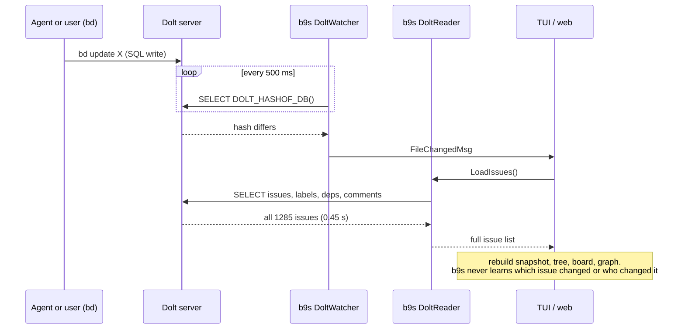

- **Dolt server** (`internal/datasource/dolt_watcher.go`): one persistent
  connection, one cheap statement per 500 ms (`refresh.poll_interval`). The
  cost is the full re-read after each change.
- **Embedded Dolt** (ADR 0025): the watcher fingerprints the store files and
  each change runs a full `bd export`.
- **All-projects view** (`dolt_multi_watcher.go`): one hash per database.
- **Web UI** (`pkg/web/store.go`): the same watchers feed a reload loop and an
  SSE stream to browsers.

The hash is complete: it moves on *every* write, from any client, including
uncommitted working-set writes. That property is what this design must keep.

## 3. What Beads offers

### 3.1 The journal write path

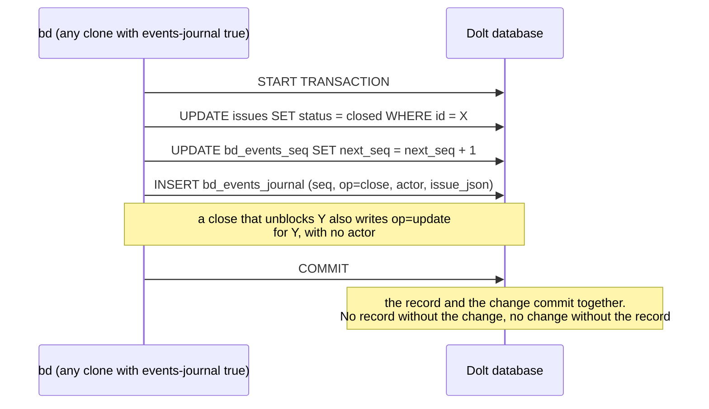

The guarantee holds only for writers that have the flag on. See 3.4.

### 3.2 Reading the journal

**One-shot:** `bd events tail --since N --json` prints the records after `N`
and exits.

**Follow:** `bd events tail --since N --follow --json` keeps running:

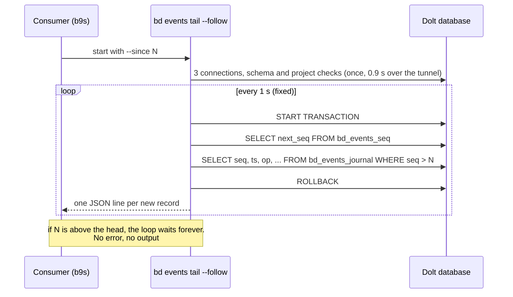

**HTTP (preview):** `bd serve` exposes `/v0/beads/events?since=N` (paged, with
`head`) and `/v0/beads/events:watch` (Server-Sent Events with
`Last-Event-ID`). It refuses embedded mode today and sends no CORS headers.

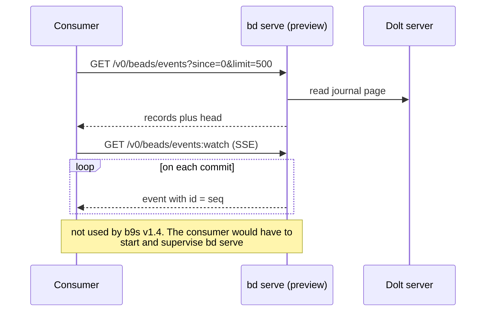

### 3.3 Record contract

Documented as stable for external consumers (`bd events tail --help`):

| Field | Meaning |
|---|---|
| `seq` | int64, gapless, strictly increasing in commit order, never reused |
| `ts` | UTC time stamped inside the committing transaction |
| `op` | `create`, `update`, `close`, `delete`, `dep_add`, `dep_remove`, `comment` |
| `issue_id` | the changed issue |
| `actor` | who made the change. Empty only for derived maintenance, such as a blocked-state update |
| `issue` | full issue **after** the change, `null` on delete |
| `dep` | `{kind, target, metadata}` on dep ops |
| `comment` | `{id, author, text, created_at, source}` on comment |

Observed on 2026-09-28, and relevant to applying records:

- `issue` carries labels, but **not** dependencies or comments. Those arrive
  only as `dep_*` and `comment` records.
- Claims, reopens and label changes arrive as `update`.
- `is_blocked` appears only when true.
- `dep_add` is sent again for an idempotent re-add, so it is an upsert.
- A delete sends `dep_remove` for each edge first, then `delete`.

### 3.4 Coverage: what the journal does not see

| Write | Journaled |
|---|---|
| `bd` in a workspace whose `.beads/config.yaml` has `events-journal: true` (or `BD_EVENTS_JOURNAL=1`) | yes |
| `bd` in another clone, lane or machine without the flag, on the same shared database | **no** |
| `bd sql` raw DML | **no** |
| `bd dolt pull`, merges, branch checkout | **no**, and re-baseline is needed |
| Schema migrations while a store opens | **no**, and they touch no issue |
| Writes through the Beads Go library directly | **no** |

The journal is **off by default**. Retention is 7 days or the newest 100k
records, whichever keeps more. A checkpoint below the retained floor fails with
`events_journal_truncated` (exit 1, JSON on stdout with `floor` and `head`).

### 3.5 Why a journal, and not a trigger that pushes

A natural question is why a write must first land in a journal table that
consumers then poll, instead of a listener on the issue tables that fires an
event. The answer is in what Dolt can do.

- **Dolt cannot push to a client.** It speaks the MySQL protocol, which has no
  equivalent of PostgreSQL's `LISTEN`/`NOTIFY`. A client learns about a change
  only by asking. Every design below still ends in a poll, or in a replication
  stream (option G).
- **A trigger can only write rows.** Dolt supports `CREATE TRIGGER`, and a
  trigger fires for every SQL writer. But its only output is another row, so a
  trigger-based design is still "write to a journal table, consumers poll it".
  It moves who writes the journal, not how consumers learn about it.
- **Embedded Dolt has no server process.** There is nothing running between
  writes that could hold a connection open and push.
- **Beads writes the journal in the application for its content.** `bd` knows
  the semantic operation (`close`, not "status column changed"), the actor, and
  the full issue after the change. A row trigger sees one table and one row, so
  a `close` that touches `issues` and `events` would become several low-level
  records that a consumer must stitch together.

Where triggers would help is **coverage**. We tested this on Dolt 2.3.2 with
`AFTER INSERT` and `AFTER UPDATE` triggers that write to a `dolt_ignore`d table,
the same shape as `bd_events_journal`:

| Write | Trigger fires |
|---|---|
| `INSERT`/`UPDATE` from any SQL client (`bd`, `bd sql`, a clone without the flag) | yes |
| `DOLT_MERGE` that changes a row (the path under `bd dolt pull`) | **no** |

A merge applies rows at the storage layer and bypasses the SQL engine, so no
trigger runs. Triggers therefore close most gaps in [3.4](#34-coverage-what-the-journal-does-not-see)
(unflagged clones, `bd sql`, direct library writes), but not pulls and merges.
The hash poll stays necessary in every design, because it is the only signal
that sees a merge.

```
             who writes the journal          what consumers do
  today      bd, if the flag is set    ──▶   poll the journal (1 s)
  triggers   the database, every SQL   ──▶   poll the journal (1 s)
             writer except merges
  binlog     the server, every commit  ──▶   hold a replication stream
             on one branch                    (push, but see option G)
```

### 3.6 The audit trail Beads already keeps

Apart from the journal, `bd` writes one row to the `events` table for each
change it makes. The table predates 1.3, every clone writes it without a flag,
and `bd history <id> --events` shows it.

| Column | Meaning |
|---|---|
| `id` | UUID |
| `issue_id` | the changed issue |
| `event_type` | `created`, `updated`, `status_changed`, `closed`, `reopened`, `claimed`, `label_added`, `label_removed`, `dependency_added`, `dependency_removed`, `commented` |
| `actor` | who made the change |
| `old_value` | for updates, the whole issue before the change as JSON |
| `new_value` | for updates, the changed fields as JSON. Otherwise a text such as the close reason or `Added dependency: ...` |
| `comment` | optional text |
| `created_at` | second resolution, indexed |

Observed in the `b9s` database on 2026-09-28:

| `event_type` | Rows | Distinct actors |
|---|---|---|
| `updated` | 1657 | 3 |
| `created` | 1315 | 2 |
| `status_changed` | 290 | 3 |
| `closed` | 284 | 2 |
| `label_added` | 235 | 2 |
| `label_removed` | 197 | 1 |
| `dependency_added` | 135 | 2 |
| `claimed` | 19 | 2 |
| `reopened` | 5 | 1 |
| `dependency_removed` | 2 | 1 |
| `commented` | 2 | 1 |

The oldest row is from 2026-03-31. Only 2 `commented` events exist against 188
rows in `comments`, so comment activity must come from the `comments` table,
which has its own `author` and `created_at`.

Like the journal, `events` is listed in `dolt_ignore`. It is working-set state
per branch, a merge or pull brings no rows, and `bd sql` writes none.

| | Journal (`bd_events_journal`) | Audit trail (`events`) |
|---|---|---|
| Written by | `bd`, only where `events-journal: true` | `bd`, in every clone |
| On by default | no | yes |
| Rows in `b9s` on 2026-09-28 | 0 | 4141 |
| Retention | 7 days, or the newest 100k records | six months of rows observed. Pruning policy not verified |
| Order | gapless `seq` | `created_at` in seconds plus a UUID. No cursor |
| Content | op, actor, the full issue after the change | event type, actor, old and new value |
| Contract | documented as stable | internal table layout |
| Read in server mode | `bd events tail`, or SQL | SQL, about 50 ms |
| Read in embedded mode | `bd events tail`, 0.13 s | one issue at a time (`bd history <id> --events`). `bd export` leaves it out |
| Sees merges and pulls | no | no |
| Sees `bd sql` | no | no |

**For *who changed what*, the audit trail is available today and covers more
writers than the journal.** The journal's real additions are the ordered cursor
and the stable contract. Those matter for applying changes one by one, not for
showing activity.

## 4. Measurements

| Operation | Time |
|---|---|
| `bd version` (no database) | 0.05 s |
| `bd events tail --since 0 --json`, shared server | 0.92 s |
| `bd events tail --since 999999 --json` (empty), shared server | 0.96 s |
| `bd count`, shared server | 0.96 s |
| b9s full SQL reload, 1285 issues, shared server | 0.45 s |
| one SQL round trip through the tunnel | 30 to 50 ms |
| new connection through the tunnel | 165 ms |
| `bd events tail`, local server on loopback | 0.06 s |
| `bd events tail`, embedded store | 0.13 s |
| `bd export`, embedded store, 1 issue | 0.5 s |
| write to arrival at a `--follow` consumer | about 1.1 s |
| `bd create` with an embedded `--follow` running | 0.51 s, not blocked |

The 0.9 s of a one-shot call is start-up. Query logging on a scratch server
shows 3 connections and 11 statements per call, of which one reads the journal:

```
conn 1  open, close (no statement)
conn 2  SELECT @@max_allowed_packet
        SHOW DATABASES
conn 3  SELECT @@max_allowed_packet
        SELECT COUNT(*) FROM information_schema.tables ...   (schema check)
        SELECT COALESCE(MAX(version), 0) FROM schema_migrations
        START TRANSACTION / SELECT value FROM metadata WHERE key='_project_id' / ROLLBACK
        START TRANSACTION / SELECT seq, ... FROM bd_events_journal ... / ROLLBACK
```

Conclusion: **a one-shot read per change is slower than today's reload on a
remote server. A long-running `--follow` pays the start-up once.**

### 4.1 Time from a write to the screen

```
  hash poll + reload    wait 0-500 ms   + reload 450 ms   ≈ 0.45-0.95 s  (average 0.7 s)
  --follow + apply      wait 0-1000 ms  + read about 40 ms ≈ 0.04-1.04 s  (average 0.55 s)
```

The follow path is not faster in a way a user would notice, because `bd` polls
the journal once per second and that interval is fixed (request
[9.3](#93-a-configurable-follow-interval)). Its gain is less work per change: one
record instead of a re-read of every issue.

### 4.2 Reading the audit trail

One connection through the tunnel, best of five runs:

| Statement | Rows | Time |
|---|---|---|
| `SELECT DOLT_HASHOF_DB()` (today's poll) | 1 | 28 ms |
| newest 500 `events`, without `old_value` and `new_value` | 500 | 49 ms |
| newest 500 `events`, with both values | 500 | 54 ms |
| `events` of the last day | 341 | 47 ms |
| newest 500 `comments` | 188 | 36 ms |

The same read through `bd sql` takes 1.98 s, almost all of it `bd` start-up.
**Reading activity over b9s' own connection adds about 50 ms to a 0.45 s
reload.**

## 5. Options considered

- **H. Read `events` and `comments` over b9s' SQL connection after each
  reload** (chosen for v1.4). About 50 ms, every `bd` writer, no flag, no child
  process, no new states. b9s already reads `issues`, `labels`, `dependencies`
  and `comments` directly, so this adds one table, not a new kind of coupling.
- **A. `bd events tail --follow`, one process per open project.** Postponed
  ([Appendix A](#appendix-a-deferred-design-following-the-journal)). It shows
  changes no sooner (4.1), the activity data is already available through H,
  and it adds a supervised process, a Reconciler with three timers and a replay
  heuristic. Revisit when Beads answers requests 9.2, 9.3 and 9.5, or when a
  full reload grows past about 1 s.
- **B. One-shot `bd events tail` after each hash change.** Rejected: 0.9 s per
  call on the shared server, twice the full reload it was meant to replace.
- **C. Read `bd_events_journal` over b9s' own SQL connection.** Rejected: it
  needs the journal flag in every clone, like A, and does not work in embedded
  mode. The table-layout risk is the same as for H, and b9s accepts it there.
- **D. `bd serve` with `events:watch`.** Deferred: preview, server mode only,
  and b9s would have to start, supervise and authenticate a server. Revisit
  when it leaves preview (see [9.6](#96-bd-serve-out-of-preview-and-embedded-support)).
- **E. Do nothing.** Rejected: the activity view is the part of #11 users can
  see, and H makes it cheap.
- **F. Database triggers that write the journal.** Not ours to build: the
  triggers would live in the Beads schema, and b9s must not change another
  tool's schema. It is the strongest request we can make to Beads, because it
  makes coverage a property of the database (see
  [3.5](#35-why-a-journal-and-not-a-trigger-that-pushes) and
  [9.5](#95-a-journal-flag-that-covers-a-shared-database)). Consumers would
  still poll, and merges would still be invisible.
- **G. Dolt binlog replication as a change feed.** Rejected for v1.4. It is
  the only true push that Dolt offers: b9s would connect as a MySQL replica
  and receive row events. But `log_bin` is off by default and needs server
  configuration on the shared host, the replication privilege is global so it
  would break the per-workspace credential boundary, the stream carries raw
  rows without the actor or the operation, it covers one branch
  (`log_bin_branch`), and it does not exist in embedded mode. Not tested here.

## 6. Design

### 6.1 Overview

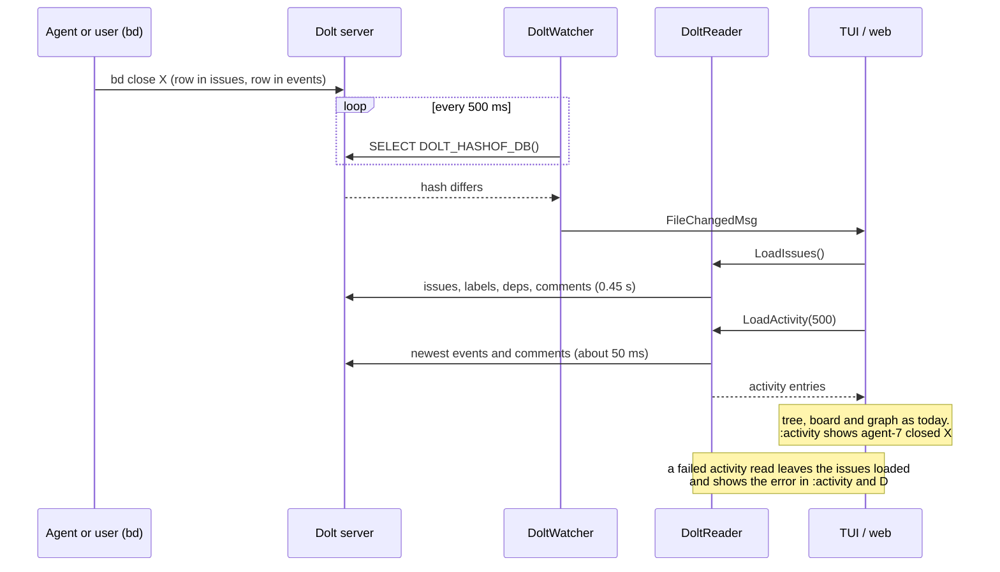

The reload path, the watcher and the hash stay as they are. The only change is
one extra read after the issue read.

### 6.2 Reading activity

`DoltReader.LoadActivity(ctx, limit int) ([]model.ActivityEntry, error)` runs
two statements on the reader's connection:

1. the newest `limit` rows of `events`, ordered by `created_at` then `id`. It
   selects `new_value` and only the `status` field of `old_value`. `old_value`
   holds the whole issue, so reading it in full would multiply the transfer
   for nothing.
2. the newest `limit` rows of `comments`, with the first line of `text`.

The two lists are merged by time, newest first, cut to `limit`, and `commented`
events are dropped because `comments` is the source for comments.

**The read is stateless.** Each reload reads the newest `limit` rows again. There
is no cursor, so there is no gap to lose and no clock skew to handle: a row with
a skewed client time sorts by its own time. The cost is fixed at about 50 ms.

**A failed read is an annotation, not a state.** The issue list does not depend
on activity, so a failed activity read never fails or delays the reload. The
error shows in `:activity` and in `D`, and the next reload tries again.

The default `limit` is 500. It is a constant in v1.4, not a config key.

### 6.3 Activity entries

```go
type ActivityEntry struct {
    ID      string       // events.id or comments.id
    IssueID string
    Kind    ActivityKind // closed enum, below
    Actor   string
    At      time.Time
    Summary string       // one line, built from new_value, old status or comment text
}
```

| `event_type` | `ActivityKind` | Summary |
|---|---|---|
| `created` | `Created` | the issue's title |
| `status_changed` | `StatusChanged` | `open → in_progress`, from the old and new status |
| `closed` | `Closed` | the close reason |
| `reopened` | `Reopened` | |
| `claimed` | `Claimed` | |
| `updated` | `Updated` | the names of the changed fields, from the `new_value` keys |
| `label_added`, `label_removed` | `LabelAdded`, `LabelRemoved` | the label |
| `dependency_added`, `dependency_removed` | `DepAdded`, `DepRemoved` | the text from `new_value` |
| row in `comments` | `Commented` | the first line of the comment |
| any other value | `Other` | the raw `event_type` |

`Other` keeps the enum closed while a newer Beads adds types: the view shows the
row instead of failing the read.

### 6.4 Sources other than a Dolt server

| Source | Activity in v1.4 | Reason shown |
|---|---|---|
| Dolt server | yes | |
| Embedded Dolt (ADR 0025) | no | `bd export` has no audit rows, and `bd history --events` reads one issue at a time (request [9.7](#97-a-documented-audit-trail-read-that-works-in-every-mode)) |
| SQLite, JSONL | no | legacy formats, no audit read in b9s |
| Dolt server without an `events` table | no | Beads older than the audit trail |
| All-projects view | no | activity is per project in v1.4 |

### 6.5 The `:activity` view

- Opened with `:activity` (ADR 0009, colon commands).
- One row per entry, newest first: time, actor, kind, issue id, title, summary.
- `Enter` opens the issue. `/` filters by actor, kind or issue.
- The header shows the source and the entry count, or the reason from 6.4, or
  the last read error.

### 6.6 Web UI

`pkg/web/store.go` keeps the entries from the last reload and exposes them as
`GET /api/activity`. Browsers refetch it when the existing SSE stream reports a
reload, so no new SSE event type is needed. The pairing token model of ADR 0020
stays the only way in.

### 6.7 Diagnostics

The `D` overlay shows the activity source, the rows read, the time and duration
of the last read, and the last error. There are no new config keys in v1.4.

### 6.8 Scope limits for v1.4

- Server mode only (6.4).
- No journal, no `--follow`, no change to the reload path or the hash poll.
- b9s still runs `bd` for every write.
- b9s never turns the journal on. That writes `.beads/config.yaml` for every
  agent in the workspace, which is the user's decision.

## 7. Benefits

| Benefit | v1.4 |
|---|---|
| Who changed what, and when | new, for every `bd` writer, six months back |
| Cost per reload | about 50 ms on top of 0.45 s, on the connection b9s already holds |
| New moving parts | one query and one view. No child process, no new states, no timers |
| Needs a Beads change or the journal flag | no |
| Shared server load | 2 statements per reload, only when something changed |

## 8. Downsides and risks

- **`events` is an internal table.** A Beads release could rename or reshape it.
  A failed read never breaks the reload (6.2), and the scratch-server
  integration test (section 10) fails on a `bd` upgrade that changes it.
  Request [9.7](#97-a-documented-audit-trail-read-that-works-in-every-mode) asks
  Beads to make it a contract.
- **Server mode only.** Embedded, SQLite and JSONL users see a reason, not
  activity.
- **Not every write appears.** `bd sql`, merges, pulls and direct library
  writes leave no `events` row. The journal has the same gaps (3.4).
- **No cursor.** Entries in the same second order by UUID, which is arbitrary.
  This is cosmetic.
- **Retention is not verified.** Six months of rows exist today. If a Beads
  compaction prunes `events`, older activity disappears, which harms nothing
  else.
- **No cut in reload work.** Each hash change still re-reads every issue, now
  plus 50 ms. The journal design in Appendix A addresses that when reloads grow.

## 9. Unfulfilled requests to Beads

Requests 9.1 to 9.6 gate the deferred journal design in
[Appendix A](#appendix-a-deferred-design-following-the-journal). Their
"workaround" lines describe that design. Request 9.7 is for the v1.4 activity
view.

### 9.1 Cheaper start-up for read commands

- **Now:** 3 connections and 11 statements per `bd` invocation, 0.9 s over a
  tunnel.
- **Workaround:** use `--follow`, pay start-up once per stream start.
- **Would unlock:** one-shot reads after a hash change (option B), with no
  child process to supervise. Also faster restarts after a tunnel drop.

### 9.2 A way to read the head

- **Now:** no CLI call returns the head. A `--since` above the head gives an
  empty success, and with `--follow` it waits forever.
- **Workaround:** replay from `--since 0` on every open, and end the replay
  by a silence heuristic.
- **Would unlock:** start from the head in constant time, keep only the last N
  records, and end the replay exactly. `bd events head --json`, or `head` in
  each `--json` line, would do. The HTTP API already returns `head`.

### 9.3 A configurable follow interval

- **Now:** fixed at 1 s.
- **Workaround:** none. Journaled changes show up to 1 s after the write.
- **Would unlock:** match b9s' 500 ms poll, or slow it down for a large number
  of idle projects.

### 9.4 A machine-readable "journal off" signal

- **Now:** exit 0 plus a note on stderr.
- **Workaround:** parse the note, plus `bd config get events-journal`.
- **Would unlock:** a reliable `Off` state. A field in the `--json` output or a
  distinct exit code would do.

### 9.5 A journal flag that covers a shared database

- **Now:** the flag lives in each clone's `.beads/config.yaml`.
- **Workaround:** document that every clone and lane must set it. Keep the
  hash backstop and the quiet reconcile.
- **Would unlock:** coverage as a property of the database. With every writer
  covered, the explain window could shrink and the activity view would be
  complete.
- **Stronger form:** let the database write the journal, with triggers on the
  issue, dependency and comment tables, or at least store the flag in the
  database. Triggers cover every SQL writer, including `bd sql` and clones
  without the flag. They do not cover merges: our test on Dolt 2.3.2 showed
  that `DOLT_MERGE` fires no trigger (see
  [3.5](#35-why-a-journal-and-not-a-trigger-that-pushes)). So pulls must still
  be signalled some other way, for example one `resync` record that `bd dolt pull`
  writes after a merge.

### 9.6 `bd serve` out of preview, and embedded support

- **Now:** preview, server mode only.
- **Workaround:** `--follow` as a child process.
- **Would unlock:** one supervised HTTP connection with SSE and
  `Last-Event-ID` resume, `head` in every page, and a path to replace the child
  process.

### 9.7 A documented audit-trail read that works in every mode

- **Now:** `events` is an internal table. In embedded mode it can be read only
  one issue at a time (`bd history <id> --events`), and `bd export` leaves it out.
- **Workaround:** read `events` over SQL in server mode, and show "not
  available" elsewhere.
- **Would unlock:** `:activity` in embedded mode, and a contract for the table
  b9s reads. For example `bd history --events --all --json --limit N`, or
  documenting the `events` columns as stable.

## 10. Testing

TDD per step. No test writes to the shared server (`CLAUDE.md`).

- **Unit, mapping:** one table test row per `event_type` from 6.3, including an
  unknown type that maps to `Other`, and a `status_changed` with the old status.
- **Unit, merge:** `events` and `comments` merged newest first, `commented`
  events dropped, the result cut to `limit`, ties ordered.
- **Unit, failure:** a failed activity read leaves the issue list loaded and
  sets the error that `:activity` and `D` show.
- **Unit, sources:** embedded, SQLite, JSONL and a database without `events`
  each give "not available" with the reason from 6.4.
- **Integration, scratch server** (`B9S_TEST_DOLT_SCRATCH_ADDR`): initialise a
  disposable database with `bd`, then `bd create`, `close`, `comments add` and
  `dep add`. Assert that `LoadActivity` returns them with the actor and the
  right kinds. This test is the guard against a Beads schema change.
- **E2E (PTY):** against the scratch server, write with `bd`, open `:activity`
  and assert that the entry and its actor appear. Bounded by
  `B9S_TUI_AUTOCLOSE_MS`.
- **Web:** `GET /api/activity` returns the entries of the last reload.

## 11. Documentation and ADR

- **ADR 0027** "Show activity from the Beads audit trail, postpone following the
  events journal". It records the measurements in section 4 and the comparison
  in 3.6, so the choice is not reopened without new facts.
- `docs/ARCHITECTURE.md`: the reload path gains the activity read.
- `README.md`: `:activity`, and why it needs a Dolt server.
- `docs/testing.md`: the scratch-server activity tests.

## 12. Delivery plan for v1.4

The Beads epic **BD Events** (`bd-vd9g.1`) is a child of the **v1.4 release**
epic (`bd-vd9g`), and the publish task `bd-vd9g.2` depends on it.

| # | Beads | Task | Depends on |
|---|---|---|---|
| 1 | `bd-yv9a` | Design document (this file) and review | |
| 2 | `bd-vd9g.1.13` | `ActivityReader`: read `events` and `comments` into entries | 1 |
| 3 | `bd-vd9g.1.6` | `:activity` view in the TUI | 2 |
| 4 | `bd-vd9g.1.5` | Web store: `GET /api/activity` | 2 |
| 5 | `bd-vd9g.1.7` | Diagnostics overlay: activity source, last read, error | 2 |
| 6 | `bd-vd9g.1.8` | Integration tests (scratch server) and the PTY E2E | 3 |
| 7 | `bd-vd9g.1.9` | ADR 0027, ARCHITECTURE, README, testing docs | 3 |
| 8 | `bd-vd9g.1.10` | Reply on #11, written by the maintainer | 1 |
| 9 | `bd-vd9g.1.12` | Community-tools PR to Beads | release |

Postponed to the deferred epic `bd-8w66` "Follow the Beads events journal":
`bd-vd9g.1.1` EventStream, `bd-vd9g.1.2` ApplyRecords, `bd-vd9g.1.3`
Reconciler, `bd-vd9g.1.4` TUI wiring, `bd-vd9g.1.11` enable the journal on our
workspaces.

## 13. Open questions

1. **Read activity on every reload, or only while `:activity` or a web client
   needs it?** v1.4 reads on every reload, for 50 ms. Reading on demand saves
   that on the shared server but adds a state to track.
2. **Web activity for a paired phone:** actors are usually git user names or
   agent names. The web UI already shows `owner`, so this adds little, but it
   deserves a look.
3. **The issue detail pane** could show the issue's own history from the same
   table. A cheap follow-up once the reader exists.

## Appendix A. Deferred design: following the journal

Written for v1.4 and postponed on 2026-09-28, after the measurements in
[section 4](#4-measurements) and the audit-trail finding in
[3.6](#36-the-audit-trail-beads-already-keeps). It is kept so the work can resume
under the deferred epic `bd-8w66` when Beads answers requests 9.2, 9.3 and 9.5,
or when a full reload grows past about 1 s. Section references inside this
appendix point to its own subsections (A.1 to A.16) or to sections 3, 4 and 9.

### A.1 Overview

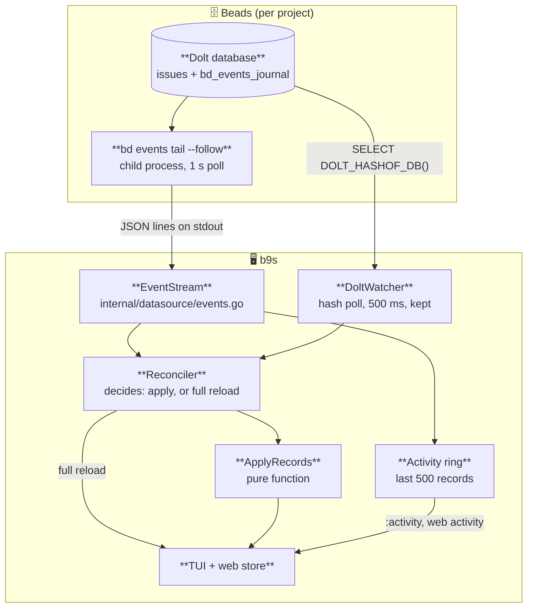

Two signals meet in one place, the **Reconciler**:

- the **stream** says *what* changed, for journaled writes only;
- the **hash** says *that* something changed, for every write.

### A.2 Opening a project: baseline, then follow

There is no command that returns the journal head, and a `--since` above the
head waits forever. So the stream always starts from a position it has read,
never from a guess.

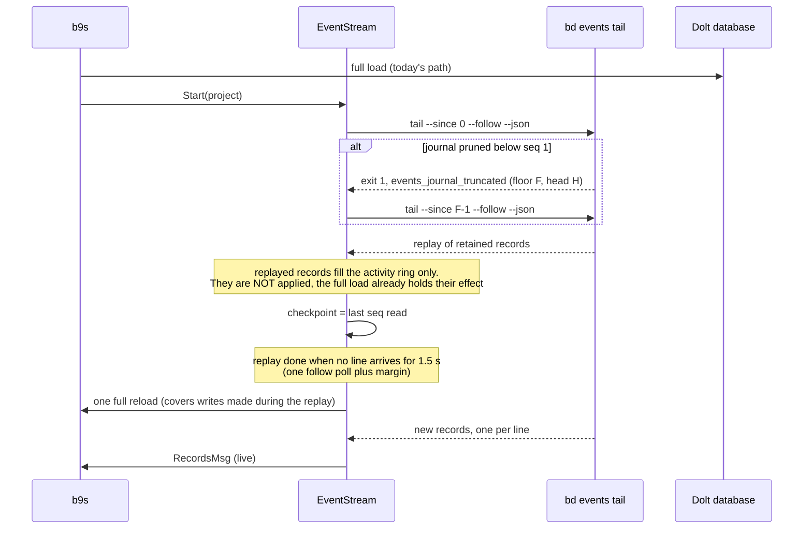

Replay cost is one full journal read per project open, in the background. At
the retention limit that is 100k records. The screen does not wait for it.

The replay ends when no line arrives for one follow interval plus margin. That
is a heuristic, forced by the missing head (request [9.2](#92-a-way-to-read-the-head)).
b9s cannot tell which replayed records the first full load already contains,
so it applies none of them and runs one more full reload when the replay ends.
That reload covers any write made while the replay ran. From then on every
record is applied. Applying records is idempotent (A.8), so a record that
overlaps a reload is safe.

### A.3 Steady state: a journaled write

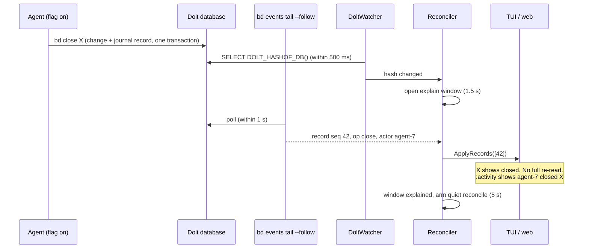

### A.4 An unjournaled write: the hash backstop

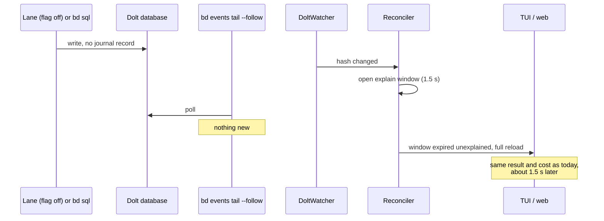

This path costs an extra 1.5 s compared with today. On a project where no
writer journals, b9s would pay that on every change. So the Reconciler learns:
**after 3 unexplained windows in a row, it stops waiting** and reloads at once
on a hash change, as today. It keeps applying records that do arrive, and
resets the counter when a record explains a window. This bounds the cost for a
workspace with the flag off, and the counter is a named finite predicate
(`journalExplainsChanges`), not a free-running number.

### A.5 A mixed burst, and why the quiet reconcile exists

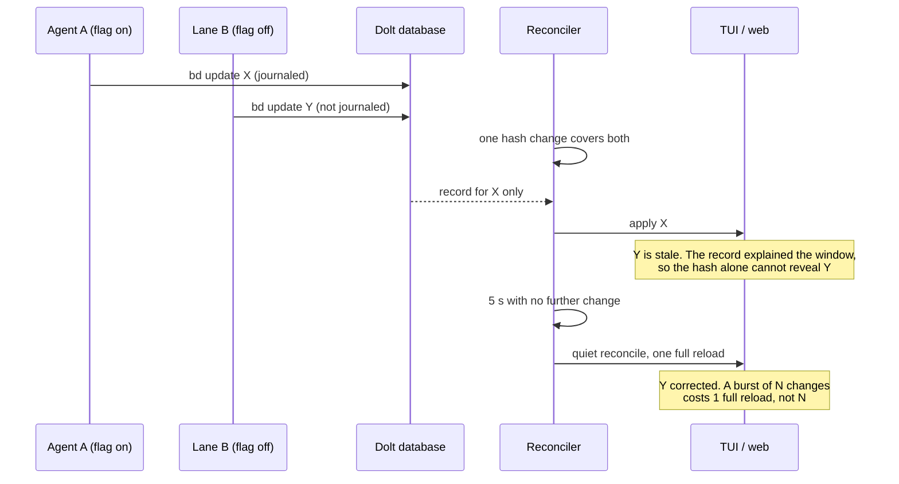

**The guarantee b9s gives: the screen is exact within 5 s of the last change
of a burst.** Journaled changes show within about 1 s. A burst that never goes
quiet for 5 s is bounded by a hard cap: a reconcile runs at least every 30 s
while changes continue.

### A.6 Stream failures

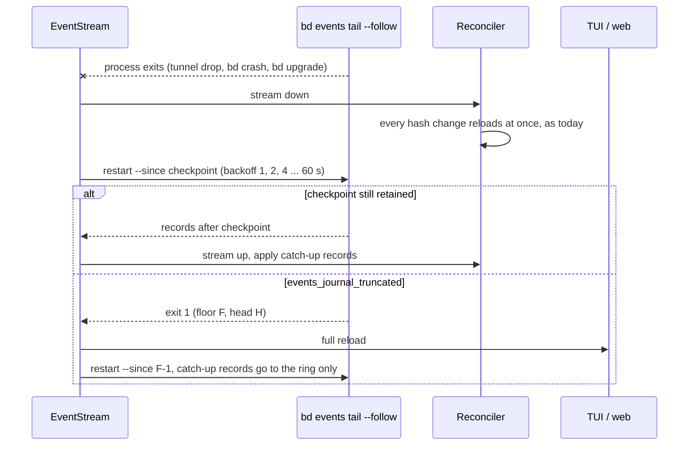

A stream that is down makes b9s behave exactly like v1.3. No failure of the
stream can leave the screen wrong for longer than one hash poll plus one
reload.

### A.7 Stream states

The stream is a small state machine. The Reconciler reads only its state, not
its internals.

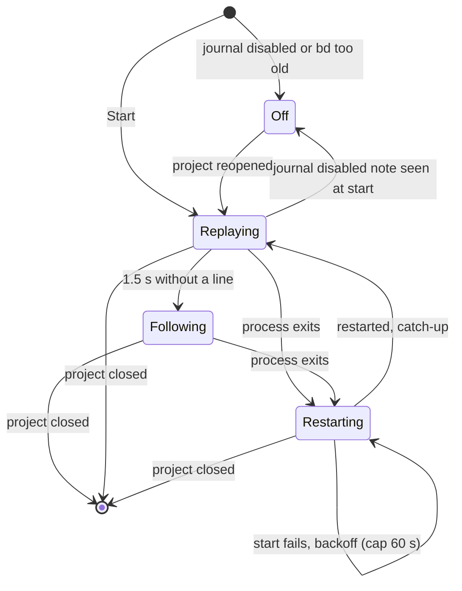

| State | Records applied | Hash change | Entry action | Deadline |
|---|---|---|---|---|
| `Off` | none | full reload at once | stop child | none |
| `Replaying` | to ring only | full reload at once | start child | 1.5 s quiet, then one full reload and `Following` |
| `Following` | applied + ring | explain window (A.3, A.4) | none | none, the hash is the watchdog |
| `Restarting` | none | full reload at once | schedule backoff timer | backoff, cap 60 s |

Setup happens on state entry, so every path into `Replaying` starts the child
the same way.

**Detecting "off":** with the journal disabled, `tail` exits 0 and prints a note
on stderr. b9s also runs `bd config get events-journal` once at start. Both are
text parsing, because there is no machine-readable signal (request
[9.4](#94-a-machine-readable-journal-off-signal)).

### A.8 Applying records

`ApplyRecords(issues []model.Issue, recs []Record) []model.Issue` is a pure
function, table-tested per op:

| op | Effect on the in-memory list |
|---|---|
| `create` | insert `issue` (no deps, no comments yet) |
| `update`, `close` | replace the issue's fields with `issue`, **keep** its dependencies and comments |
| `delete` | remove the issue. Its edges were already removed by the preceding `dep_remove` records |
| `dep_add` | upsert the edge `(issue_id, dep.target, dep.kind)` |
| `dep_remove` | remove that edge if present |
| `comment` | append `comment` if its `id` is not already there |

Every op is idempotent, so a record applied twice (replay overlap, restart)
changes nothing the second time. After applying, the snapshot is rebuilt as
today (graph, board, tree), because derived state such as blocked chains
depends on the whole list.

### A.9 Embedded mode

`--follow` against an embedded store did not block `bd create` in testing.
The stream opens the store only for each poll, so ADR 0025's rule that b9s
never holds the store open still holds. Here the gain is larger: a record costs
0.13 s against a full `bd export` of 0.5 s and more.

### A.10 Web UI

`pkg/web/store.go` uses the same watchers, so it gets the same Reconciler. The
activity ring is exposed as `GET /api/activity` and as an `activity` event on
the existing SSE stream. Browsers never talk to `bd` (no CORS in `bd serve`,
and the pairing token model of ADR 0020 stays the only way in).

### A.11 The `:activity` view

- Opened with `:activity` (ADR 0009, colon commands).
- One row per record, newest first: time, actor, op, issue id, title.
- `Enter` opens the issue. `/` filters by actor or op.
- The header shows the stream state: `following`, `replaying`, `restarting`,
  or `journal off (enable with bd config set events-journal true)`.
- Derived updates with no actor (blocked-state changes) are hidden by default
  and shown with a toggle.

### A.12 Diagnostics and configuration

- The `D` diagnostics overlay shows: journal on or off, stream state, last
  `seq`, the count of unexplained windows, and the time of the last reconcile.
- New config keys, under `refresh:` next to `poll_interval`:
  - `events: auto | off` (default `auto`: stream when the journal is on)
  - `reconcile_quiet: 5s`, `reconcile_max: 30s`
- **b9s never turns the journal on.** That writes `.beads/config.yaml` for
  every agent in the workspace, which is the user's decision. The README
  explains how and why.

### A.13 Scope limits of the journal design

- The all-projects view keeps hash polling only. One follow process per
  database would scale badly on a server with many projects.
- No `bd serve`.
- b9s does not replace its own write path. It still runs `bd` for every write.
- Checkpoints live in memory only. A restart of b9s replays again.

### A.14 Benefits of following the journal

| Benefit | Server mode | Embedded mode |
|---|---|---|
| Full re-reads per burst of N changes | 1 instead of N | 1 instead of N |
| Time to show a journaled change | about 1 s, without waiting for a reload | about 1 s, instead of 0.5 s+ per `bd export` |
| Who changed what, and when | available without the journal (3.6) | not available elsewhere in embedded mode |
| Load on the shared server | fewer full reads, but 4 statements per second from the follow | no server |
| Record contract | documented as stable by Beads, unlike the table layout b9s reads today | same |

The activity data is available without the journal in server mode (3.6), so
the remaining benefit is the reload saving. It is modest on the server, where a
full reload is 0.45 s, and larger in embedded mode, where each change runs a
full `bd export`.

### A.15 Downsides and risks of following the journal

- **The journal is incomplete by design** (3.4). b9s cannot rely on it for
  correctness, so it needs the hash poll, the explain window and the quiet
  reconcile. That is three mechanisms where v1.3 had one.
- **Latency is not better for unjournaled writes.** A write with no record
  shows up to 1.5 s later than in v1.3, until the Reconciler stops waiting
  after 3 unexplained windows (A.4).
- **Latency for journaled writes is bounded by `bd`'s fixed 1 s poll**, which
  b9s cannot change (request [9.3](#93-a-configurable-follow-interval)).
- **One child process per open project**, to start, supervise, back off and
  stop on exit. A leaked child is a new failure class. Tests must prove that
  closing a project and quitting b9s leave no `bd` process behind.
- **Extra server load:** 4 statements per second per b9s instance per open
  project, against 2 statements per second for the hash poll today. It is small,
  but it multiplies across users on the shared server.
- **Replay cost on every project open**: up to the retention limit, since there
  is no way to start from the head (request [9.2](#92-a-way-to-read-the-head)).
- **Replay end is a heuristic** (1.5 s of silence). A slow first page on a
  large journal could end the replay early. That is harmless, because applying
  records is idempotent and the full load covers them, but the activity ring
  could briefly show a partial history.
- **"Journal off" is detected by parsing stderr text** (request
  [9.4](#94-a-machine-readable-journal-off-signal)). A wording change in `bd`
  would make b9s treat an off journal as an empty one. That is safe, because
  the hash still reloads, but the header would be wrong.
- **Version coupling:** `bd` before 1.3 has no `events` command. b9s must
  detect that and stay in `Off`.
- **Coverage depends on every writer's local config** (request
  [9.5](#95-a-journal-flag-that-covers-a-shared-database)). On our shared
  server, every lane image and every laptop clone must set the flag, or the
  activity view silently misses their work.
- **`bd dolt pull` is not journaled.** A user who pulls sees a hash change that
  no record explains. That is handled by the backstop, but the activity view
  never shows those changes.

### A.16 Open questions for the journal design

1. **Should b9s offer to enable the journal?** This design says no. A one-key
   prompt ("journal is off, enable it?") would still write a shared config file
   on the user's behalf.
2. **Explain window and reconcile timings** (1.5 s, 5 s, 30 s) come from the
   1 s follow interval and the 0.45 s reload. They should be checked on a busy
   project before release.
3. **The all-projects view:** leave it on hash polling, or follow only the
   project under the cursor?
