# BD Events: live updates from the Beads events journal

| | |
|---|---|
| Status | Draft design, for review |
| Release | v1.4 (blocks the v1.4 publish) |
| Beads | `bd-vd9g.1` Epic: BD Events, under `bd-vd9g` Epic: v1.4 release |
| Upstream | [vanderheijden86/b9s#11](https://github.com/vanderheijden86/b9s/issues/11), Beads [v1.3.0](https://github.com/gastownhall/beads/releases/tag/v1.3.0) |
| Measured with | `bd` 1.3.0-rc.1, macOS, shared Dolt server reached through an SSH tunnel |

## Table of contents

1. [Summary](#1-summary)
2. [How b9s reloads today](#2-how-b9s-reloads-today)
3. [What Beads 1.3 offers](#3-what-beads-13-offers)
4. [Measurements](#4-measurements)
5. [Options considered](#5-options-considered)
6. [Design](#6-design)
7. [Benefits](#7-benefits)
8. [Downsides and risks](#8-downsides-and-risks)
9. [Unfulfilled requests to Beads](#9-unfulfilled-requests-to-beads)
10. [Testing](#10-testing)
11. [Documentation and ADR](#11-documentation-and-adr)
12. [Delivery plan for v1.4](#12-delivery-plan-for-v14)
13. [Open questions](#13-open-questions)

---

## 1. Summary

Beads 1.3 adds an **events journal**: every `bd` write can append an ordered
record (`seq`, `op`, `actor`, the issue after the change) in the same
transaction as the write. `bd events tail --follow` streams those records, and
`bd serve` (preview) offers them over HTTP.

**b9s v1.4 runs one `bd events tail --follow` process per open project, applies
each record to the issues on screen as it arrives, and shows the records in a
new `:activity` view. The 500 ms hash poll stays as the backstop, because the
journal does not see every write.**

What we gain: the screen updates without a full re-read per change, and b9s can
show *who changed what* for the first time. What we give up: one extra process
per project, up to 1 s latency set by `bd`, and a design that must stay correct
while the journal is incomplete. Five things we would need from Beads to close
the remaining gaps are listed in [section 9](#9-unfulfilled-requests-to-beads).

## 2. How b9s reloads today

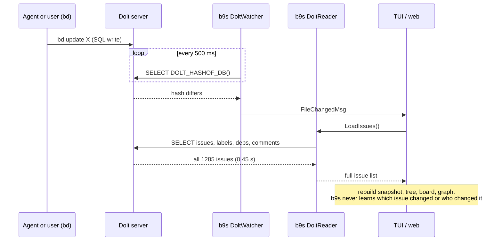

- **Dolt server** (`internal/datasource/dolt_watcher.go`): one persistent
  connection, one cheap statement per 500 ms (`refresh.poll_interval`). The
  cost is the full re-read after each change.
- **Embedded Dolt** (ADR 0025): the watcher fingerprints the store files and
  each change runs a full `bd export`.
- **All-projects view** (`dolt_multi_watcher.go`): one hash per database.
- **Web UI** (`pkg/web/store.go`): the same watchers feed a reload loop and an
  SSE stream to browsers.

The hash is complete: it moves on *every* write, from any client, including
uncommitted working-set writes. That property is what this design must keep.

## 3. What Beads 1.3 offers

### 3.1 The journal write path

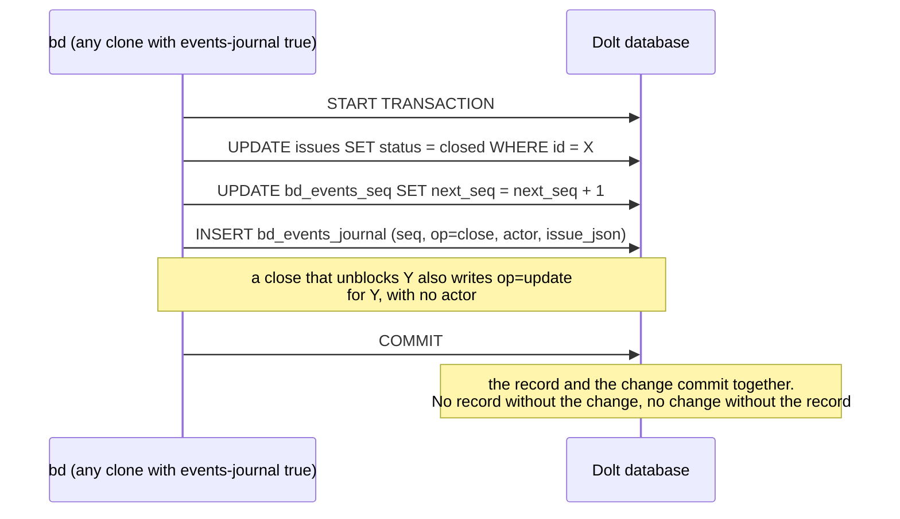

The guarantee holds only for writers that have the flag on. See 3.4.

### 3.2 Reading the journal

**One-shot:** `bd events tail --since N --json` prints the records after `N`
and exits.

**Follow:** `bd events tail --since N --follow --json` keeps running:

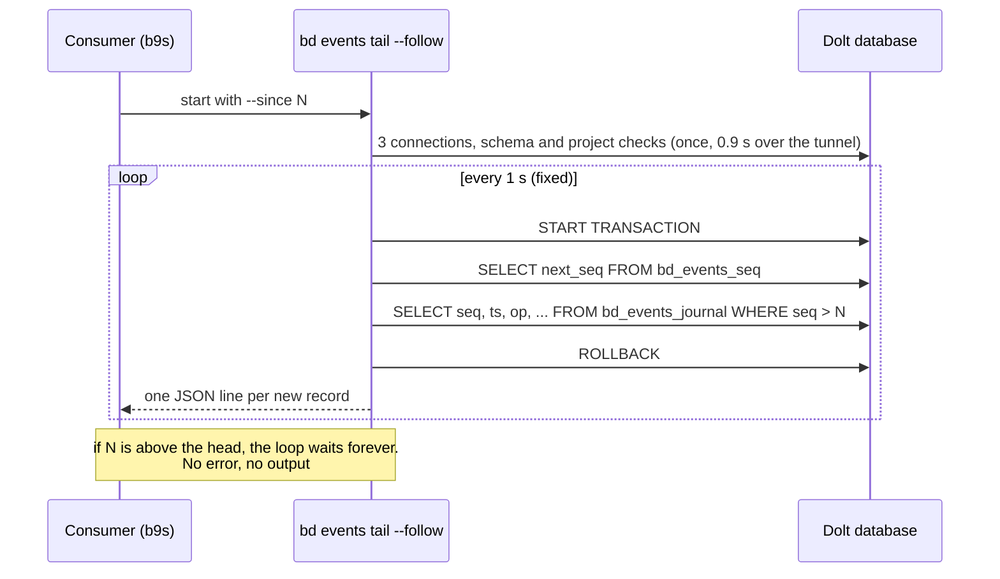

**HTTP (preview):** `bd serve` exposes `/v0/beads/events?since=N` (paged, with
`head`) and `/v0/beads/events:watch` (Server-Sent Events with
`Last-Event-ID`). It refuses embedded mode today and sends no CORS headers.

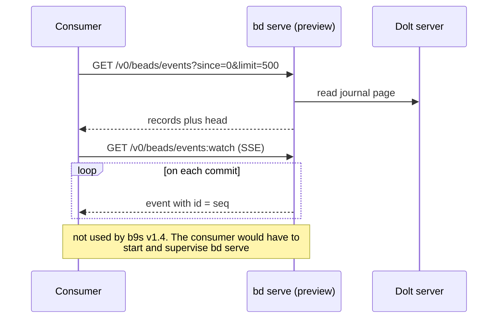

### 3.3 Record contract

Documented as stable for external consumers (`bd events tail --help`):

| Field | Meaning |
|---|---|
| `seq` | int64, gapless, strictly increasing in commit order, never reused |
| `ts` | UTC time stamped inside the committing transaction |
| `op` | `create`, `update`, `close`, `delete`, `dep_add`, `dep_remove`, `comment` |
| `issue_id` | the changed issue |
| `actor` | who made the change. Empty only for derived maintenance, such as a blocked-state update |
| `issue` | full issue **after** the change, `null` on delete |
| `dep` | `{kind, target, metadata}` on dep ops |
| `comment` | `{id, author, text, created_at, source}` on comment |

Observed on 2026-09-28, and relevant to applying records:

- `issue` carries labels, but **not** dependencies or comments. Those arrive
  only as `dep_*` and `comment` records.
- Claims, reopens and label changes arrive as `update`.
- `is_blocked` appears only when true.
- `dep_add` is sent again for an idempotent re-add, so it is an upsert.
- A delete sends `dep_remove` for each edge first, then `delete`.

### 3.4 Coverage: what the journal does not see

| Write | Journaled |
|---|---|
| `bd` in a workspace whose `.beads/config.yaml` has `events-journal: true` (or `BD_EVENTS_JOURNAL=1`) | yes |
| `bd` in another clone, lane or machine without the flag, on the same shared database | **no** |
| `bd sql` raw DML | **no** |
| `bd dolt pull`, merges, branch checkout | **no**, and re-baseline is needed |
| Schema migrations while a store opens | **no**, and they touch no issue |
| Writes through the Beads Go library directly | **no** |

The journal is **off by default**. Retention is 7 days or the newest 100k
records, whichever keeps more. A checkpoint below the retained floor fails with
`events_journal_truncated` (exit 1, JSON on stdout with `floor` and `head`).

## 4. Measurements

| Operation | Time |
|---|---|
| `bd version` (no database) | 0.05 s |
| `bd events tail --since 0 --json`, shared server | 0.92 s |
| `bd events tail --since 999999 --json` (empty), shared server | 0.96 s |
| `bd count`, shared server | 0.96 s |
| b9s full SQL reload, 1285 issues, shared server | 0.45 s |
| one SQL round trip through the tunnel | 30 to 50 ms |
| new connection through the tunnel | 165 ms |
| `bd events tail`, local server on loopback | 0.06 s |
| `bd events tail`, embedded store | 0.13 s |
| `bd export`, embedded store, 1 issue | 0.5 s |
| write to arrival at a `--follow` consumer | about 1.1 s |
| `bd create` with an embedded `--follow` running | 0.51 s, not blocked |

The 0.9 s of a one-shot call is start-up. Query logging on a scratch server
shows 3 connections and 11 statements per call, of which one reads the journal:

```
conn 1  open, close (no statement)
conn 2  SELECT @@max_allowed_packet
        SHOW DATABASES
conn 3  SELECT @@max_allowed_packet
        SELECT COUNT(*) FROM information_schema.tables ...   (schema check)
        SELECT COALESCE(MAX(version), 0) FROM schema_migrations
        START TRANSACTION / SELECT value FROM metadata WHERE key='_project_id' / ROLLBACK
        START TRANSACTION / SELECT seq, ... FROM bd_events_journal ... / ROLLBACK
```

Conclusion: **a one-shot read per change is slower than today's reload on a
remote server. A long-running `--follow` pays the start-up once.**

## 5. Options considered

- **A. `bd events tail --follow`, one process per open project** (chosen).
  Uses the documented CLI contract, works in server and embedded mode, and
  pays start-up once. Costs a child process to supervise and 1 s latency.
- **B. One-shot `bd events tail` after each hash change.** Rejected: 0.9 s per
  call on the shared server, twice the full reload it was meant to replace.
- **C. Read `bd_events_journal` over b9s' own SQL connection.** Rejected: fast
  (one statement, about 40 ms), but it binds b9s to a table layout the Beads
  team says can change, and it does not work in embedded mode.
- **D. `bd serve` with `events:watch`.** Deferred: preview, server mode only,
  and b9s would have to start, supervise and authenticate a server. Revisit
  when it leaves preview (see [9.6](#96-bd-serve-out-of-preview-and-embedded-support)).
- **E. Do nothing.** Rejected: the activity data (actor, op) exists only in the
  journal.

## 6. Design

### 6.1 Overview

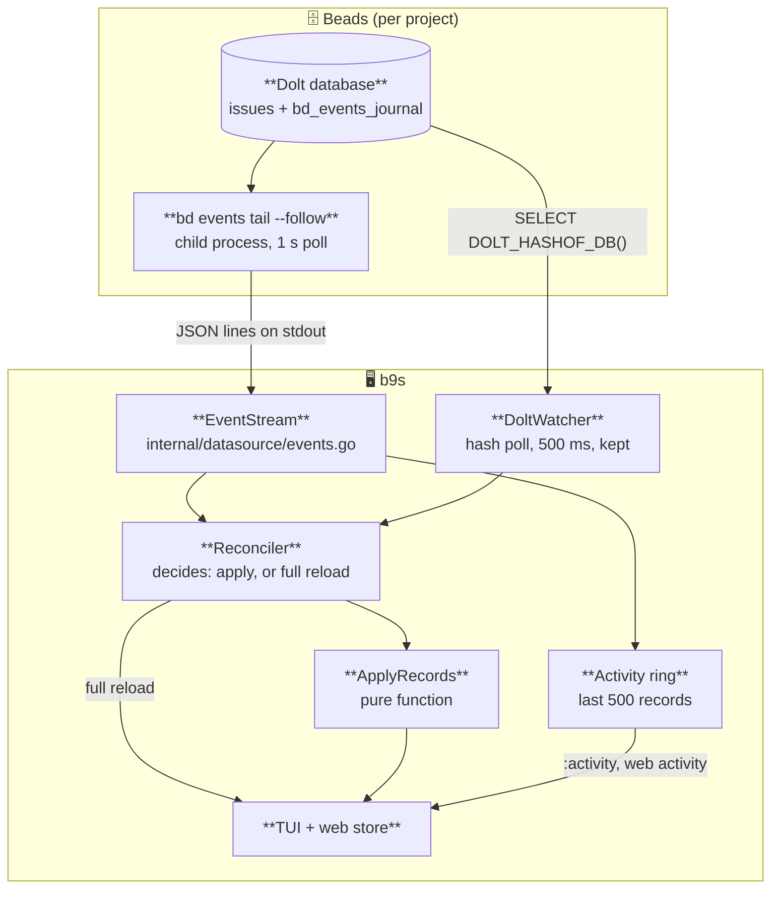

Two signals meet in one place, the **Reconciler**:

- the **stream** says *what* changed, for journaled writes only;
- the **hash** says *that* something changed, for every write.

### 6.2 Opening a project: baseline, then follow

There is no command that returns the journal head, and a `--since` above the
head waits forever. So the stream always starts from a position it has read,
never from a guess.

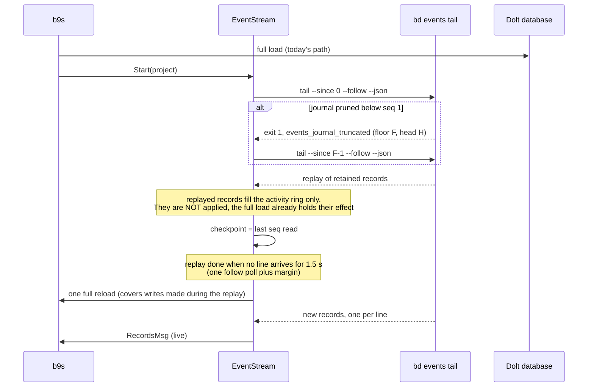

Replay cost is one full journal read per project open, in the background. At
the retention limit that is 100k records. The screen does not wait for it.

The replay ends when no line arrives for one follow interval plus margin. That
is a heuristic, forced by the missing head (request [9.2](#92-a-way-to-read-the-head)).
b9s cannot tell which replayed records the first full load already contains,
so it applies none of them and runs one more full reload when the replay ends.
That reload covers any write made while the replay ran. From then on every
record is applied. Applying records is idempotent (6.8), so a record that
overlaps a reload is safe.

### 6.3 Steady state: a journaled write

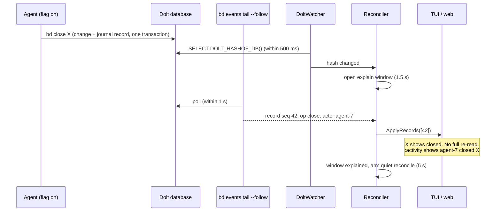

### 6.4 An unjournaled write: the hash backstop

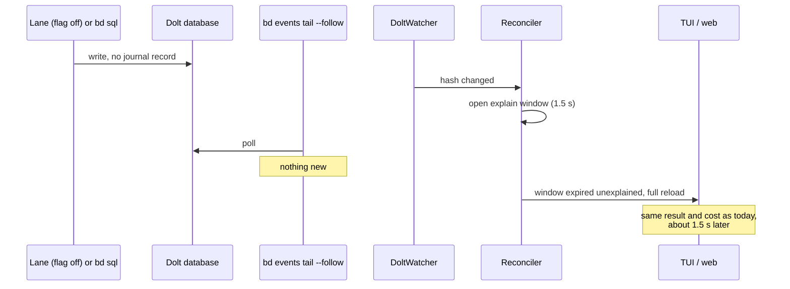

This path costs an extra 1.5 s compared with today. On a project where no
writer journals, b9s would pay that on every change. So the Reconciler learns:
**after 3 unexplained windows in a row, it stops waiting** and reloads at once
on a hash change, as today. It keeps applying records that do arrive, and
resets the counter when a record explains a window. This bounds the cost for a
workspace with the flag off, and the counter is a named finite predicate
(`journalExplainsChanges`), not a free-running number.

### 6.5 A mixed burst, and why the quiet reconcile exists

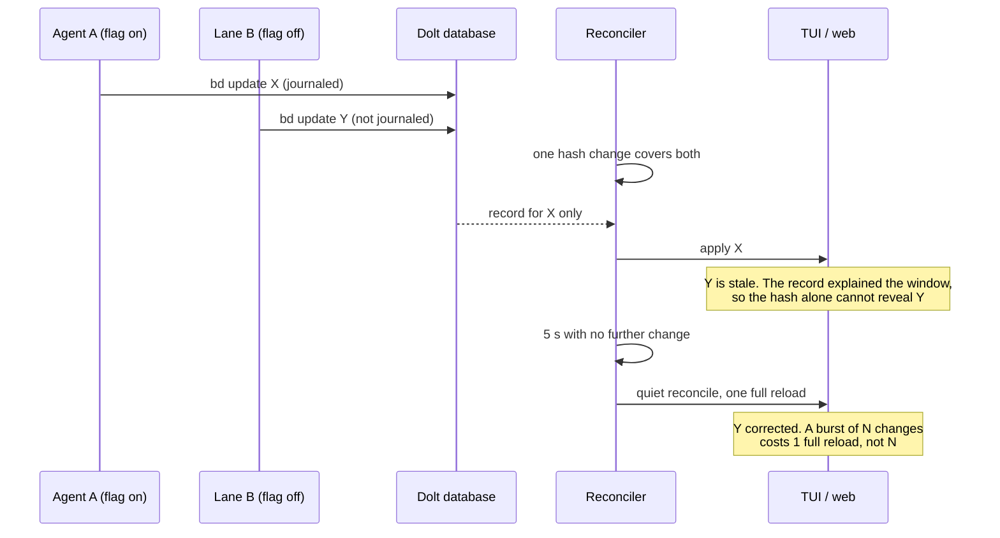

**The guarantee b9s gives: the screen is exact within 5 s of the last change
of a burst.** Journaled changes show within about 1 s. A burst that never goes
quiet for 5 s is bounded by a hard cap: a reconcile runs at least every 30 s
while changes continue.

### 6.6 Stream failures

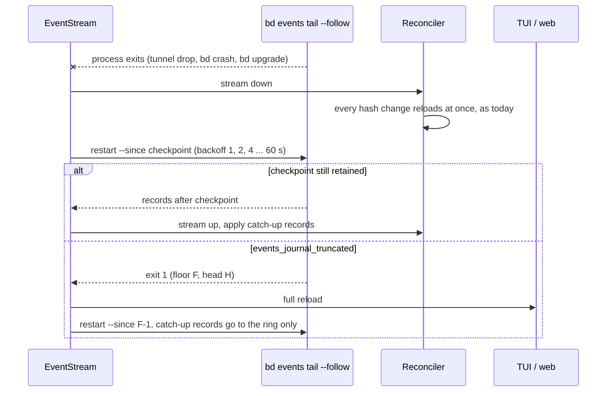

A stream that is down makes b9s behave exactly like v1.3. No failure of the
stream can leave the screen wrong for longer than one hash poll plus one
reload.

### 6.7 Stream states

The stream is a small state machine. The Reconciler reads only its state, not
its internals.

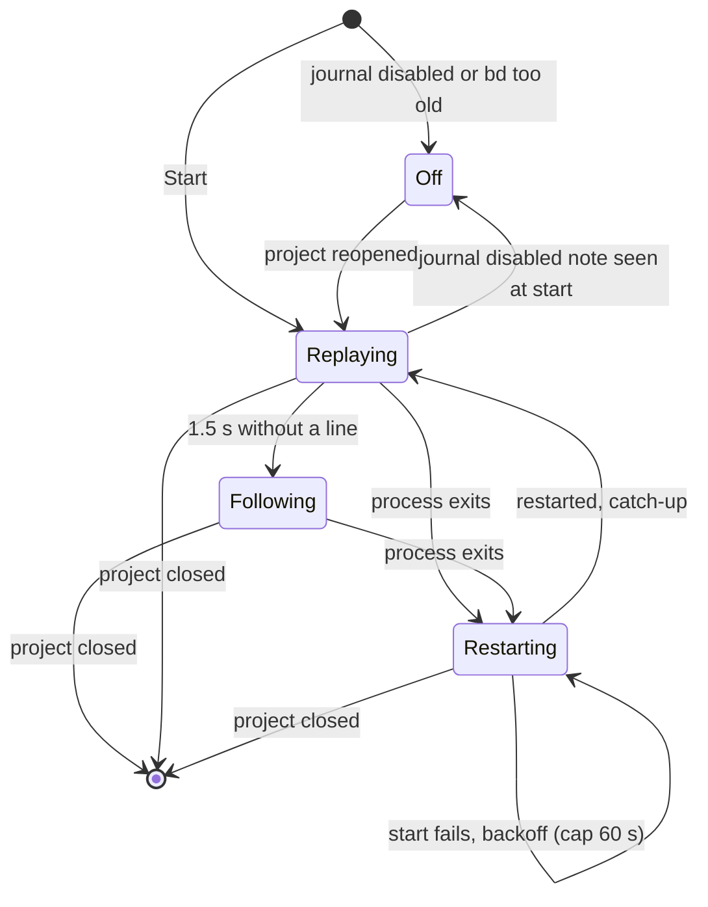

| State | Records applied | Hash change | Entry action | Deadline |
|---|---|---|---|---|
| `Off` | none | full reload at once | stop child | none |
| `Replaying` | to ring only | full reload at once | start child | 1.5 s quiet, then one full reload and `Following` |
| `Following` | applied + ring | explain window (6.3, 6.4) | none | none, the hash is the watchdog |
| `Restarting` | none | full reload at once | schedule backoff timer | backoff, cap 60 s |

Setup happens on state entry, so every path into `Replaying` starts the child
the same way.

**Detecting "off":** with the journal disabled, `tail` exits 0 and prints a note
on stderr. b9s also runs `bd config get events-journal` once at start. Both are
text parsing, because there is no machine-readable signal (request
[9.4](#94-a-machine-readable-journal-off-signal)).

### 6.8 Applying records

`ApplyRecords(issues []model.Issue, recs []Record) []model.Issue` is a pure
function, table-tested per op:

| op | Effect on the in-memory list |
|---|---|
| `create` | insert `issue` (no deps, no comments yet) |
| `update`, `close` | replace the issue's fields with `issue`, **keep** its dependencies and comments |
| `delete` | remove the issue. Its edges were already removed by the preceding `dep_remove` records |
| `dep_add` | upsert the edge `(issue_id, dep.target, dep.kind)` |
| `dep_remove` | remove that edge if present |
| `comment` | append `comment` if its `id` is not already there |

Every op is idempotent, so a record applied twice (replay overlap, restart)
changes nothing the second time. After applying, the snapshot is rebuilt as
today (graph, board, tree), because derived state such as blocked chains
depends on the whole list.

### 6.9 Embedded mode

`--follow` against an embedded store did not block `bd create` in testing.
The stream opens the store only for each poll, so ADR 0025's rule that b9s
never holds the store open still holds. Here the gain is larger: a record costs
0.13 s against a full `bd export` of 0.5 s and more.

### 6.10 Web UI

`pkg/web/store.go` uses the same watchers, so it gets the same Reconciler. The
activity ring is exposed as `GET /api/activity` and as an `activity` event on
the existing SSE stream. Browsers never talk to `bd` (no CORS in `bd serve`,
and the pairing token model of ADR 0020 stays the only way in).

### 6.11 The `:activity` view

- Opened with `:activity` (ADR 0009, colon commands).
- One row per record, newest first: time, actor, op, issue id, title.
- `Enter` opens the issue. `/` filters by actor or op.
- The header shows the stream state: `following`, `replaying`, `restarting`,
  or `journal off (enable with bd config set events-journal true)`.
- Derived updates with no actor (blocked-state changes) are hidden by default
  and shown with a toggle.

### 6.12 Diagnostics and configuration

- The `D` diagnostics overlay shows: journal on or off, stream state, last
  `seq`, the count of unexplained windows, and the time of the last reconcile.
- New config keys, under `refresh:` next to `poll_interval`:
  - `events: auto | off` (default `auto`: stream when the journal is on)
  - `reconcile_quiet: 5s`, `reconcile_max: 30s`
- **b9s never turns the journal on.** That writes `.beads/config.yaml` for
  every agent in the workspace, which is the user's decision. The README
  explains how and why.

### 6.13 Scope limits for v1.4

- The all-projects view keeps hash polling only. One follow process per
  database would scale badly on a server with many projects.
- No `bd serve`.
- b9s does not replace its own write path. It still runs `bd` for every write.
- Checkpoints live in memory only. A restart of b9s replays again.

## 7. Benefits

| Benefit | Server mode | Embedded mode |
|---|---|---|
| Full re-reads per burst of N changes | 1 instead of N | 1 instead of N |
| Time to show a journaled change | about 1 s, without waiting for a reload | about 1 s, instead of 0.5 s+ per `bd export` |
| Who changed what, and when | new (`:activity`) | new |
| Load on the shared server | fewer full reads, but 4 statements per second from the follow | no server |
| Record contract | documented as stable by Beads, unlike the table layout b9s reads today | same |

The largest benefit is the activity data. It is information b9s could not show
at all before. The reload savings are real but modest on the server: a full
reload is 0.45 s.

## 8. Downsides and risks

- **The journal is incomplete by design** (3.4). b9s cannot rely on it for
  correctness, so it needs the hash poll, the explain window and the quiet
  reconcile. That is three mechanisms where v1.3 had one.
- **Latency is not better for unjournaled writes.** A write with no record
  shows up to 1.5 s later than in v1.3, until the Reconciler stops waiting
  after 3 unexplained windows (6.4).
- **Latency for journaled writes is bounded by `bd`'s fixed 1 s poll**, which
  b9s cannot change (request [9.3](#93-a-configurable-follow-interval)).
- **One child process per open project**, to start, supervise, back off and
  stop on exit. A leaked child is a new failure class. Tests must prove that
  closing a project and quitting b9s leave no `bd` process behind.
- **Extra server load:** 4 statements per second per b9s instance per open
  project, against 2 statements per second for the hash poll today. It is small,
  but it multiplies across users on the shared server.
- **Replay cost on every project open**: up to the retention limit, since there
  is no way to start from the head (request [9.2](#92-a-way-to-read-the-head)).
- **Replay end is a heuristic** (1.5 s of silence). A slow first page on a
  large journal could end the replay early. That is harmless, because applying
  records is idempotent and the full load covers them, but the activity ring
  could briefly show a partial history.
- **"Journal off" is detected by parsing stderr text** (request
  [9.4](#94-a-machine-readable-journal-off-signal)). A wording change in `bd`
  would make b9s treat an off journal as an empty one. That is safe, because
  the hash still reloads, but the header would be wrong.
- **Version coupling:** `bd` before 1.3 has no `events` command. b9s must
  detect that and stay in `Off`.
- **Coverage depends on every writer's local config** (request
  [9.5](#95-a-journal-flag-that-covers-a-shared-database)). On our shared
  server, every lane image and every laptop clone must set the flag, or the
  activity view silently misses their work.
- **`bd dolt pull` is not journaled.** A user who pulls sees a hash change that
  no record explains. That is handled by the backstop, but the activity view
  never shows those changes.

## 9. Unfulfilled requests to Beads

Each request names the workaround b9s ships in v1.4 and what the request would
remove. These go into the reply on #11.

### 9.1 Cheaper start-up for read commands

- **Now:** 3 connections and 11 statements per `bd` invocation, 0.9 s over a
  tunnel.
- **Workaround:** use `--follow`, pay start-up once per stream start.
- **Would unlock:** one-shot reads after a hash change (option B), with no
  child process to supervise. Also faster restarts after a tunnel drop.

### 9.2 A way to read the head

- **Now:** no CLI call returns the head. A `--since` above the head gives an
  empty success, and with `--follow` it waits forever.
- **Workaround:** replay from `--since 0` on every open, and end the replay
  by a silence heuristic.
- **Would unlock:** start from the head in constant time, keep only the last N
  records, and end the replay exactly. `bd events head --json`, or `head` in
  each `--json` line, would do. The HTTP API already returns `head`.

### 9.3 A configurable follow interval

- **Now:** fixed at 1 s.
- **Workaround:** none. Journaled changes show up to 1 s after the write.
- **Would unlock:** match b9s' 500 ms poll, or slow it down for a large number
  of idle projects.

### 9.4 A machine-readable "journal off" signal

- **Now:** exit 0 plus a note on stderr.
- **Workaround:** parse the note, plus `bd config get events-journal`.
- **Would unlock:** a reliable `Off` state. A field in the `--json` output or a
  distinct exit code would do.

### 9.5 A journal flag that covers a shared database

- **Now:** the flag lives in each clone's `.beads/config.yaml`.
- **Workaround:** document that every clone and lane must set it. Keep the
  hash backstop and the quiet reconcile.
- **Would unlock:** coverage as a property of the database. With every writer
  covered, the explain window could shrink and the activity view would be
  complete.

### 9.6 `bd serve` out of preview, and embedded support

- **Now:** preview, server mode only.
- **Workaround:** `--follow` as a child process.
- **Would unlock:** one supervised HTTP connection with SSE and
  `Last-Event-ID` resume, `head` in every page, and a path to replace the child
  process.

## 10. Testing

TDD per step. No test writes to the shared server (`CLAUDE.md`).

- **Unit, `internal/datasource`:** record parsing from fixture lines captured
  on 2026-09-28 (all seven ops), the truncated error, and the stderr note.
- **Unit, `ApplyRecords`:** table test per op, idempotence (apply twice gives
  the same result), a delete after `dep_remove`, `dep_add` re-add, missing
  `is_blocked` read as false.
- **Unit, Reconciler:** a fake clock and fake stream drive the paths in 6.3 to
  6.6, including the 3-window rule and the 30 s cap. No real sleeps.
- **Unit, stream supervisor:** a fake `bd` script that prints lines, exits,
  exits with `events_journal_truncated`, or hangs. Asserts the restart from
  the checkpoint, the backoff, and that `Stop` leaves no child running.
- **Integration, scratch server** (`B9S_TEST_DOLT_SCRATCH_ADDR`): enable the
  journal on a disposable database, run `bd` writes, assert that b9s applies
  them, and that a raw SQL write is caught by the backstop.
- **Integration, embedded:** the same against a temporary embedded store, plus
  a check that `bd create` succeeds while the stream runs.
- **E2E (PTY):** open a project with the journal on, write with `bd`, assert
  that the row changes and that `:activity` lists the change with its actor.
  Bounded by `B9S_TUI_AUTOCLOSE_MS`.
- **Leak check:** after each stream test and after the E2E run, no
  `bd events tail` process with the test's workspace in its arguments remains.

## 11. Documentation and ADR

- **ADR 0026** "Follow the bd events journal, keep the hash poll as the
  backstop" with the sequence diagram from 6.5.
- `docs/ARCHITECTURE.md`: the data-flow section gains the stream and the
  Reconciler.
- `README.md`: `:activity`, the new config keys, and how to enable the journal.
- `docs/testing.md`: the scratch-server journal tests.

## 12. Delivery plan for v1.4

The Beads epic **BD Events** (`bd-vd9g.1`) is a child of the **v1.4 release**
epic (`bd-vd9g`), and the publish task `bd-vd9g.2` depends on it. The tasks, in order:

| # | Beads | Task | Depends on |
|---|---|---|---|
| 1 | `bd-yv9a` | Design document (this file) and review | |
| 2 | `bd-vd9g.1.1` | `EventStream`: run and supervise `bd events tail --follow`, parse records, typed errors | 1 |
| 3 | `bd-vd9g.1.2` | `ApplyRecords`: pure apply function | 1 |
| 4 | `bd-vd9g.1.3` | Reconciler: explain window, 3-window rule, quiet reconcile, cap | 2, 3 |
| 5 | `bd-vd9g.1.4` | Wire the TUI (both the direct and the BackgroundWorker reload paths) | 4 |
| 6 | `bd-vd9g.1.5` | Wire the web store, `/api/activity` and the SSE `activity` event | 4 |
| 7 | `bd-vd9g.1.6` | `:activity` view in the TUI | 5 |
| 8 | `bd-vd9g.1.7` | Diagnostics overlay and the `refresh.events` config keys | 5 |
| 9 | `bd-vd9g.1.8` | Integration tests (scratch server, embedded) and the PTY E2E | 5, 7 |
| 10 | `bd-vd9g.1.9` | ADR 0026, ARCHITECTURE, README, testing docs | 4 |
| 11 | `bd-vd9g.1.10` | Reply on #11 with the findings and requests (section 9) | 1 |
| 12 | `bd-vd9g.1.11` | Enable the journal on our own workspaces and lanes | 9 |
| 13 | `bd-vd9g.1.12` | Community-tools PR to Beads | release |

## 13. Open questions

1. **Should b9s offer to enable the journal?** This design says no. A one-key
   prompt in `:activity` ("journal is off, enable it?") would still write a
   shared config file on the user's behalf.
2. **Explain window and reconcile timings** (1.5 s, 5 s, 30 s) come from the
   1 s follow interval and the 0.45 s reload. They should be checked on a busy
   project before release.
3. **Web activity for a paired phone:** should the phone see actors' email
   addresses? The `issue` object carries `owner`, which the web UI already
   shows, so this adds nothing new, but it deserves a look.
4. **The all-projects view:** leave it on hash polling, or follow only the
   project under the cursor?
